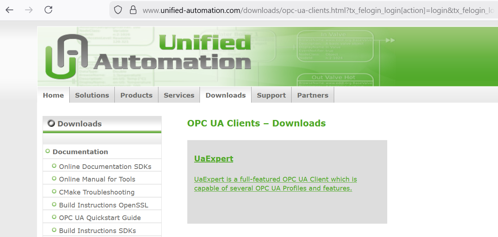
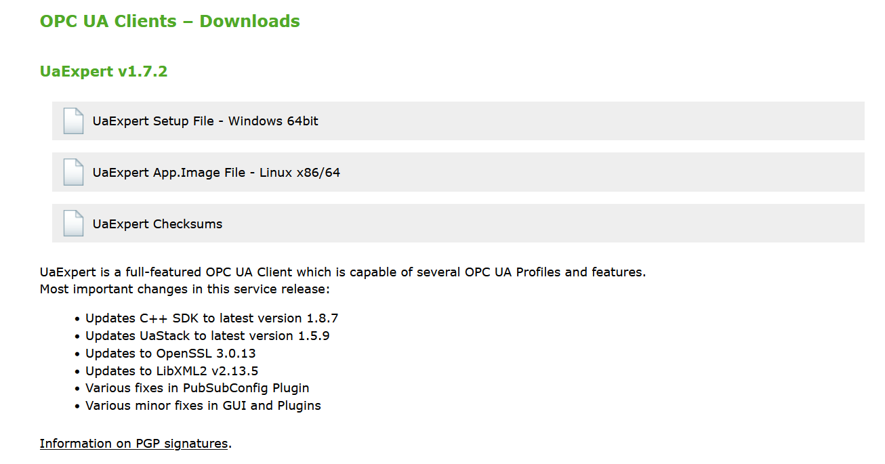
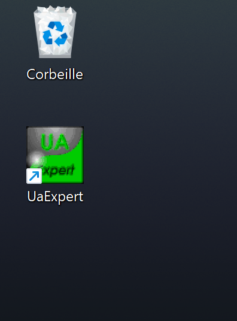
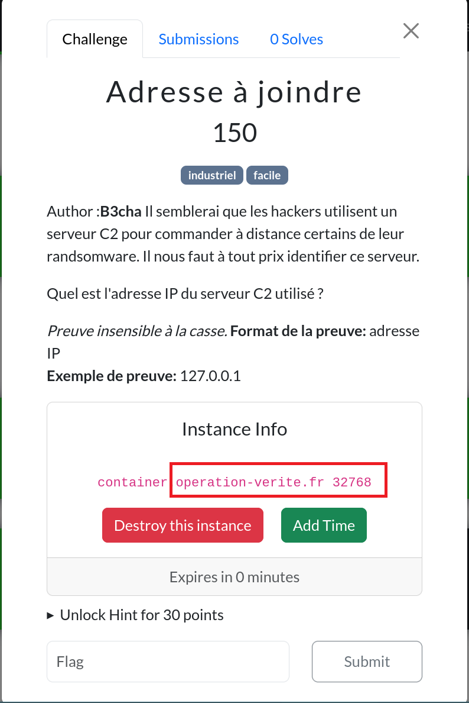
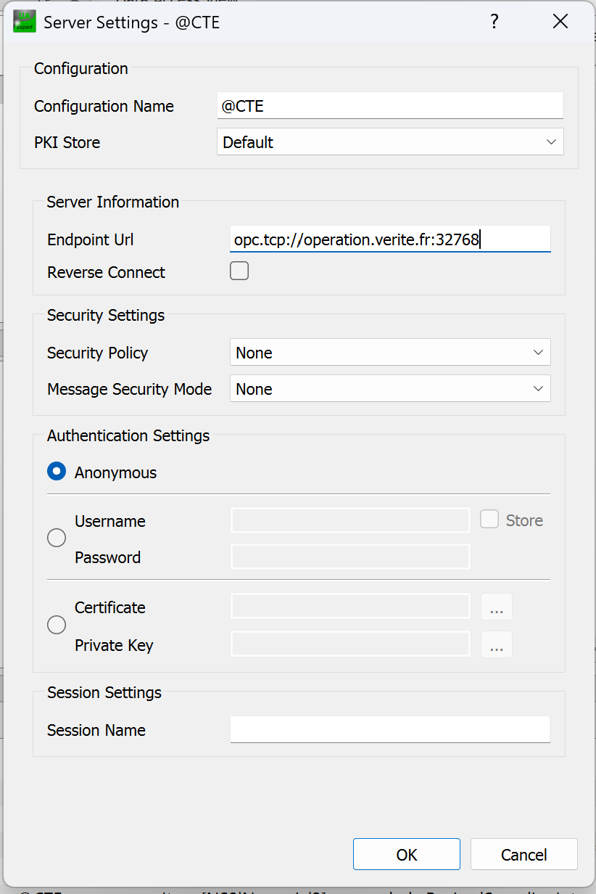
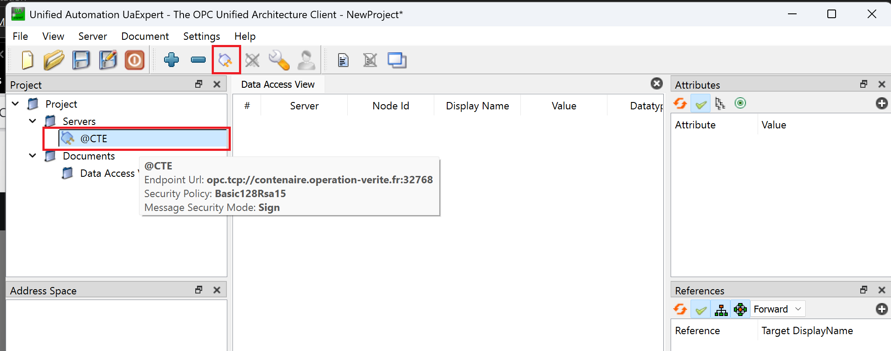
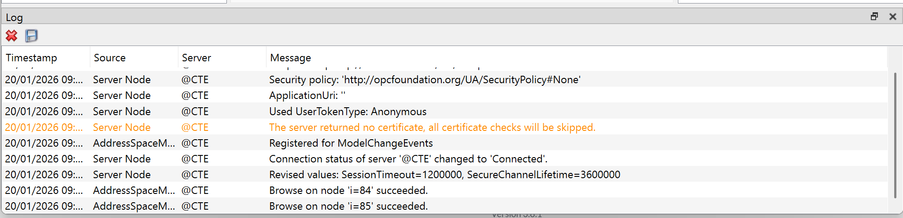
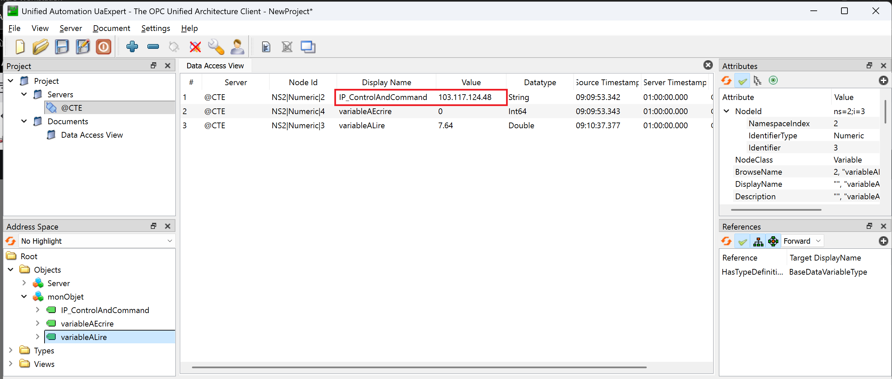

## Challenge : Adresse à joindre

## Informations du challenge

| Catégorie | Difficulté | Points | Auteur |
|-----------|------------|--------|--------|
| Indus | Facile | 150 | B3cha |

**Preuve :** `103.117.124.48`

## Résumé

Ce challenge nécessite de résoudre un challenge industriel pour trouver l'adresse IP du serveur C2 utilisé par les cyber-criminels.
Pour réaliser ce challenge, deux étapes sont nécessaires :

1. **Réussir à se connecter au serveur** - comprendre le protocole de communication utilisé pour joindre le serveur et s'y connecter
2. **Analyser le contenu du serveur** - retrouver l'adresse IP du C2 recherchée sur le serveur

## Étape 1 : Connexion au serveur

### Contexte

La lecture attentive du challenge permet d'identifier une information précieuse dans les tags :
- `Indus` => challenge sur les protocoles industriels
- `opc ua` => désigne un protocole industriel **Open Platform Communications Unified Architecture** (en cherchant un peu sur internet si on ne connaît pas)

Ces informations constituent notre point de départ pour le challenge ; nous avons donc affaire à un serveur OPC UA. Décidément, EternalBlue est fidèle à sa réputation : **des challenges industriels dans chaque CTE**.

### Se connecter au serveur OPC UA

Une rapide recherche sur internet avec les mots-clés `OPC UA + connexion + client` nous permet d'identifier les possibilités pour se connecter à un serveur OPC UA : un client OPC UA en Python, ou bien un client gratuit (il faut tout de même s'inscrire et se créer un compte pour pouvoir télécharger le client lourd) : `UA Expert`

Sélectionnez le client compatible avec votre système d'exploitation, et installez-le :

Une nouvelle icône apparaît sur le bureau ; lancez le programme (en cliquant dessus ;-) :

Sur l'interface générale du client, il faut cliquer sur le bouton `+` (plus) pour créer une nouvelle connexion à un serveur :

Pour configurer les paramètres de connexion, nous allons avoir besoin des informations fournies par le challenge au lancement du docker, à savoir l'**url du serveur** ainsi que **le numéro de port** sur lequel le serveur OPC UA tourne :

Dans notre cas précis, les informations utiles sont :
1. Url du serveur : `operation.verite.fr`
2. Numéro de port : 32768

Sur le panneau de configuration (ajout d'un serveur), il faut préciser plusieurs paramètres comme affiché sur la figure suivante :

Les champs à renseigner sont :
- **Configuration name :** `@CTE` (ou tout autre nom)
- **Endpoint Url :** `opc.tcp://operation.verite.fr:32768`
- **Security Policy :** laissez les deux champs à `None`
- **Authentification Settings :** mettre `Anonymous`

Cela signifie qu'aucune configuration de sécurité n'est nécessaire pour se connecter au serveur et qu'il accepte les connexions anonymes.
Cool pour un challenge facile (espérons que ça soit le cas pour les autres challenges ;-).

Après avoir cliqué sur le bouton `OK`, sur la page principale, sélectionnez votre serveur, puis cliquez sur `la prise de connexion` :

La connexion est établie ; le panneau des événements de connexion affiche les messages suivants en bas de page :

Cool, on est connecté !

## Étape 2 : analyser le contenu du serveur

Une fois connecté, faites un drag & drop des variables situées dans la rubrique `Address Space` vers la zone `Data Access View` au centre de l'interface.

Une variable en particulier saute à nos yeux : **IP_ControlAndCommand**. C'est la preuve recherchée : `103.117.124.48`
Les autres variables sont animées, mais d'aucun intérêt immédiat pour résoudre l'actuel challenge.

Une rapide recherche sur internet indique qu'il s'agit d'une adresse sur une plage IP du Portugal (intéressant).

### Résultat

La réponse attendue est donc l'adresse IP utilisée par les cyber-criminels. Le code malveillant se connecte à ce serveur OPC UA qui détermine de manière dynamique l'adresse IP du C2 à joindre (assez astucieux comme technique).

✅ **Preuve :** `103.117.124.48`
