## Challenge : Agent utilisateur

## Informations du challenge

| Catégorie | Difficulté | Points | Auteur |
|-----------|------------|--------|--------|
| Indus | Facile | 250 | B3cha |

**Preuve :** `pasteis2natas`

## Résumé

Ce challenge nécessite de résoudre un challenge industriel de niveau *intermédiaire* pour trouver un **user-agent** utilisé par un sous-groupe des cyber-criminels.
Pour réaliser ce challenge, deux étapes sont nécessaires :

1. **Réussir à se connecter au serveur** - franchir l'étape d'authentification utilisateur
2. **Introduire le bon code PIN** - cette étape est nécessaire pour se voir délivrer le sésame `user-agent`

## Étape 1 : Connexion au serveur

### Contexte

Comme nous avons pu le voir lors du challenge **Adresse à joindre**, nous sommes maintenant normalement capables de nous connecter à un serveur OPC UA.

Je crains que, maintenant, comprendre les mécanismes d'authentification du protocole OPC UA devienne indispensable.

Il existe trois modes de connexion possibles :
- `Anonymous` : accepte toutes les connexions (vu lors du challenge **Adresse à joindre**)
- `Username/password` : l'utilisateur doit posséder un compte sur le serveur pour pouvoir s'y connecter
- `X.509 certificate` : des certificats X.509 sont mis en place entre le client et le serveur.

### Se connecter en mode `Anonymous`

Tout comme lors du challenge **Adresse à joindre**, nous allons tenter de nous connecter en mode `Anonymous` sur le serveur.

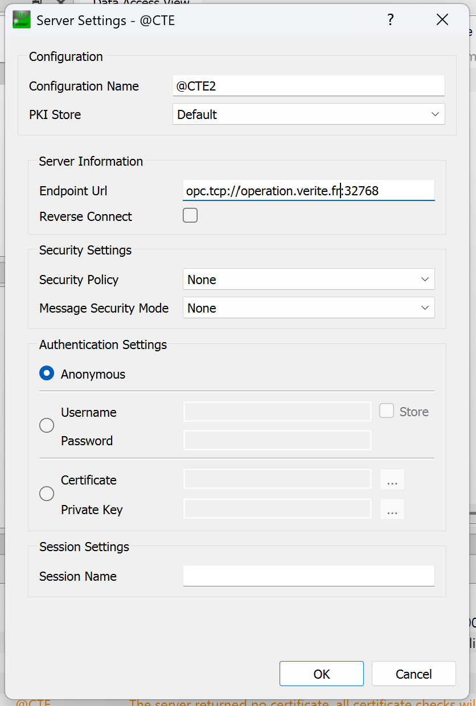

L'analyse des messages d'erreur indique un échec d'authentification, motif `BadIdentityTokenRejected`.

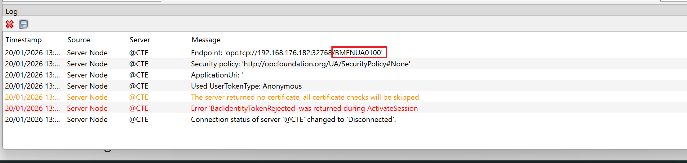

Toutefois, un détail intéressant dans les logs attire notre attention : l'url fournit une indication sur le type de serveur OPC UA adressé, **BMENUA0100**.
Il s'agit d'une carte OPC UA Server de marque Schneider Electric.

Quelques recherches sur votre moteur de recherche favori avec les mots-clés `BMENUA0100 + Default password` nous donnent un résultat :

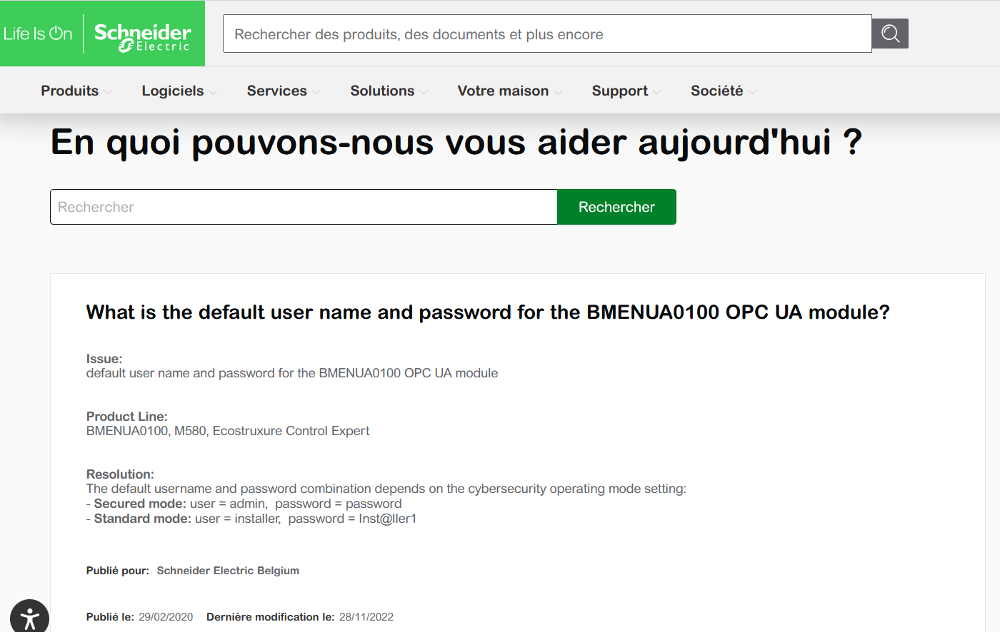

Il ne reste plus qu'à espérer que le mot de passe par défaut (du Secured mode) soit conservé sur notre serveur :
1. login : **admin**
2. mot de passe : **password**

**/!\ Au passage, ce n'est pas une bonne pratique de laisser les mots de passe par défaut du constructeur sur les équipements industriels.**

Pour cela, nous allons configurer notre client UaExpert comme ceci :

D'abord, on ajoute un nouveau serveur OPC UA :

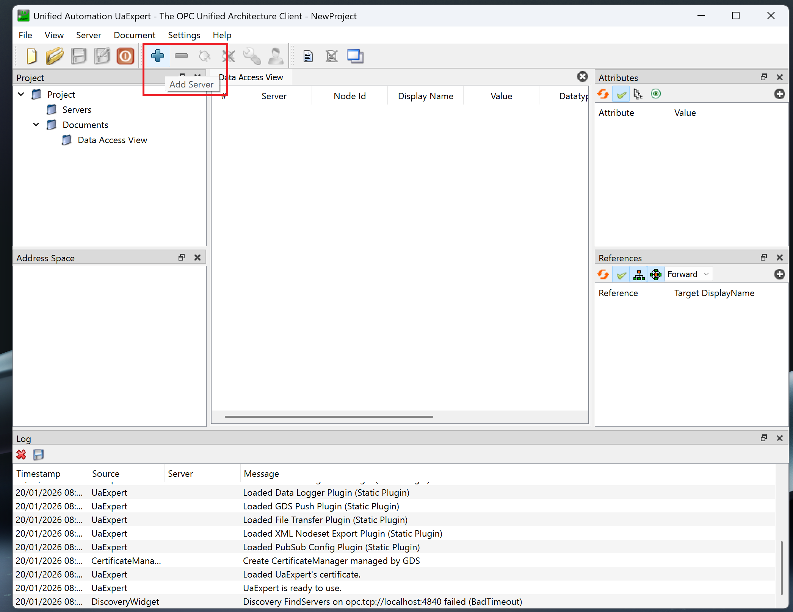

Puis on configure la connexion en mode `User authentication`.
Sur le panneau de configuration (ajout d'un serveur), il faut préciser plusieurs paramètres comme affiché sur la figure suivante :

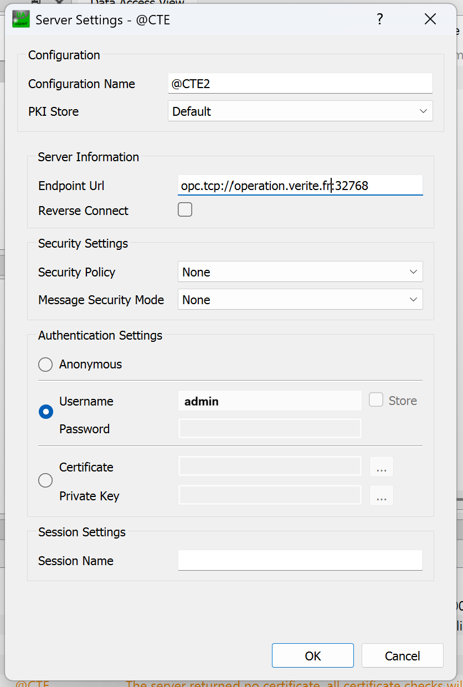

Les champs à renseigner sont :
- **Configuration name :** `@CTE2` (ou tout autre nom)
- **Endpoint Url :** `opc.tcp://operation.verite.fr:32768`
- **Security Policy :** laisser les deux champs à `None`
- **Authentification Settings :** mettre dans le champ Username `admin`

Puis on se connecte au serveur OPC UA en cliquant sur la petite prise :

Une mire d'authentification s'affiche, nous invitant à saisir le mot de passe de l'utilisateur **admin** ; tapez `password`.

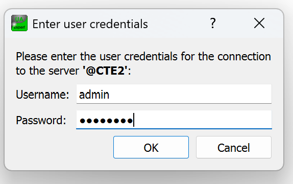

Le journal d'événements indique que nous sommes bien logués sur le serveur OPC UA.

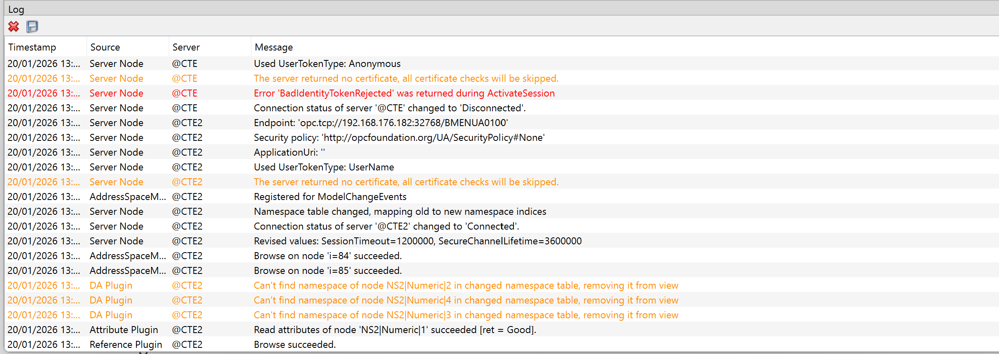

Cool, on est connecté ! J'espère que pour le troisième challenge ce ne sera pas *l'authentification par certificats !*

## Étape 2 : Analyse du contenu du serveur

Une fois connecté, il y a dans la partie **Address Space** deux zones de données :
1. Usine_Production
2. Zone Securisee CTE

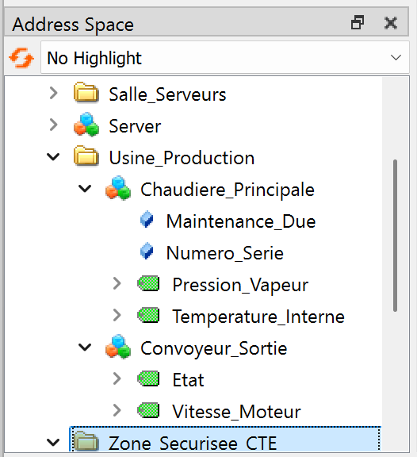

Après une rapide exploration (heureusement, il n'y a pas beaucoup de code à analyser sur ce serveur, merci B3cha !), faites un drag & drop des variables situées dans la rubrique `Address Space` vers la zone `Data Access View` au centre de l'interface.

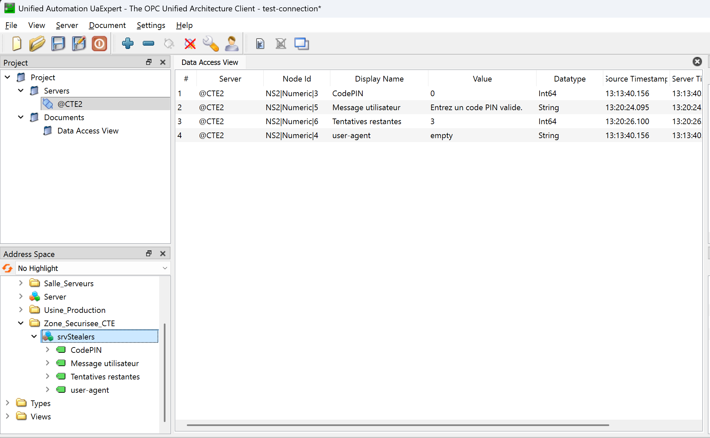

Déjà, le nom du nœud OPC UA est très intéressant : **srvStealers**, c'est sans doute le nom du sous-groupe du gang de criminels.

Il y a 4 variables :
- `CodePIN` : probablement pour saisir un code PIN (mais de combien de digits : 3, 4, 6 ?)
- `Message utilisateur` : bon, là c'est très explicite, une invitation à saisir un code PIN valide (je ne le connais pas)
- `Tentatives restantes` : par défaut il vaut 3, puis 2, 1, et BOUM !
- `user-agent` : par défaut ce champ vaut **empty** ; d'après le nom du challenge `Agent Utilisateur`, il est probable que ça soit notre flag.

### Première tentative

Commençons par saisir un code PIN basique **1234** dans la zone `Value` de la première ligne et regardons ce qui se passe :

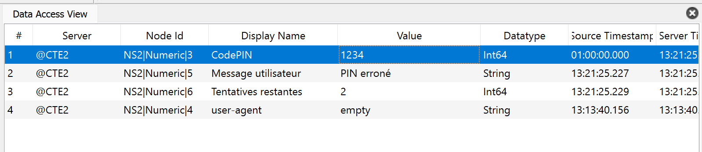

Le message utilisateur est explicite : **PIN erroné**, il reste 2 tentatives. `user-agent` vaut toujours **empty**.

### Deuxième tentative

En saisissant le code PIN **0000** puis **9999**, le nombre de tentatives expire, `user-agent` vaut toujours **empty**, puis le serveur coupe sa connexion.
Nous sommes obligés de redémarrer le docker sur le serveur (bouton ctfd).

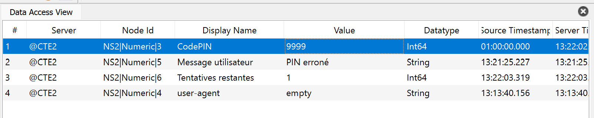

### Cette fois-ci c'est la bonne

Coder un script Python pour tenter les **9999** possibilités est une solution, mais aucune garantie que le code PIN ne soit pas à 6 chiffres.

Y a-t-il un lien avec le code PIN découvert lors du challenge **Pringles CanOpen** ? Nous y avons trouvé le code PIN `3395` ; ça ne coûte rien de l'essayer !

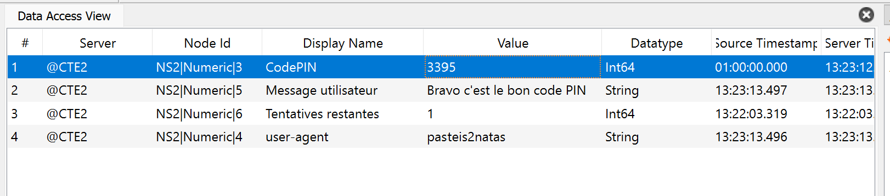

Bingo ! Je comprends mieux le mot `CanOpen` dans l'intitulé du challenge. C'est un autre protocole industriel de communication, comme OPC UA.

C'est rigolo.

### Résultat

La réponse attendue est la valeur du champ `user-agent` : **pasteis2natas**, c'est une célèbre pâtisserie, spécialité portugaise.

Mais pourquoi nous fournir un `user-agent` ? Il va peut-être servir plus tard pour se connecter sur un autre serveur ?

✅ **Preuve :** `pasteis2natas`
