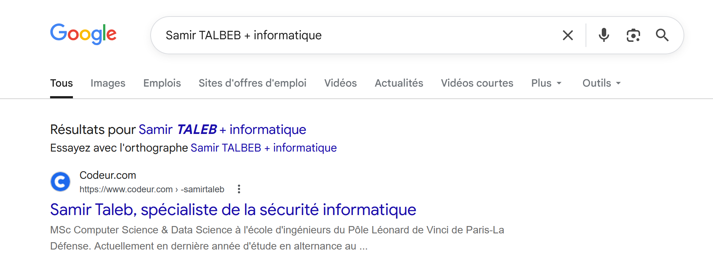
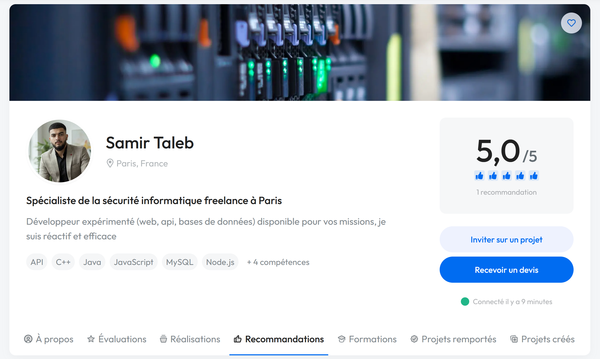
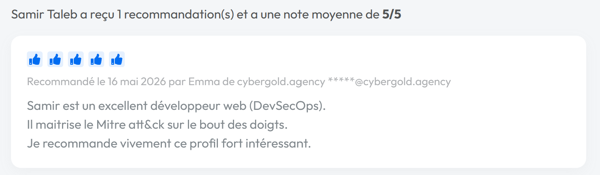
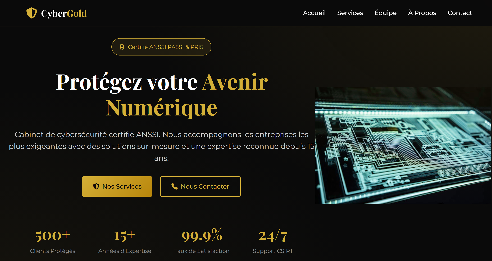

# Challenge : Vitrine parfaite

## Informations du challenge

| Categorie | Difficulte | Points | Auteur |
|-----------|------------|--------|--------|
| GoogleInt | Facile | 150 | B3cha |

**Preuve:** `cybergold.agency`

---

## Résumé

Ce challenge nécessite de retrouver le compte `Codeur.com` de Samir pour identifier la société qui a poster un avis
sur le profil de Samir.

## Identification du profil codeur

La résolution du challenge `Profession` indique que **Samir RALEB** est étudiant en informatique. Les recherches de profil
sur LinckedIn n'ont rien donné.

Uen recherche rapide sur les navigateurs web avec les mots clés :  `Samir TALEB + informatique` permet d'identifier un compte sur
le site `codeur.com` : https://www.codeur.com/-samirtaleb

## Analyse du profil de Samir

L'analyse du profil de Samir permet d'identifier un avis dans la rubrique **Recommendations**

L'avis date du 16 mai 2026 d'une personne nommée **Emma** de la société `cybergold.agency`.

Une recherche google avec ce nom de société **cybergold.agency** permet d'identifier le site web : https://www.cybergold.agency/

Le pied de page indique : `Capture The Evidence (CTE) - Ce site web est entrièrement fictif`. Pas de doute, c'est bien une ressource du CTE.

Il s'agit d'une société écran pour dissimuler sous couvert de prestations informatiques et de cybersécurité légale,
elle collecte des renseignements sur ses futures cibles. Ces sociétés n'hésitent pas à prétendre des labellisations
avec l'ANSSI. Il faut toujours vérifier les antécédants d'une société aussi fiable soit elle.

---

### Résultat

La solution de notre challenge est donc l'url du site de cette société **cybergold.agency**.

✅ **Preuve:** `cybergold.agency`

<!--
 author : b3cha
 date	: 16/05/2026
 version: 1.0
-->
