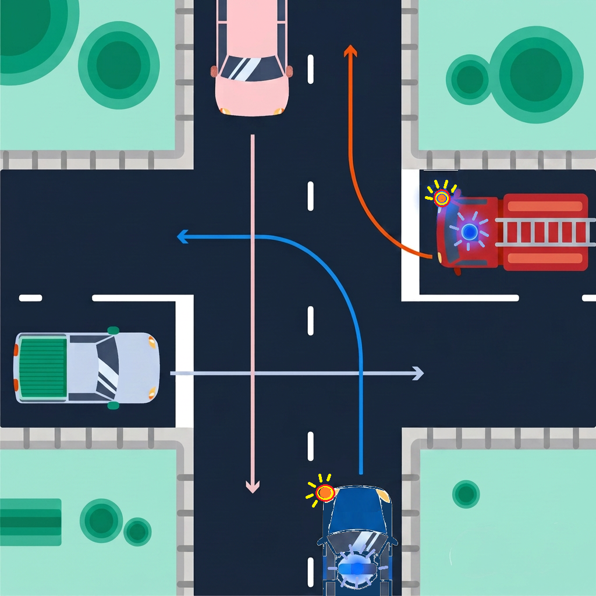
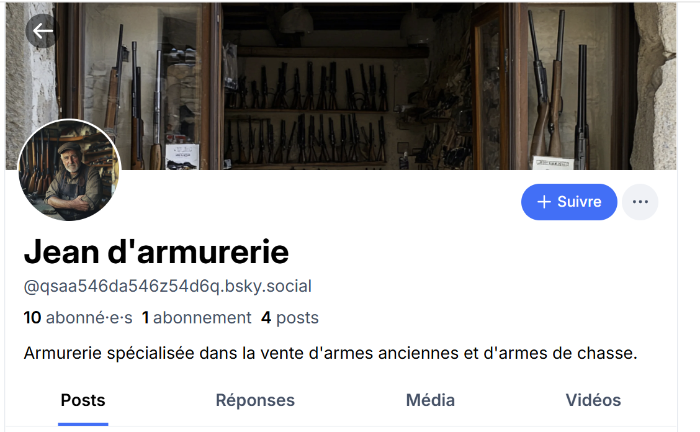
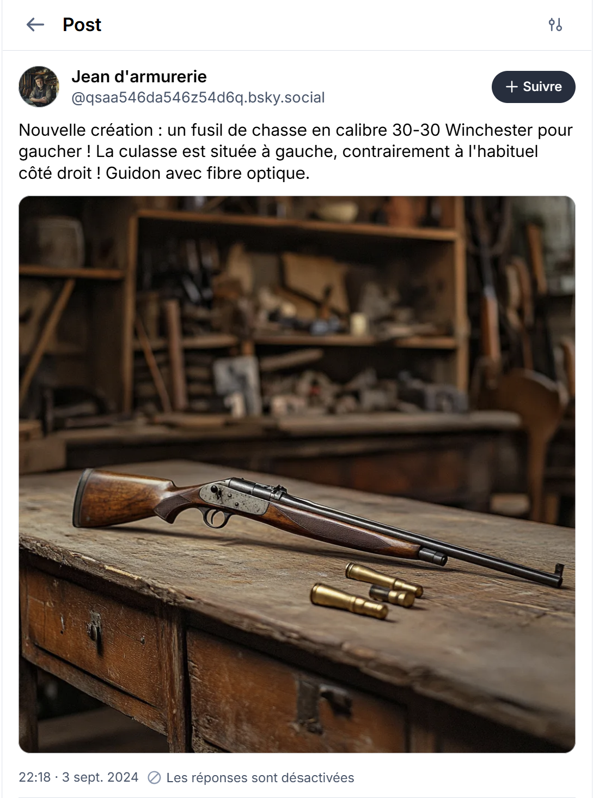

# Challenge : Hidden challenge

## Informations du challenge

| Catégorie | Difficulté | Points | Auteur |
|-----------|------------|--------|--------|
| Misc | Facile | 4x 100 | B3cha |


## Résumé

Ce challenge nécessite de résoudre 4 petites énigmes

- Enigme 1 : code de la route
- Enigme 2 : recherche en sources ouvertes
- Enigme 3 : sanctions encourues
- Enigme 4 : liste des protagonistes du CTE v2

---

## Identification du challenge caché

Lors de l'analyse du code source du site `http://cybergold.agency` les joueurs découvrent un message caché sur la page **team.html**


L'équipe contacte les admins du CTE sur leur canal **Discord** avec le mot clé `FURTIF`.

Un rendez-vous audio est fixé avec l'équipe pour leur proposer 4 énigmes de 5 minutes chacune.

Les joueurs doivent répondre par écrit dans leur canal dans le temps imparti.

Chaque bonne réponse permet d'obtenir un bonus de 100 pts supplémentaires.

## Enigme 1 : code de la route (100 pts)

L'énigme propose l'image suivante :



**QUESTION**

Quel est l'ordre de priorité ?

**REPONSE**

La bonne réponse est :
1. véhicule rouge (les secours sont prioritaires sur tout autre urgence)
2. véhicule bleu (les véhicules (VIG) en intervention des forces de l'ordre)
3. véhicule rose (pas de stop)
4. véhicule gris (dernier à passer)

## Enigme 2 : recherche en sources ouvertes (100 pts)

L'énigme 2 propose une devinette.

**QUESTION**

```shell
Il se prénomme Jean
Son patronyme évoque la maison des pandores
Il a la fibre, mais quel est son calibre ?
```

**REPONSE**

Il s'agit de retrouver le nom du personnage `Jean d'Armurerie` ressource présentée lors du CTE v1.

Une recherche sur les réseaux sociaux permet d'identifier son compte `bluesky` (https://bsky.app/profile/qsaa546da546z54d6q.bsky.social=



Un de ses posts parle de fibre et de calibre : https://bsky.app/profile/qsaa546da546z54d6q.bsky.social/post/3l3bn3immeo25



La réponse à notre devinette est : `30-30` ou `30-30 Winchester` (les deux réponses sont acceptées).

## Enigme 3 : sanctions encourues par Miguel (100 pts)

**QUESTION**

Que reproche t-on à Miguel d'un point de vue légal ?

**REPONSE**

Seules les infractions directement commises par **Miguel SANTOS** peuvent lui être reprochées sous réserve de la qualification par le procureur :
- usurpation d'identité;
- association de malfaiteurs;
- escroquerie en bande organisée;
- recel.

## Enigme 4 : liste des protagonistes du CTE v2 (100 pts)

**QUESTION**

Combien y a t-il de protagonistes au total ? nommez-les ?

**REPONSE**

Seuls les personnages actifs de l'histoire sont considérés comme protagonistes (auteurs ou victimes).

```shell
- Mélanie LEFEVRE (victime)
- Samir TALEB (ami de la victime)
- Miguel SANTOS (fixeur)
- Henri NAPOLINO (chef de groupe criminel)
- Tiago RIBEIRO (fixeur)
- Carla DIMEO (fixeur)
- Michel LORENZO (fixeur)
- Jawad BENDAOUD (bailleur)
- Quilroy (hacker)
- theodu13 (influenceur)
- raphael33 (influenceur)
- Sarahlachti (influenceur)
- Karl2Strasbourg (influenceur)
- Sofiène FRIKHA (Alias Joudène) a simplement commenté une pétition - réponse acceptée.
```

### Précisions

L'analyse des réponses multiples permet d'octroyer la totalité des 100 points, si la réponse est intégralement correcte.

Une mauvaise réponse (même partielle) entraine la perte des 100 points.
