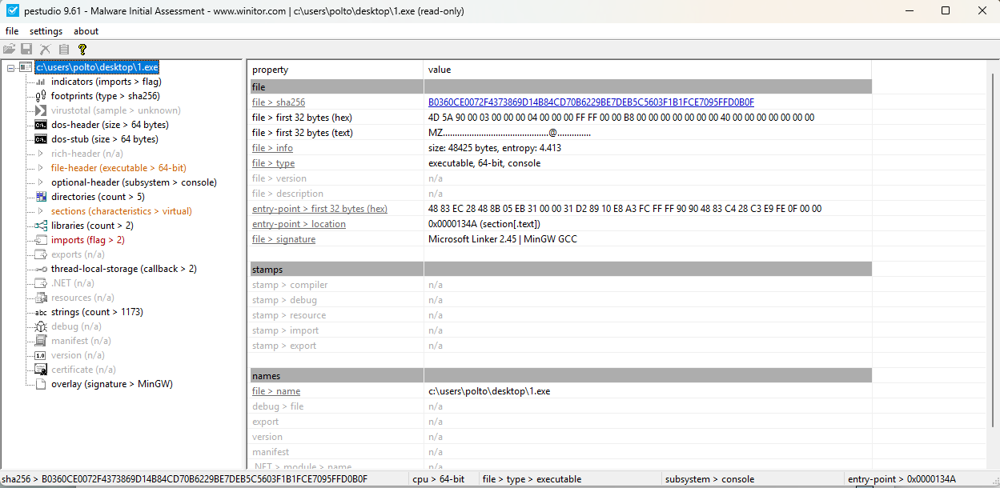
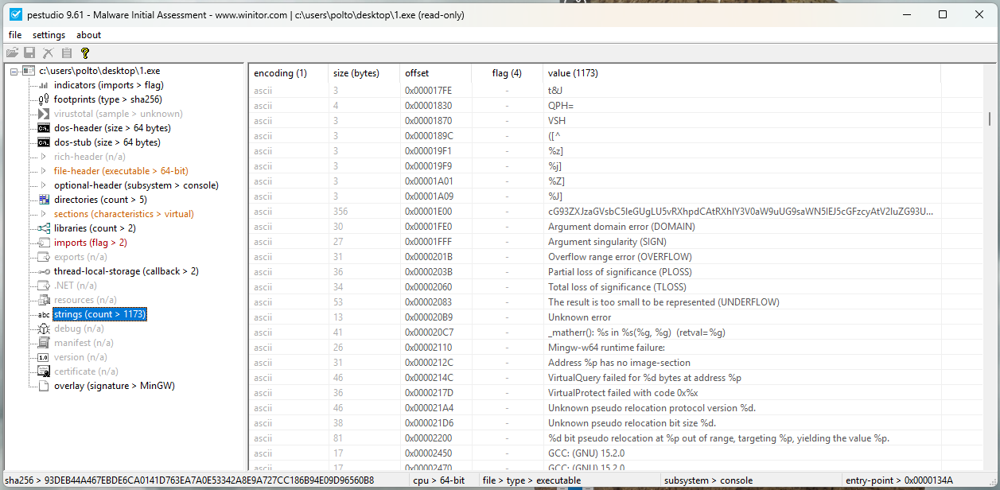
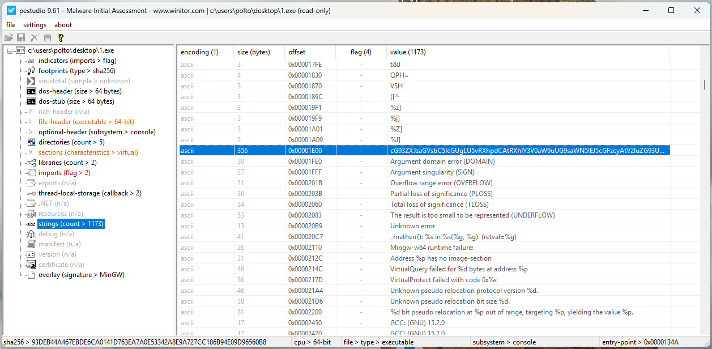
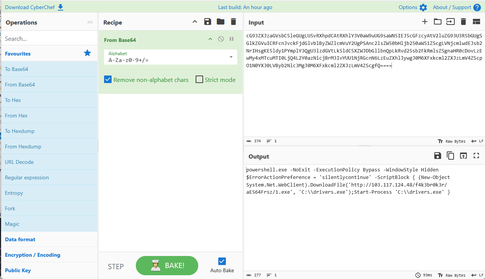

# Challenge : Do you like beacon ?

## Informations du challenge

| Catégorie | Difficulté | Points | Auteur |
|-----------|------------|--------|--------|
| Reverse | Facile | 100 | Geistnigma |

**Preuve :** `/f4k3br0k3r/aE564Frsz/1.exe`

---

## Résumé

Ce challenge vise à effectuer du reverse engineering sur un fichier PE.
Deux étapes sont nécessaires pour cette analyse :

1. extraction des informations de l'exécutable avec l'outil `PeStudio`
2. analyse du contenu et recherche des artefacts

---

### Récupération des informations du PE

Pour récupérer les informations sur ce dernier, nous allons utiliser l'outil **PeStudio**. On remarque que celui-ci est bien un exécutable 64 bits, de type console, et compilé avec MinGW GCC.



### Analyse des strings

Nous allons à présent regarder les différentes strings du binaire. On observe qu'il y en a plus de 1 173.



Au-delà des différentes strings que l'on peut retrouver dans un binaire, on remarque une chaîne en Base64 de 356 octets qui se démarque du reste.



Nous la récupérons et allons la décoder.

### Décodage du Base64

En décodant cette dernière, on observe qu'il s'agit d'une commande PowerShell.



Concrètement, cette commande lance un PowerShell discrètement (présence de `-NoExit`, `-ExecutionPolicy Bypass`, `-WindowStyle Hidden`, `ErrorActionPreference = 'silentlycontinue'`).
Puis elle télécharge un fichier depuis Internet (grâce à `System.Net.WebClient`).
Enfin, elle exécute directement le fichier téléchargé (`Start-Process 'C:\drivers.exe'`).

### Résultat

Nous avons donc trouvé le nom du binaire stocké sur le serveur ainsi que le dossier du serveur C2 dans lequel il se situe.

```
http://103.117.124.48/f4k3br0k3r/aE564Frsz/1.exe
```

✅ **Preuve :** `/f4k3br0k3r/aE564Frsz/1.exe`
