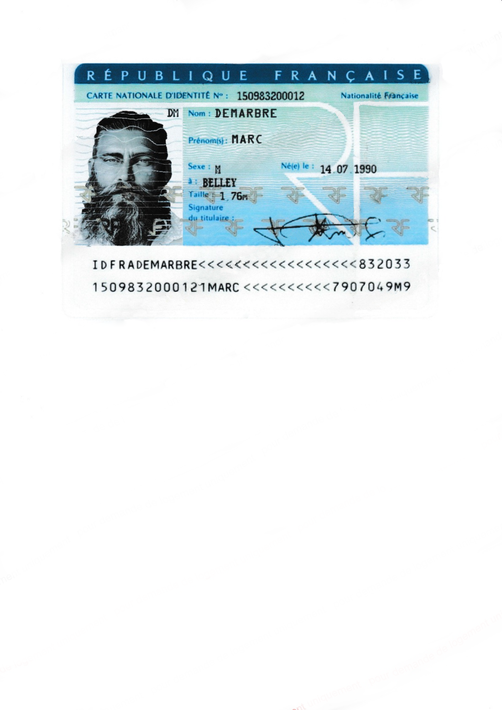
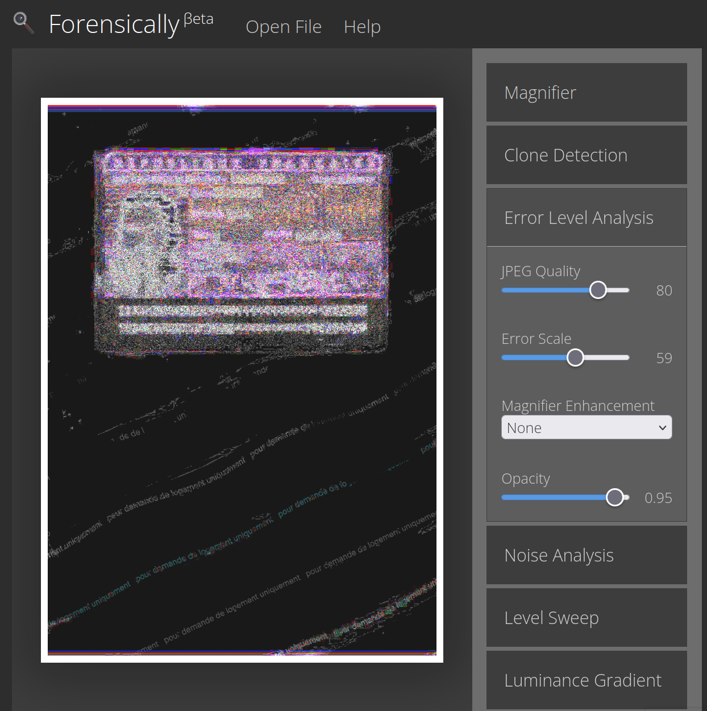

# Challenge : Preuve invisible

## Informations du challenge

| Catégorie | Difficulté | Points | Auteur |
|-----------|------------|--------|--------|
| ImInt | Facile | 150 | B3cha |

**Preuve :** `13-logement`

## Résumé

Pour contribuer à sécuriser ses fichiers en ligne, l'utilisation d'un filigrane est très généralement recommandée. Bien que ces derniers puissent, non sans mal, être quasiment totalement effacés pour l'œil humain en cas de manipulation, ce genre d'opération frauduleuse laisse toujours des traces !

Ici, nous disposons d'une quinzaine de documents, dont l'un d'eux (une fausse identité générée dans le cadre de ce CTF) disposait justement d'un filigrane à l'origine !

Dans le challenge `Double Jeu`, il y a plusieurs fichiers PDF dont **document 13.pdf**, qui contient la CNI de Marc DEMARBRE (victime du premier CTF). Exporter l'image contenue dans le fichier PDF en JPG.

En ouvrant l'image avec des outils de forensics spécialisés, tels que l'outil `forensically` hébergé sur https://29a.ch/photo-forensics, il est possible de faire apparaître les imperfections qui pourraient sembler invisibles sans traitement, notamment grâce à la détection d'erreur qui dessine des contrastes autour des artefacts visuels.

Pour l'image n°13, on est donc en mesure de restaurer partiellement un filigrane effacé provenant de https://filigrane.beta.gouv.fr :

Ce dernier est distinctement lisible. On peut y lire « *pour demande de logement uniquement* », qui est donc le motif pour lequel la victime a cédé une copie de sa pièce d'identité.

✅ **Preuve :** `13-logement`
