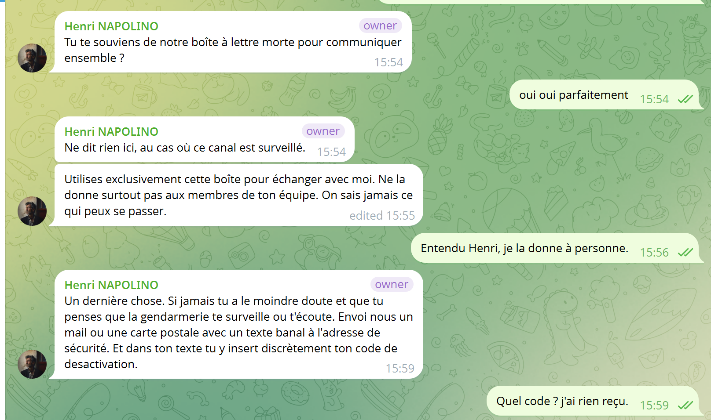
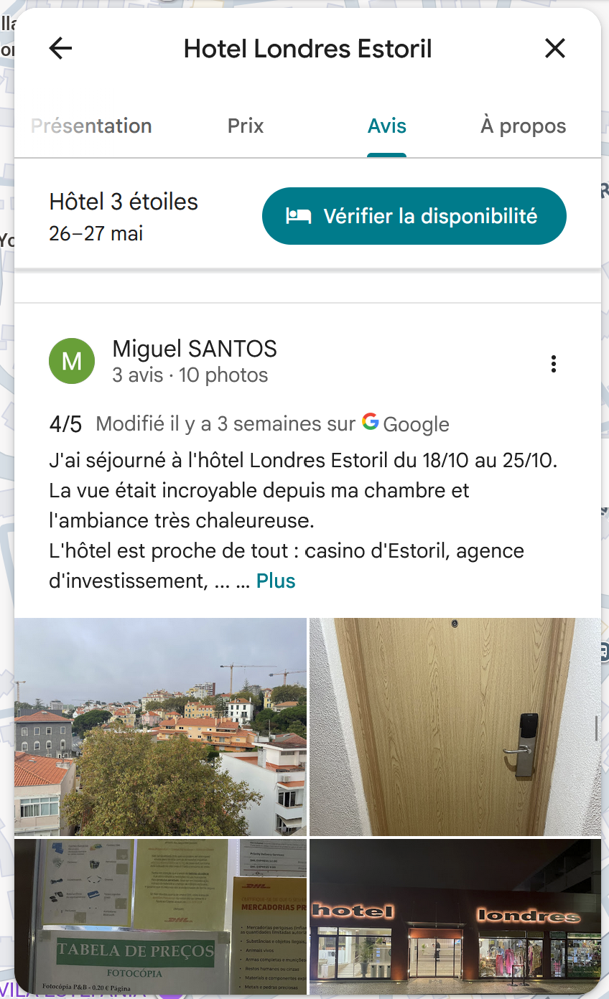
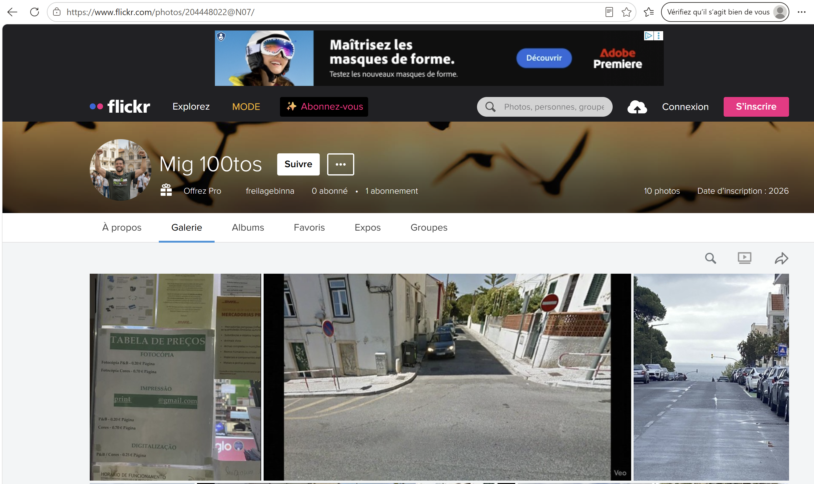
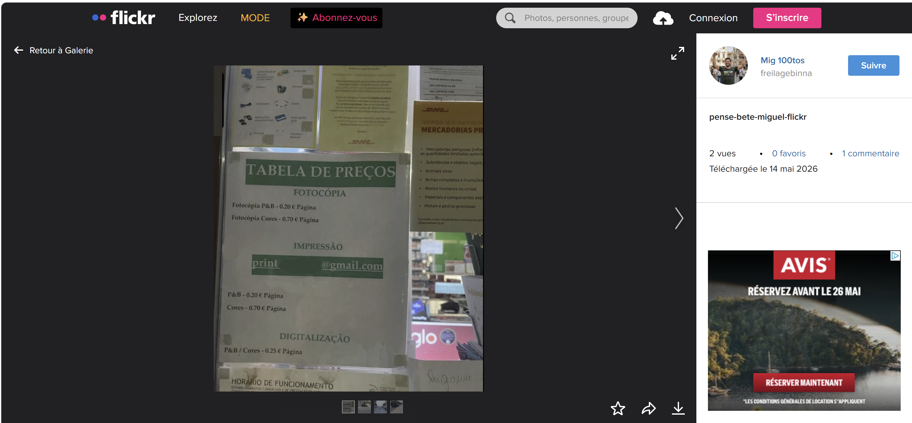

# Challenge : Boîte à lettre morte

## Informations du challenge

| Catégorie | Difficulté | Points | Auteur |
|-----------|------------|--------|--------|
| Osint | Moyen | 200 | B3cha |

**Preuve :** `print.cruzeiro@gmail.com`

---

## Résumé

Ce challenge nécessite de retrouver la photo enregistrée par **Miguel** sur son avis Google de l'hôtel.
Fantasmas-de-Redes utilise un point de vente tabac accolé à l'hôtel Estoril pour s'envoyer et recevoir des messages.
Il est possible d'y envoyer des courriers papier ou bien des mails.

---

### Avis Google Maps

Lors des échanges Telegram (t.me/F4nt45maS2R3dEs) entre Miguel et Henri, l'existence d'une boîte à lettres morte est évoquée.

Pour mémoire, une `boîte à lettres morte` est une technique d'échange discret entre deux individus, mais de manière indirecte.
La rupture de communication est effectuée via cette boîte à lettres. Dans notre cas, Henri a sélectionné un bureau de tabac à Estoril.
Lorsque Miguel souhaite lui adresser un message, il peut soit envoyer son message par mail à l'adresse de la boîte à lettres,
soit expédier une carte postale ou un courrier à destination de ce tabac.
Puis, dans un second temps, un coursier de Fantasmas-de-Redes passe de temps à autre pour relever le courrier. Cette action
est couverte par un acte banal : achat d'un paquet de cigarettes, d'un carnet de timbres, etc.

Lors de la résolution du challenge `Une ville en chantier`, nous avons trouvé le numéro de chambre d'hôtel de Miguel
à partir de son avis Google sur **l'hôtel Londres Estoril**. Sur ce même avis, Miguel a posté une dizaine de photos dont celle-ci :

Cette photo indique l'adresse mail de contact du tabac-presse : `print.cruzeiro@gmail.com` (conforme au format de flag).

### Point de confirmation Flickr

En poursuivant les recherches, nous trouvons sur le réseau [www.flickr.com](https://www.flickr.com) un compte au nom de `Mig 100tos` ; la photo de profil
permet d'identifier clairement **Miguel Santos** portant un t-shirt de l'IRONMAN Cascais, les bras levés.

Plusieurs photos y figurent, dont un rappel de l'affiche à l'entrée du tabac-presse :

Sur cette dernière photo, l'adresse mail est incomplète, `print    @gmail.com`, ce qui sert de point de confirmation.

## Résultat

La solution de notre challenge est l'adresse mail inscrite sur l'affiche du tabac-presse accolé à l'hôtel Londres Estoril.

✅ **Preuve :** `print.cruzeiro@gmail.com`
