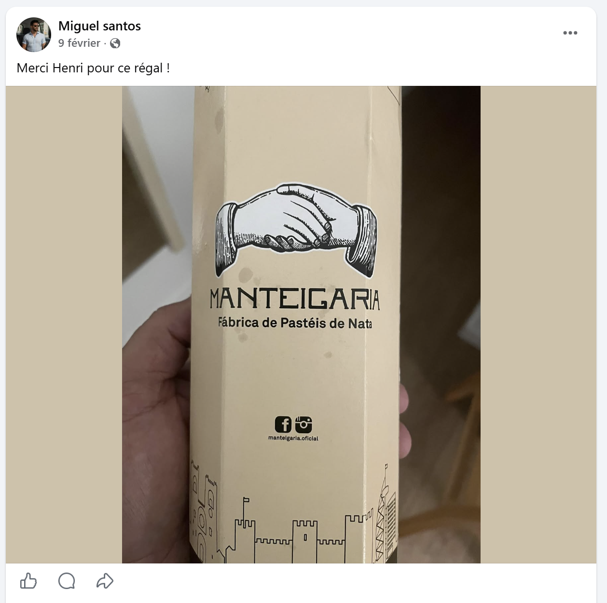

# Challenge : Douceur de vivre

## Informations du challenge

| Catégorie | Difficulté | Points | Auteur |
|-----------|------------|--------|--------|
| SocMint | Facile | 100 | B3cha |

**Preuve :** `MANTEIGARIA-Pastéis de nata`

---

## Résumé

Ce challenge nécessite de retrouver le premier compte Facebook de **Miguel**.
Ne surtout pas s'arrêter au premier compte Facebook, au risque de ne pas voir le post de Miguel.

## Recherche du post sur le compte Facebook de Miguel

En cherchant sur Facebook tous les comptes au nom de **Miguel SANTOS**, on trouve deux comptes :

1. https://www.facebook.com/@miguel.santos.299650
2. https://www.facebook.com/profile.php?id=61582916518941

L'information recherchée se trouve dans le post du 9 février 2026 sur le compte avec l'id `miguel.santos.299650`.

Il s'agit d'une pâtisserie très célèbre au Portugal.
Les pastéis de nata (pastel de nata au singulier) sont de petites tartelettes portugaises composées principalement de :

- pâte feuilletée : croustillante et légèrement caramélisée,
- crème aux œufs (*nata* = crème) préparée avec :
  - jaunes d'œufs
  - lait ou crème
  - sucre
  - farine ou fécule (selon les recettes)
- arômes :
  - cannelle
  - zeste de citron
  - parfois vanille

Après cuisson à très haute température, le dessus devient légèrement brûlé et tacheté, caractéristique des vrais pastéis portugais.
Traditionnellement, ils se dégustent tièdes avec :

- un peu de cannelle en poudre
- du sucre glace

La version la plus célèbre vient des Pastéis de Belém à Lisbonne.

**Nota :** petit conseil, bien garder en tête cette pâtisserie, celle-ci sera une clé secrète pour réussir à se rendre sur le
Marketplace du groupe criminel sur le Darkweb.

---

### Résultat

La solution de notre challenge, en respectant le format de la preuve :

1. nom de l'établissement en majuscules : `MANTEIGARIA`
2. nom de la pâtisserie : `Pastéis de nata`

✅ **Preuve :** `MANTEIGARIA-Pastéis de nata`
