# Challenge : Marketplace

## Informations du challenge

| Catégorie | Difficulté | Points | Auteur |
|-----------|------------|--------|--------|
| Osint | Moyen | 200 | B3cha |

**Preuve :** `6tz6wsus4mwbe23fhi6k6ygkgwpgqpabbcqty6g2p5ew4hasynhwpkid.onion`

## Résumé

À la lecture de l'énoncé, nous sommes à la recherche d'une URL qui se termine par `.onion`.

Le groupe `Fantasmas de Redes` doit nécessairement proposer cette URL à ses clients s'il veut vendre des kits d'identité.


## Méthode 1 : résolution depuis les réseaux sociaux

En s'appuyant sur la liste des réseaux sociaux de Miguel, on va restreindre nos recherches aux réseaux sociaux offrant la possibilité
de créer des groupes publics => Facebook en premier.

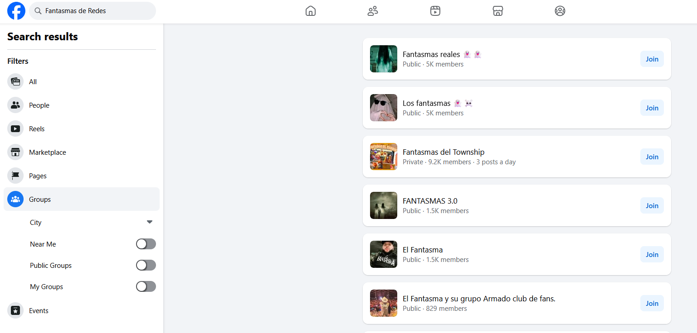

L'analyse des différents résultats montre qu'aucun nom de groupe ne coïncide avec le nom exact `Fantasmas de Redes`.
On va tenter avec une autre orthographe : `Fantasmas-de-Redes`.

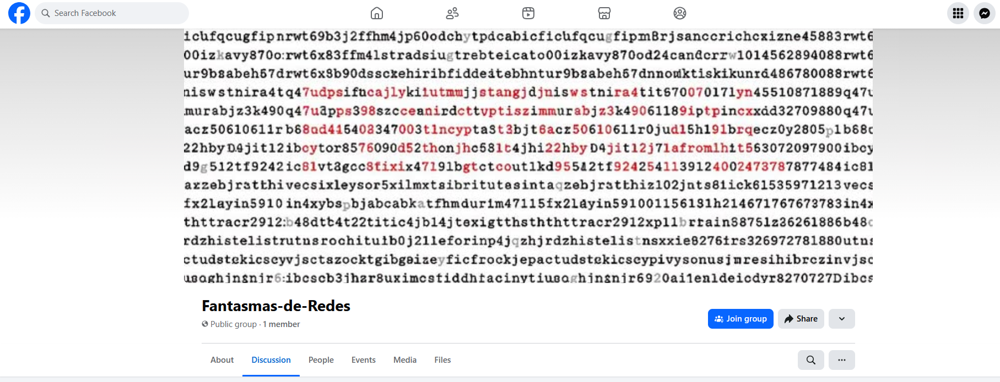

La photo de couverture du groupe attire notre attention, et surtout l'administrateur du groupe se nomme `Miguel SANTOS`.

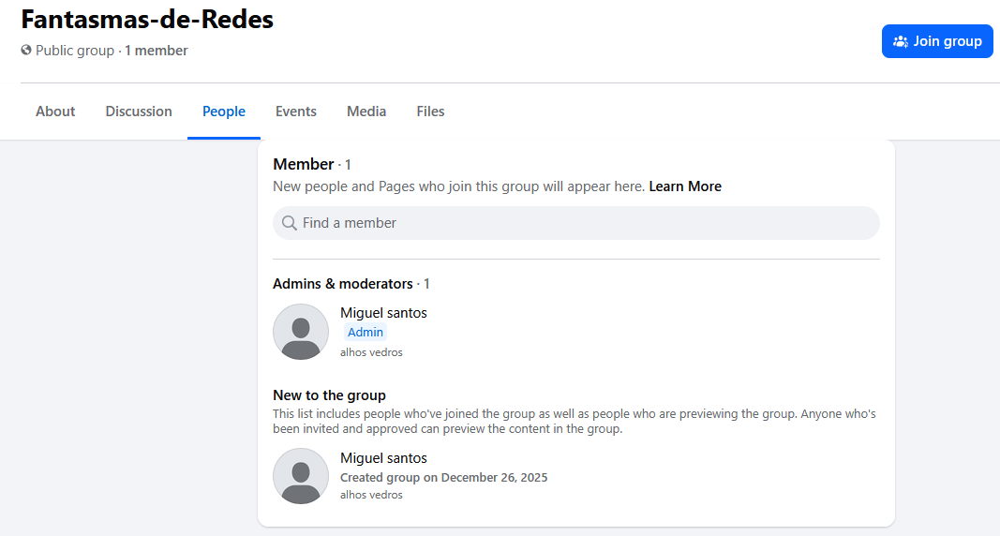

Cette même information est visible sur le profil Facebook de Miguel :

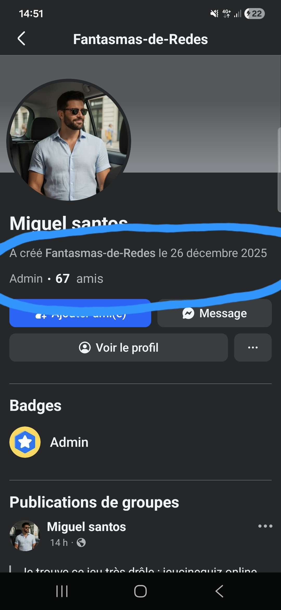

Nous allons donc nous intéresser à l'image du groupe :

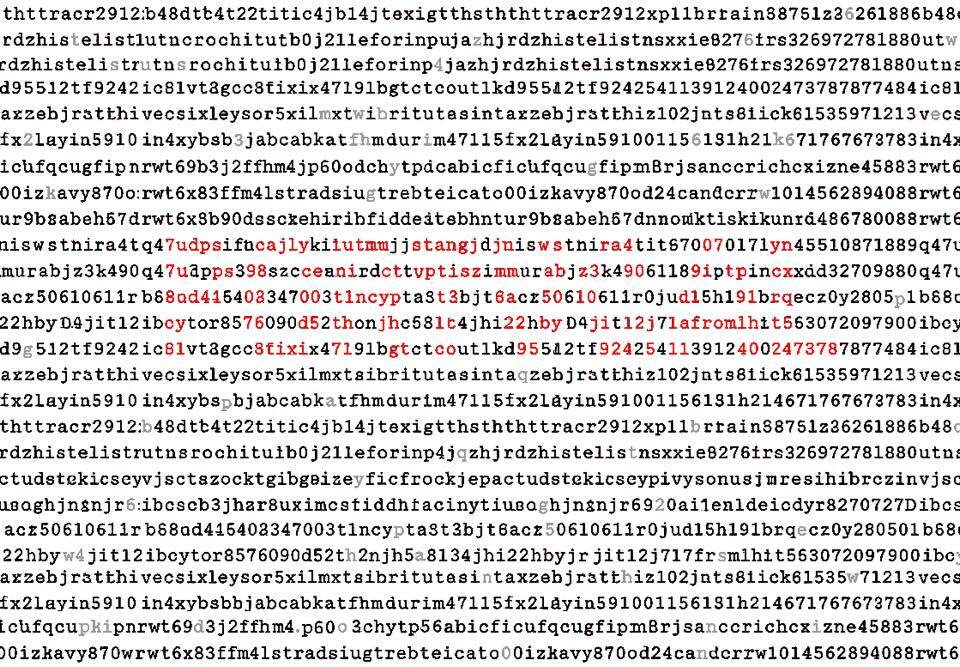

Au centre de l'image, les lettres rouges forment le mot **Portugal**. Nous remarquons aussi que certaines lettres sont de couleur grise.
Et comme l'énoncé du challenge référence le tag `stegano`, nous allons donc chercher l'URL dans cette image.
Deux possibilités : les recueillir à la main ou coder <a href="src/extraire.py">un script Python</a> pour extraire ces lettres (en s'aidant ou non de l'IA).

```shell
import cv2
import numpy as np
import pytesseract
from PIL import Image

# Si tesseract n'est pas dans le PATH (Windows)
# pytesseract.pytesseract.tesseract_cmd = r"C:\Program Files\Tesseract-OCR\tesseract.exe"

IMAGE_PATH = "image.png"

# 1. Charger l'image
img = cv2.imread(IMAGE_PATH)

# 2. Convertir en espace HSV (plus fiable pour la couleur)
hsv = cv2.cvtColor(img, cv2.COLOR_BGR2HSV)

# 3. Définir une plage de gris
# Le gris a une saturation faible
lower_gray = np.array([0, 0, 50])
upper_gray = np.array([180, 50, 220])

mask = cv2.inRange(hsv, lower_gray, upper_gray)

# 4. Nettoyage du masque
kernel = np.ones((2, 2), np.uint8)
mask = cv2.morphologyEx(mask, cv2.MORPH_OPEN, kernel)

# 5. Créer une image ne contenant que le texte gris
gray_text_img = cv2.bitwise_and(img, img, mask=mask)

# 6. Conversion pour OCR
gray = cv2.cvtColor(gray_text_img, cv2.COLOR_BGR2GRAY)
gray = cv2.threshold(gray, 150, 255, cv2.THRESH_BINARY)[1]

# 7. OCR ligne par ligne
custom_config = r'--oem 3 --psm 6'
text = pytesseract.image_to_string(gray, config=custom_config, lang="eng")

# 8. Mise sur une seule ligne de tous les caractères

one_line_text = "".join(
    char for char in text
    if char.isalnum() or char in ".&"
)

# 9. Correction du résultat en remplaçant & par g
one_line_text = one_line_text.replace("&", "g")

# 10. Remplacement du caractère coupé en bord par y
one_line_text = one_line_text.replace("n", "?n", 1)

# 11. Suppression de l'hallucination de l'algo
one_line_text = one_line_text.replace("ad", "", 1)

# 12. Conversion en minuscule de tous les caractères
one_line_text = "".join(c for c in one_line_text if not c.isupper())

print(one_line_text)
```

Une fois exécuté, le code Python fournit le résultat suivant :

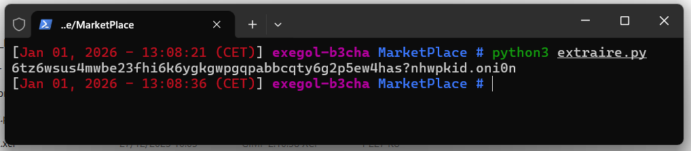

**Remarque 1 :** une lettre en bord de page ne peut être lue qu'à l'œil nu : il s'agit d'un `y` (le code Python le remplace par un point d'interrogation).
L'OCR détecte deux lettres inexistantes `ad` qu'il faut supprimer du résultat final (étape 11). Il est donc indispensable de vérifier visuellement le résultat
fourni par le script.

Une deuxième lettre en bord de page : une chance sur deux, `c` ou `o`, à tester sur la cible finale pour confirmer l'URL.

**Remarque 2 :** tout chiffre `0` présent dans l'URL du site `.onion` doit nécessairement être considéré comme la représentation leetspeak d'un `o`, car les caractères qui permettent de composer les adresses en .onion sont uniquement les lettres de l'alphabet latin et les chiffres compris entre 2 et 7 inclus (référence Wikipédia : <https://fr.wikipedia.org/wiki/.onion>).

- [x] Preuve : **6tz6wsus4mwbe23fhi6k6ygkgwpgqpabbcqty6g2p5ew4hasynhwpkid.onion**

## Méthode 2 : résolution depuis le site internet

Il existe une seconde possibilité pour retrouver l'URL du .onion sur le site web de `Stealers`.

L'URL du site `cybergold.agency` a été trouvée lors de la résolution du challenge **Vitrine parfaite**.

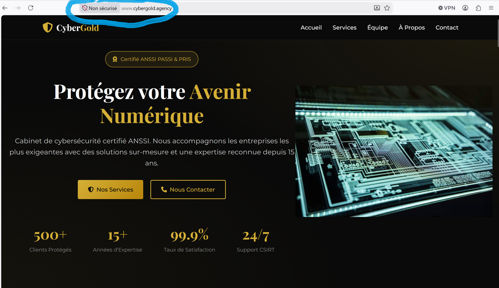

Un élément attire notre attention sur le site : le navigateur indique un problème de certificat SSL :

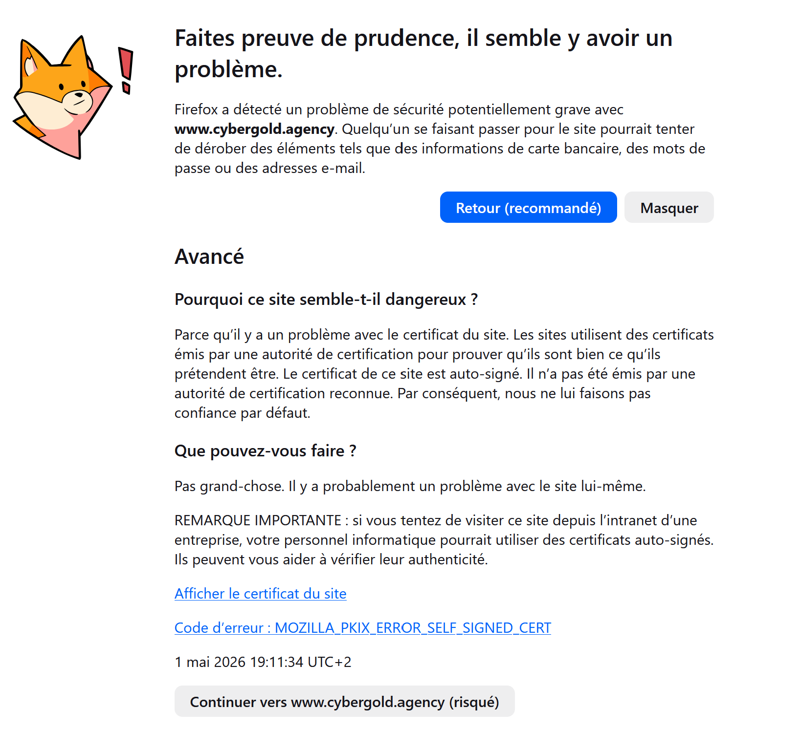

Pour des hackers, mettre un certificat compromis ou auto-signé attirerait la suspicion des éventuels clients qui visiteraient leur site.
Inspectons ce certificat en cliquant sur le bouton **afficher le certificat du site**.

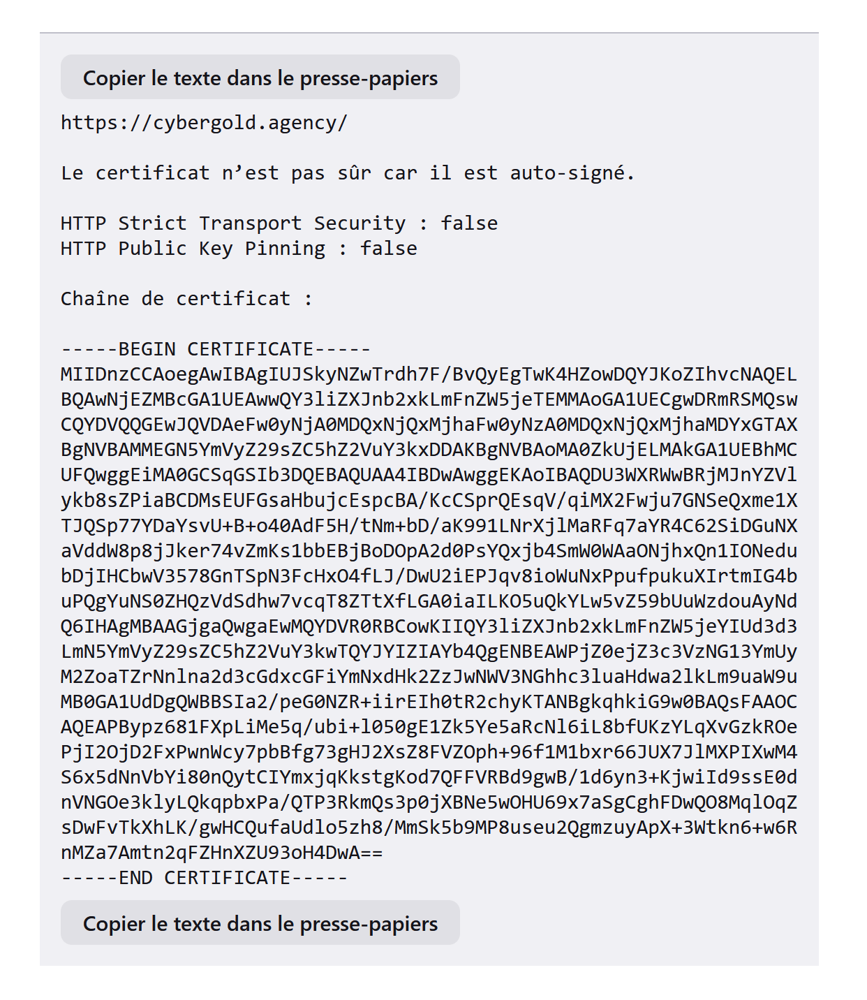

L'erreur indique clairement que le certificat est **auto-signé**, d'où l'alerte du navigateur.
Il existe un site assez sympa pour analyser les certificats SSL si vous n'êtes pas familier avec les lignes de commande d'OpenSSL (un peu comme moi ;-) :

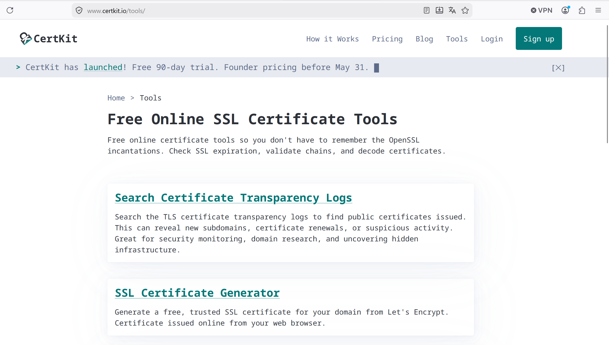

Choisir la rubrique `PEM Certificate Decoder` :

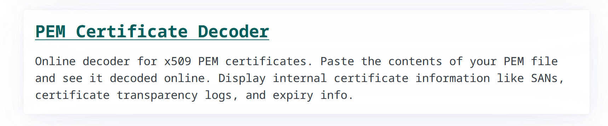

Pour cela, il faut coller le texte du certificat entre les balises BEGIN CERTIFICATE et END CERTIFICATE.

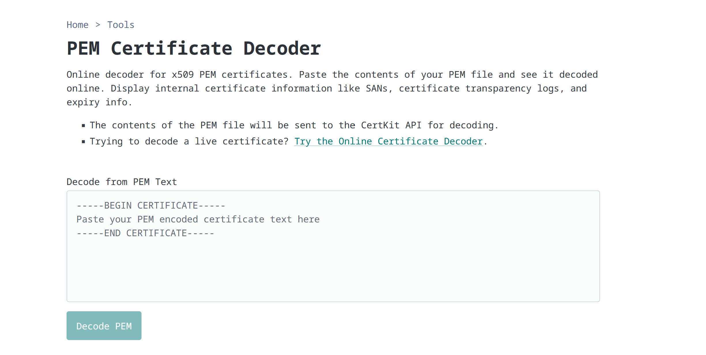

Les informations générales du certificat indiquent une organisation `FdR` (on apprendra plus tard qu'il s'agit de **F**antasmas-**d**e-**R**edes).

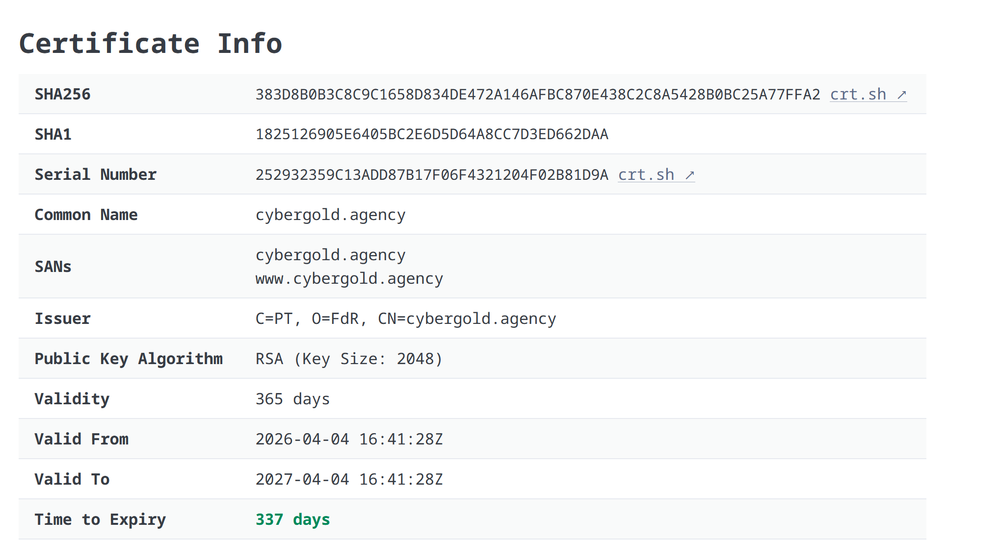

La partie information brute (`Raw`) est très intéressante : notamment, dans la rubrique `Netscape Comment` figure une adresse **.onion**.

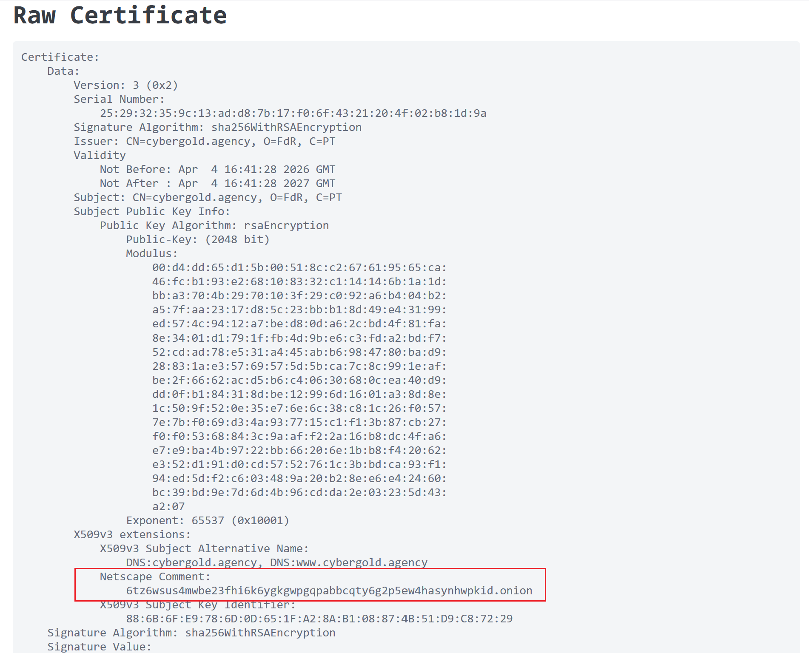

Il est également possible d'obtenir le même résultat en copiant directement le contenu du certificat dans l'outil `Cyberchef` et en convertissant le contenu du certificat avec l'option **From Base64**.

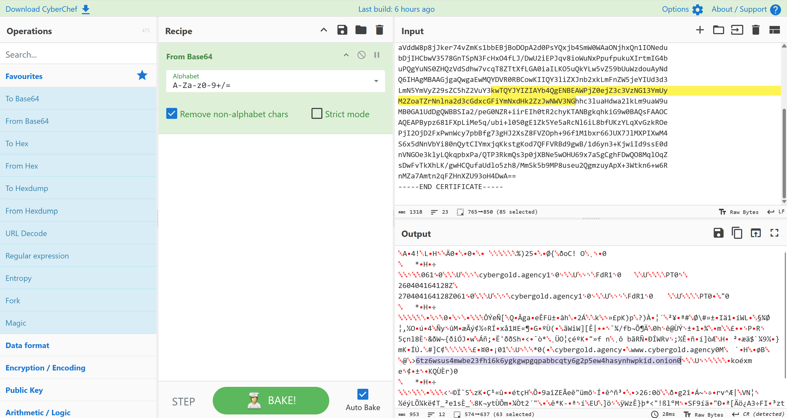

La même adresse **.onion** y figure (sans prendre le 0 à la fin).

### Résultat

✅ Preuve : **6tz6wsus4mwbe23fhi6k6ygkgwpgqpabbcqty6g2p5ew4hasynhwpkid.onion**
