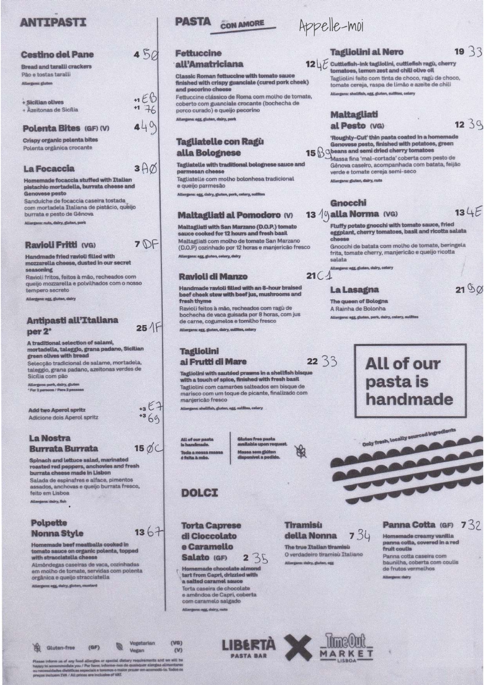
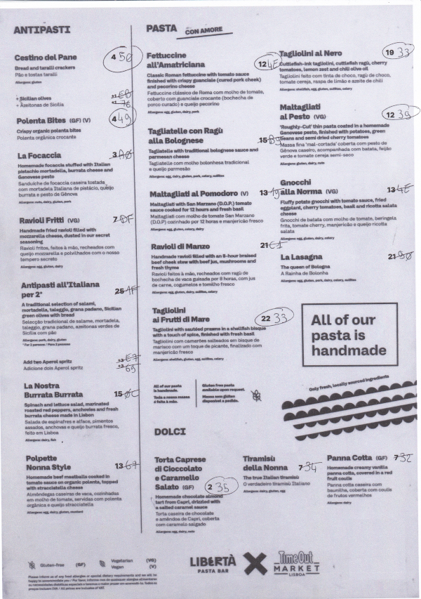
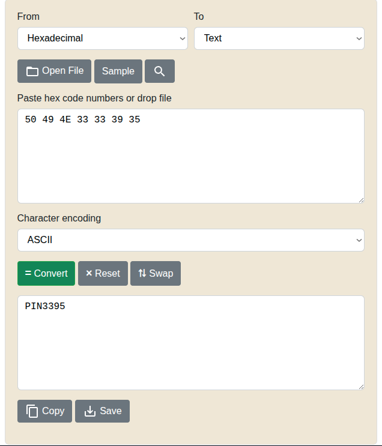

# Challenge : Pringles CanOpen

## Informations du challenge

| Catégorie | Difficulté | Points | Auteur |
|-----------|------------|--------|--------|
| Misc, OSINT | Moyen | 200 | Geistnigma |

**Preuve :** `3395`

---

## Résumé

Ce challenge vise à décoder un message caché dans un menu.
Deux étapes sont nécessaires pour cette analyse :

1. Analyse du menu : identification des `lucky numbers`
2. Décodage du message et récupération de la preuve

---

## Étape 1 : Analyse du menu — **lucky numbers**

Dans un premier temps, il faut récupérer le menu du restaurant présent dans le Proton Drive de Miguel (https://drive.proton.me/urls/X8GMZPNV74#GFhopliaf5M7).

En haut à droite, une annotation **Appelle moi** ; sachant qu'il y a un tag `actif` sur l'énoncé du challenge, nous en déduisons qu'il faut appeler
le numéro de Miguel (seul numéro en notre possession à ce stade de l'enquête) : (`06 70 54 54 18`).
Sur le répondeur téléphonique, une voix familière, celle de Henri NAPOLINO (ce dernier a donné sa ligne téléphonique française à Miguel en oubliant de modifier
le message vocal de son répondeur). Le message indique :

 `Mon grand-père italien me disait toujours, au restaurant : "La chance n'a pas sa place ici"`

### Analyse

En observant le menu, on remarque qu'à côté de chaque prix, un code hexadécimal manuscrit est présent. En corrélant la phrase indice et le menu, on peut arriver à l'hypothèse suivante.

**« La chance »**

Chance + chiffres présents sur le menu = nombres chanceux (lucky numbers).

**« N'a pas sa place ici »**

Cela sous-entend que la suite des lucky numbers doit être écartée du menu.

En regardant sur Internet, nous trouvons rapidement la suite de ces chiffres (https://oeis.org/wiki/Lucky_numbers).

Nous allons donc barrer les chiffres présents dans la suite des lucky numbers.

---

## Étape 2 : Décodage et récupération de la preuve

Après avoir retiré les lucky numbers, il nous reste les prix suivants, qui forment les nombres consécutifs suivants :

* 4 (0x50)
* 4 (0x49)
* 12 (0x4E)
* 22 (0x33)
* 19 (0x33)
* 12 (0x39)
* 2 (0x35)

Soit la chaîne hexadécimale :

 `50 49 4E 33 33 39 35`

Nous allons donc convertir celle-ci en ASCII grâce à l'outil en ligne RapidTables
 (https://www.rapidtables.com/convert/number/hex-to-ascii.html).

---

### Résultat

Nous avons ainsi trouvé le code. Par ailleurs, cela ne vous rappelle-t-il rien ? Il s'agit du numéro de licence d'autorisation de vol de l'avion vu lors du challenge « Rendez-vous avec l'histoire ».

✅ **Preuve :** `3395`

**PS :** Ce challenge est inspiré de la série Mr. Robot (S02E11).
