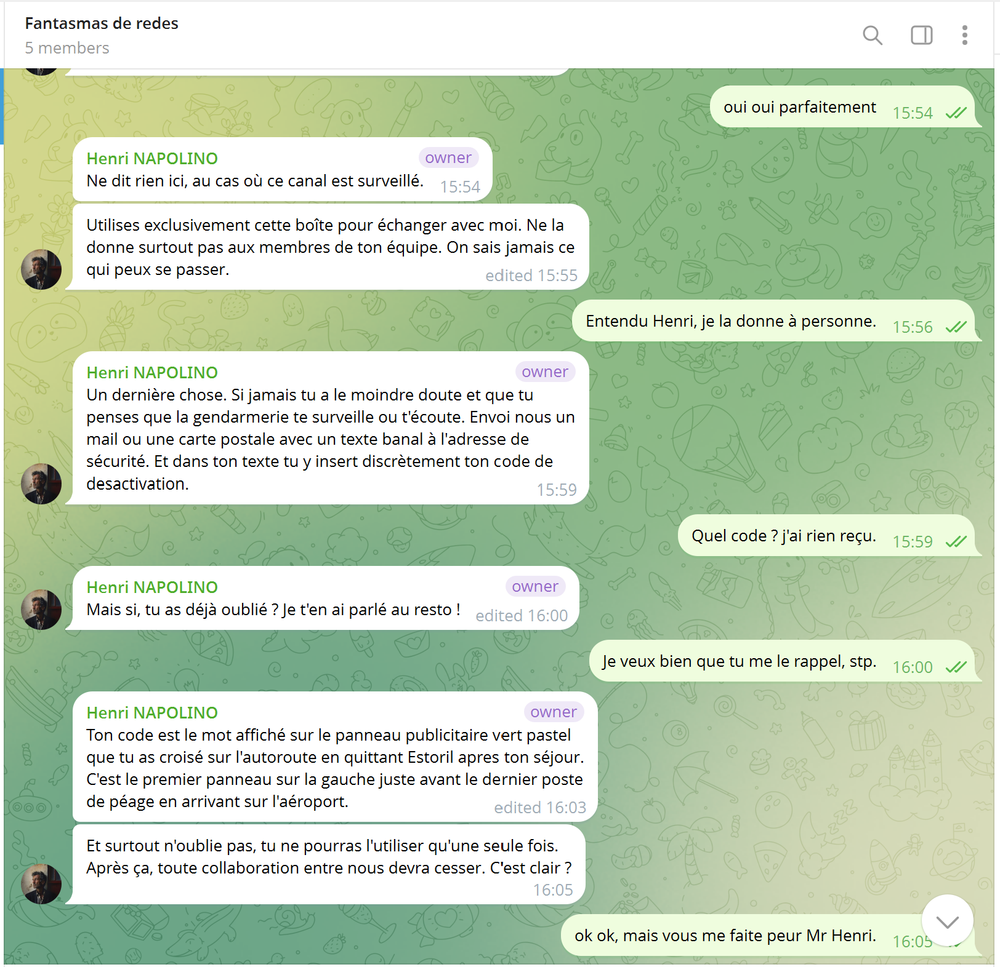
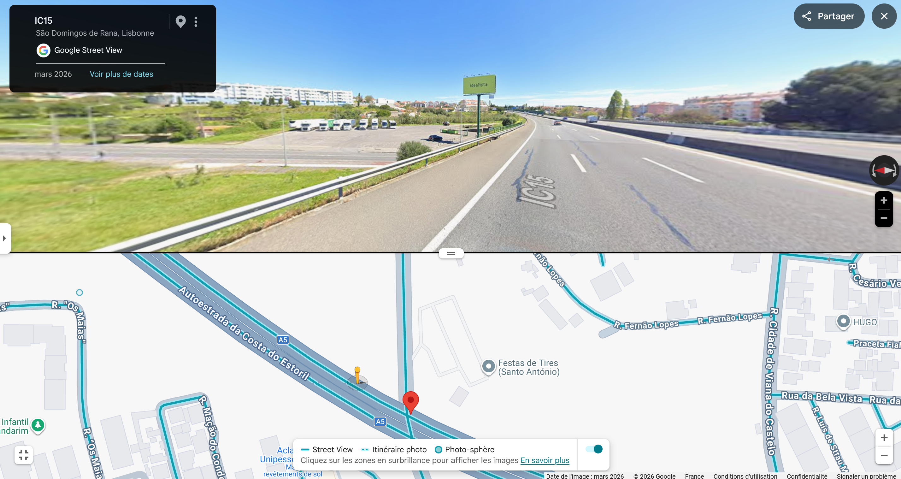
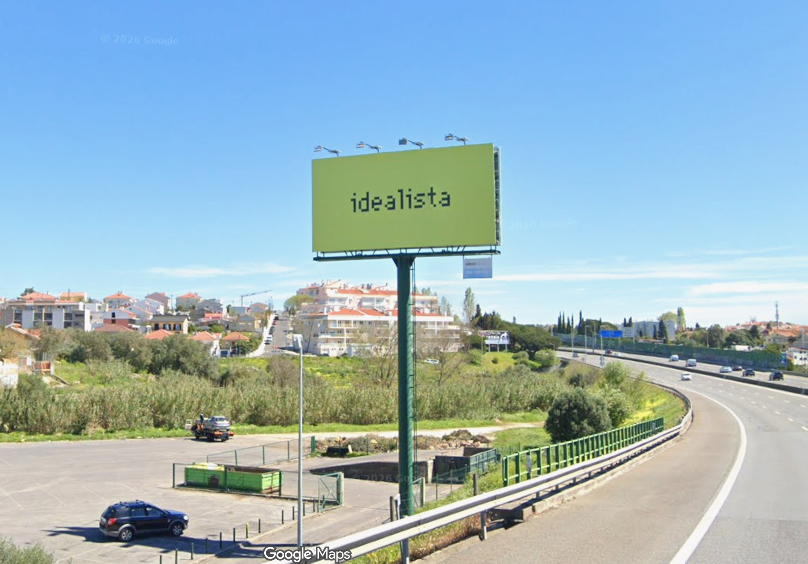

# Challenge : Shutdown

## Informations du challenge

| Catégorie | Difficulté | Points | Auteur |
|-----------|------------|--------|--------|
| GeoInt | Moyen | 300 | B3cha |

**Preuve :** `idealista` (insensible à la casse)

# Résumé

Dans ce challenge, il faut commencer par trouver les consignes fournies par Henri sur le groupe Telegram de `Fantasmas-de-Redes`,
puis appliquer les consignes de recherche sur Google Maps pour réussir à localiser le panneau publicitaire.

# Identification des consignes de désactivation

## Le groupe Telegram Fantasmas-de-Redes

En recherchant sur Telegram avec le nom du groupe `Fantasmas-de-Redes`, le compte Telegram de **Henri Napolino** ressort,
avec comme pseudo `@CEO_Fantasmas_De_Redes`. Sur son profil, il y a une photo de lui et une image du logo du groupe
**Fantasmas-de-Redes** ; téléchargeons cette photo pour l'analyser. Elle présente en bas de l'image un début de texte, `F4nt45maS2`, le reste n'apparaît pas.
On peut penser que c'est le mot `Redes` en leetspeak.


En recherchant sur Telegram avec la chaîne `F4nt45maS2`, un groupe apparaît, t.me/F4nt45maS2R3dEs : il s'agit du groupe d'échanges
des membres importants de Fantasmas-de-Redes.
Sur ce groupe Telegram, un échange intéressant entre Henri et Miguel :



Henri indique clairement l'emplacement du panneau contenant le mot-clé de désactivation de Miguel à envoyer sur la boîte à lettres
morte :

```shell
 Ton code est le mot affiché sur le panneau publicitaire vert pastel que tu as croisé 
 sur l'autoroute en quittant Estoril apres ton séjour. C'est le premier panneau sur 
 la gauche juste avant le dernier poste de péage en arrivant sur l'aéroport.
```

# Identification du panneau publicitaire

On commence par localiser le dernier poste de péage avant l'arrivée à l'aéroport de Lisbonne. Pour cela, il faut faire un
itinéraire Google Maps **Estoril -> Lisbonne** et suivre l'autoroute A5.


À la hauteur du repère `IC15`, le dernier poste de péage apparaît :


Passons sur Google Street View et remontons l'autoroute dans le sens Lisbonne -> Estoril, à l'emplacement GPS `38°42'32" N 9°20'53" W`.
Juste avant l'échangeur, et en prenant soin de se retourner (dans le sens opposé de la circulation), le panneau publicitaire vert pastel apparaît sur une photo de **mars 2026** :



En zoomant sur le panneau, le mot-clé `Idealista` est clairement inscrit.



C'est bien le flag recherché.

---

## Résultat

La solution de notre challenge est donc le mot inscrit sur le panneau publicitaire.

✅ **Preuve :** `idealista`
