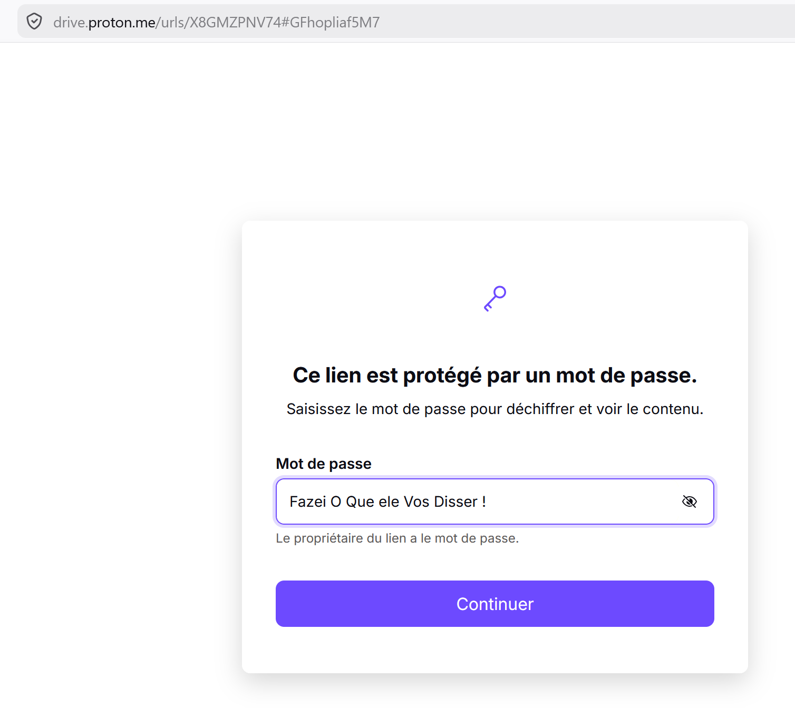
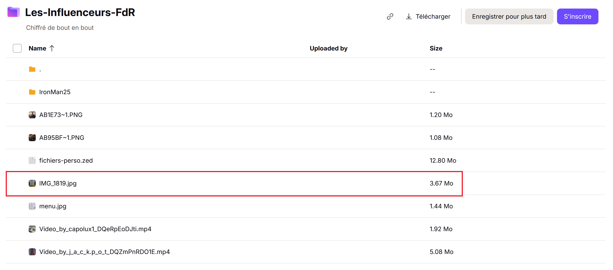
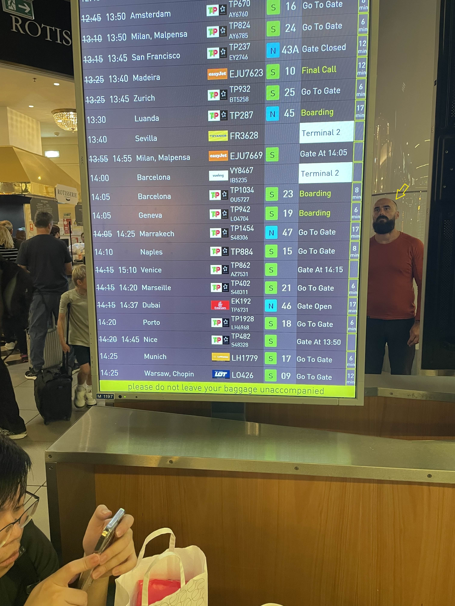

# Challenge : Sous haute surveillance

## Informations du challenge

| Catégorie | Difficulté | Points | Auteur |
|-----------|------------|--------|--------|
| Osint | Moyen | 200 | B3cha |

**Preuve :** `chauve-barbe`

---

## Résumé

Ce challenge nécessite de retrouver la photo prise discrètement par **Miguel** de la personne qui le suit.
Cette photo est disponible sur le Proton Drive de Miguel (https://drive.proton.me/urls/X8GMZPNV74#GFhopliaf5M7),
retrouvé lors du challenge `Lutte d'influence`.

### Accéder au Proton Drive

Lors du challenge `Lutte d'influence`, nous avons découvert le Proton Drive de Miguel :
https://drive.proton.me/urls/X8GMZPNV74#GFhopliaf5M7

Celui-ci exige un mot de passe. En s'appuyant sur l'ensemble des mots de passe et passphrases collectés lors des précédents challenges,
on découvre que le mot de passe n'est rien d'autre que le flag du challenge `Mail empoisonné` en minuscule : **Fazei O Que ele Vos Disser !**

On retrouve ce mot de passe inscrit en noir sur noir (80 %) sur la dernière ligne du Briefing Mission `Opération vérité` reçu par mail
lors du démarrage du CTE.

Une fois l'accès au contenu du dossier obtenu, c'est le fichier image `IMG_1819.jpg` qui nous intéresse :

En regardant avec précision, on constate que Miguel a réussi à prendre discrètement la photo de la personne qui le suit :

Il s'agit d'une personne de type européen, crâne rasé (chauve) avec une barbe.
Le challenge demande les éléments distinctifs du visage :

1. Coupe de cheveux : **chauve**
2. Visage : **barbe** (l'exemple de flag propose `bouc`).

En formant le flag, on obtient `chauve-barbe`, preuve insensible à la casse.

## Résultat

La solution de notre challenge est donc le reflet de la personne devant le panneau d'affichage de la salle d'embarquement.

✅ **Preuve :** `chauve-barbe`
