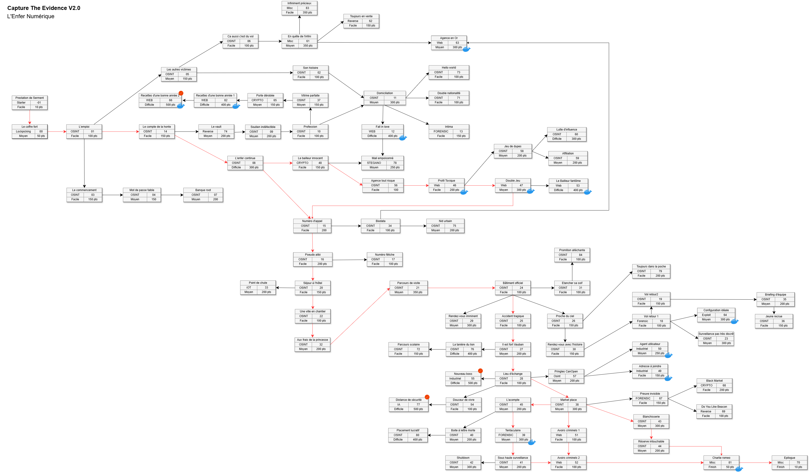

---

---

Solutions des challenges du CTEv2 : "L'Enfer Numérique"

[EternalBlue CTF Team](https://eternalblue.team)

---

# A la porte
| **Challenge**                                                   | **Auteur**    | **Catégorie** | **Difficulté** | **Résolutions** |
| --------------------------------------------------------------- | ------------- | ------------- | -------------- | --------------- |
| [PrestationDeSerment](./ALaPorte/PrestationDeSerment/README.md) | B3cha         | lecture       | facile         |                 |
| [LeCoffreFort](./ALaPorte/LeCoffreFort/README.md)               | B3cha & Gearz | osint         | moyen          |                 |

# Bienvenue en enfer
| **Challenge**                                                       | **Auteur** | **Catégorie**  | **Difficulté** | **Résolutions** |
| ------------------------------------------------------------------- | ---------- | -------------- | -------------- | --------------- |
| [LEmploi](./BienvenueEnEnfer/LEmploi/README.md)                     | B3cha      | osint          | facile         |                 |
| [LeCommencement](./BienvenueEnEnfer/LeCommencement/README.md)       | B3cha      | osint          | facile         |                 |
| [MotDePasseFaible](./BienvenueEnEnfer/MotDePasseFaible/README.md)   | B3cha      | osint & crypto | facile         |                 |
| [BanqueRoot](./BienvenueEnEnfer/BanqueRoot/README.md)               | B3cha      | osint          | moyen          |                 |
| [LeCompteDeLaHonte](./BienvenueEnEnfer/LeCompteDeLaHonte/README.md) | B3cha      | osint          | facile         |                 |
| [LesAutresVictimes](./BienvenueEnEnfer/LesAutresVictimes/README.md) | B3cha      | osint          | moyen          |                 |
| [CaAussiCEstDuVol](./BienvenueEnEnfer/CaAussiCEstDuVol/README.md)   | B3cha      | osint          | facile         |                 |
| [SonHistoire](./BienvenueEnEnfer/SonHistoire/README.md)             | B3cha      | osint          | facile         |                 |
| [LEnferContinue](./BienvenueEnEnfer/LEnferContinue/README.md)       | B3cha      | osint          | difficile      |                 |

# Conseils d'un ami
| **Challenge**                                                         | **Auteur** | **Catégorie**      | **Difficulté** | **Résolutions** |
| --------------------------------------------------------------------- | ---------- | ------------------ | -------------- | --------------- |
| [Domiciliation](./ConseilsDUnAmi/Domiciliation/README.md)             | B3cha      | osint              | moyen          |                 |
| [DoubleNationalite](./ConseilsDUnAmi/DoubleNationalite/README.md)     | B3cha      | osint              | facile         |                 |
| [FallInLove](./ConseilsDUnAmi/FallInLove/README.md)                   | Rooting    | web                | moyen          |                 |
| [HelloWorld](./ConseilsDUnAmi/HelloWorld/README.md)                   | B3cha      | osint              | facile         |                 |
| [Intima](./ConseilsDUnAmi/Intima/README.md)                           | Cryptax    | reverse & forensic | facile         |                 |
| [LeVault](./ConseilsDUnAmi/LeVault/README.md)                         | RORO!      | reverse & python   | moyen          |                 |
| [MailEmpoisonne](./ConseilsDUnAmi/MailEmploisonne/README.md)          | B3cha      | forensic & stegano | moyen          |                 |
| [Profession](./ConseilsDUnAmi/Profession/README.md)                   | B3cha      | osint              | facile         |                 |
| [SoutienIndefectible](./ConseilsDUnAmi/SoutienIndefectible/README.md) | B3cha      | osint              | moyen          |                 |

# Ennemis de l'intérieur
| **Challenge**                                                            | **Auteur** | **Catégorie**  | **Difficulté** | **Résolutions** |
| ------------------------------------------------------------------------ | ---------- | -------------- | -------------- | --------------- |
| [AgenceToutRisque](./EnnemisDeLInterieur/AgenceToutRisque/README.md)     | B3cha      | osint          | facile         |                 |
| [DoubleJeu](./EnnemisDeLInterieur/DoubleJeu/README.md)                   | YoyoChaud  | web            | moyen          |                 |
| [LeBailleurFantome](./EnnemisDeLInterieur/LeBailleurFantome/README.md)   | YoyoChaud  | web            | difficile      |                 |
| [LeBailleurInnocent](./EnnemisDeLInterieur/LeBailleurInnocent/README.md) | B3cha      | osint & crypto | facile         |                 |
| [ProfilToxique](./EnnemisDeLInterieur/ProfilToxique/README.md)           | YoyoChaud  | web            | facile         |                 |

# Phantômes du net
| **Challenge**                                                | **Auteur** | **Catégorie**       | **Difficulté** | **Résolutions** |
| ------------------------------------------------------------ | ---------- | ------------------- | -------------- | --------------- |
| [Affiliation](./FantomesDuNet/Affiliation/README.md)         | B3cha      | Socmint & actif     | moyen          |                 |
| [JeuDeDupes](./FantomesDuNet/JeuDeDupes/README.md)           | B3cha      | Socmint & GoogleInt | moyen          |                 |
| [LutteDInfluence](./FantomesDuNet/LutteDInfluence/README.md) | B3cha      | osint               | difficile      |                 |

# Fixeur
| **Challenge**                                                                   | **Auteur**              | **Catégorie**              | **Difficulté** | **Résolutions** |
| ------------------------------------------------------------------------------- | ----------------------- | -------------------------- | -------------- | --------------- |
| [AccidentTragique](./Fixeur/AccidentTragique/README.md)                         | B3cha                   | osint                      | facile         |                 |
| [AuxFraisDeLaPrincesse](./Fixeur/AuxFraisDeLaPrincesse/README.md)               | B3cha                   | ImInt & GoogleInt          | facile         |                 |
| [BatimentOfficiel](./Fixeur/BatimentOfficiel/README.md)                         | B3cha                   | osint                      | facile         |                 |
| [Biodata](./Fixeur/Biodata/README.md)                                           | B3cha                   | osint                      | facile         |                 |
| [BriefingDEquipe](./Fixeur/BriefingDEquipe/README.md)                           | Hekct                   | SocMint & GeoInt           | facile         |                 |
| [DistanceDeSecurite](./Fixeur/DistanceDeSecurite/README.md)                     | Sp3ctralFlow & map_hack | IA                         | difficile      |                 |
| [EtancherSaSoif](./Fixeur/EtancherSaSoif/README.md)                             | B3cha                   | SocMint & GeoInt           | facile         |                 |
| [IlEstFortVauban](./Fixeur/IlEstFortVauban/README.md)                           | B3cha                   | GeoInt                     | moyen          |                 |
| [JeuneRecrue](./Fixeur/JeuneRecrue/README.md)                                   | Debunk                  | SocMint                    | facile         |                 |
| [LieuDEchange](./Fixeur/LieuDEchange/README.md)                                 | B3cha                   | osint                      | facile         |                 |
| [NidUrbain](./Fixeur/NidUrbain/README.md)                                       | DeBunk                  | osint                      | moyen          |                 |
| [NumeroDAppel](./Fixeur/NumeroDAppel/README.md)                                 | B3cha                   | SocMint                    | facile         |                 |
| [NumeroFetiche](./Fixeur/NumeroFetiche/README.md)                               | B3cha                   | GoogleInt                  | facile         |                 |
| [ParcoursDeVisite](./Fixeur/ParcoursDeVisite/README.md)                         | B3cha                   | osint                      | moyen          |                 |
| [ParcoursScolaire](./Fixeur/ParcoursScolaire/README.md)                         | B3cha                   | osint & Deep web           | facile         |                 |
| [PointDeChute](./Fixeur/PointDeChute/README.md)                                 | Samy & B3cha            | IoT & forensic             | moyen          |                 |
| [ProcheDuCiel](./Fixeur/ProcheDuCiel/README.md)                                 | B3cha                   | osint                      | facile         |                 |
| [PseudoAlibi](./Fixeur/PseudoAlibi/README.md)                                   | B3cha                   | SocMint                    | facile         |                 |
| [RendezVousAvecLHistoire](./Fixeur/RendezVousAvecLHistoire/README.md)           | B3cha                   | SocMint & GeoInt           | facile         |                 |
| [RendezVousImminent](./Fixeur/RendezVousImminent/README.md)                     | B3cha                   | osint                      | moyen          |                 |
| [SejourALHotel](./Fixeur/SejourALHotel/README.md)                               | B3cha                   | GoogleInt                  | facile         |                 |
| [SurveillancePasTresDiescrete](./Fixeur/SurveillancePasTresDiescrete/README.md) | B3cha                   | moyen                      | facile         |                 |
| [ToujoursDansLaPoche](./Fixeur/ToujoursDansLaPoche/README.md)                   | B3cha                   | osint                      | moyen          |                 |
| [UneVilleEnChantier](./Fixeur/UneVilleEnChantier/README.md)                     | B3cha                   | osint                      | facile         |                 |
| [VolRetour1](./Fixeur/VolRetour1/README.md)                                     | B3cha                   | osint & stegano & forensic | facile         |                 |
| [VolRetour2](./Fixeur/VolRetour2/README.md)                                     | B3cha                   | osint                      | facile         |                 |

# Groupe organisé
| **Challenge**                                                       | **Auteur** | **Catégorie** | **Difficulté** |
| ------------------------------------------------------------------- | ---------- | ------------- | -------------- |
| [AgenceEnOr](./GroupeOrganise/AgenceEnOr/README.md)                 | YoyoChaud  | Web & crypto  | moyen          |
| [EnQueteDeLInfini](./GroupeOrganise/EnQueteDeLInfini/README.md)     | Vaskange   | osint & misc  | moyen          |
| [ToujoursEnVente](./GroupeOrganise/ToujoursEnVente/README.md)       | Miaou      | reverse       | moyen          |
| [InfinimentPrecieux](./GroupeOrganise/InfinimentPrecieux/README.md) | Vaskange   | osint & misc  | moyen          |

# Haut du spectre
| **Challenge**                                                              | **Auteur** | **Catégorie**     | **Difficulté** | **Résolutions** |
| -------------------------------------------------------------------------- | ---------- | ----------------- | -------------- | --------------- |
| [AdresseAJoindre](./HautDuSpectre/AdresseAJoindre/README.md)               | B3cha      | Indus & OPCUA     | facile         |                 |
| [AgentUtilisateur](./HautDuSpectre/AgentUtilisateur/README.md)             | B3cha      | Indus & OPCUA     | moyen          |                 |
| [ConfigurationIdeale](./HautDuSpectre/ConfigurationIdeale/README.md)       | YoyoChaud  | exploitation      | moyen          |                 |
| [PorteDerobee](./HautDuSpectre/PorteDerobee/README.md)                     | B3cha      | Forensic & crypto | facile         |                 |
| [RecetteDUneBonneannee1](./HautDuSpectre/RecetteDUneBonneannee1/README.md) | bUst4gr0   | web               | difficile      |                 |
| [RecetteDUneBonneannee2](./HautDuSpectre/RecetteDUneBonneannee2/README.md) | bUst4gr0   | web               | difficile      |                 |
| [VitrineParfaite](./HautDuSpectre/VitrineParfaite/README.md)               | B3cha      | GoogleInt         | facile         |                 |

# Kit complet
| **Challenge**                                             | **Auteur** | **Catégorie** | **Difficulté** | **Résolutions** |
| --------------------------------------------------------- | ---------- | ------------- | -------------- | --------------- |
| [BlackMarket](./KitComplet/BlackMarket/README.md)         | Miaou      | Crypto        | moyen          |                 |
| [DoYouLikeBeacon](./KitComplet/DoYouLikeBeacon/README.md) | Geistnigma | reverse       | facile         |                 |
| [PreuveInvisible](./KitComplet/PreuveInvisible/README.md) | B3cha      | IA & ImInt    | facile         |                 |

# Organisation criminelle
| **Challenge**                                                                     | **Auteur** | **Catégorie**        | **Difficulté** | **Résolutions** |
| --------------------------------------------------------------------------------- | ---------- | -------------------- | -------------- | --------------- |
| [BoiteALettreMorte](./OrganisationCriminelle/BoiteAlettreMorte/README.md)         | B3cha      | osint                | moyen          |                 |
| [DouceurDeVivre](./OrganisationCriminelle/DouceurDeVivre/README.md)               | B3cha      | SocMint              | facile         |                 |
| [MarketPlace](./OrganisationCriminelle/MarketPlace/README.md)                     | B3cha      | osint & stegano      | moyen          |                 |
| [PringlesCanOpen](./OrganisationCriminelle/PringlesCanOpen/README.md)             | Geistnigma | Misc & osint & actif | moyen          |                 |
| [Shutdown](./OrganisationCriminelle/Shutdown/README.md)                           | B3cha      | GeoInt               | moyen          |                 |
| [SousHautesurveillance](./OrganisationCriminelle/SousHautesurveillance/README.md) | B3cha      | osint                | moyen          |                 |
| [Tentaculaire](./OrganisationCriminelle/Tentaculaire/README.md)                   | RORO!      | web & forensic       | moyen          |                 |

# Réseaux financiers
| **Challenge**                                                          | **Auteur**  | **Catégorie** | **Difficulté** | **Résolutions** |
| ---------------------------------------------------------------------- | ----------- | ------------- | -------------- | --------------- |
| [AvoirsCriminels1](./ReseauxFinanciers/AvoirsCriminels1/README.md)     | Geinstnigma | Web           | facile         |                 |
| [AvoirsCriminels2](./ReseauxFinanciers/AvoirsCriminels2/README.md)     | Geinstnigma | Web           | facile         |                 |
| [Blanchisserie](./ReseauxFinanciers/Blanchisserie/README.md)           | B3cha       | osint         | moyen          |                 |
| [LAcompte](./ReseauxFinanciers/LAcompte/README.md)                     | B3cha       | osint         | moyen          |                 |
| [LaTaniereDuLion](./ReseauxFinanciers/LaTaniereDuLion/README.md)       | map_hack    | osint         | difficile      |                 |
| [NouveauBoss](./ReseauxFinanciers/NouveauBoss/README.md)               | WaRRioROXY  | Indus & OPCUA | difficile      |                 |
| [PlacementLucratif](./ReseauxFinanciers/PlacementLucratif/README.md)   | B3cha       | osint         | difficile      |                 |
| [ReserveIntouchable](./ReseauxFinanciers/ReserveIntouchable/README.md) | B3cha       | GeoInt        | moyen          |                 |

# Tout à une fin
| **Challenge**                                        | **Auteur** | **Catégorie** | **Difficulté** | **Résolutions** |
| ---------------------------------------------------- | ---------- | ------------- | -------------- | --------------- |
| [CharlieRomeo](./ToutAUneFin/CharlieRomeo/README.md) | YoyoChaud  | Misc          | facile         |                 |
| [Epilogue](./ToutAUneFin/Epilogue/README.md)         | B3cha      | Epilogue      | facile         |                 |

