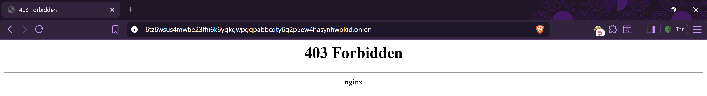
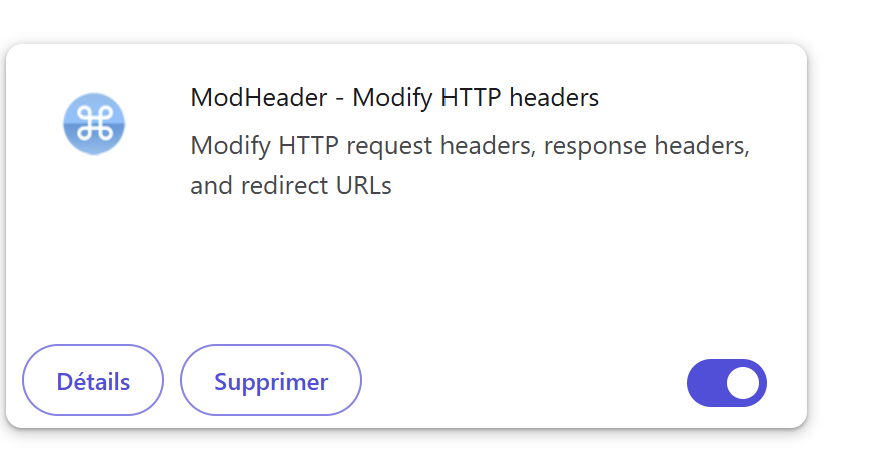
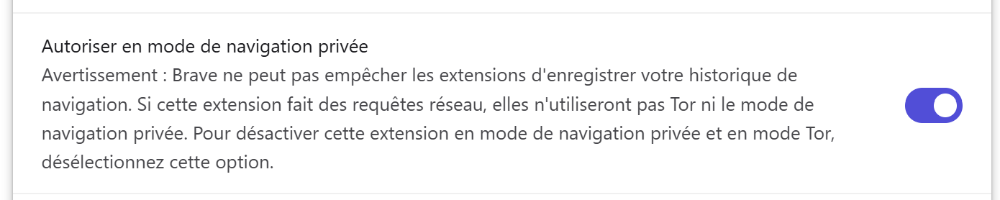
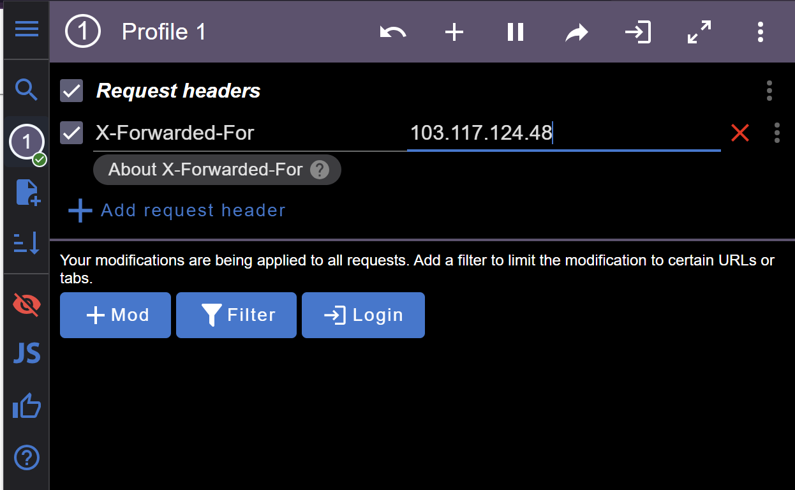
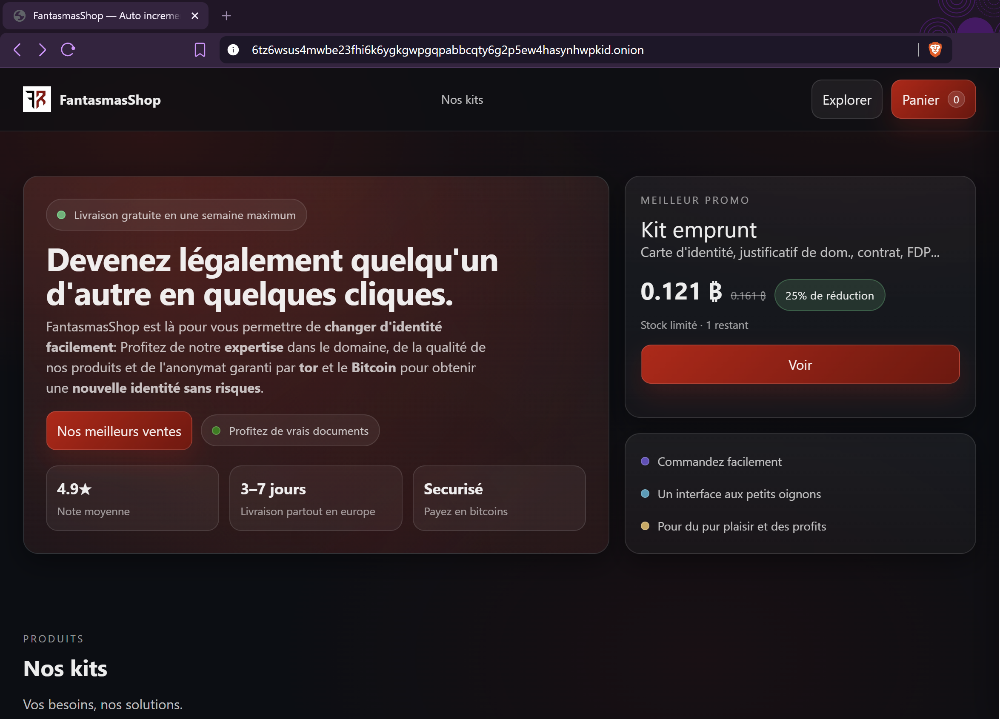
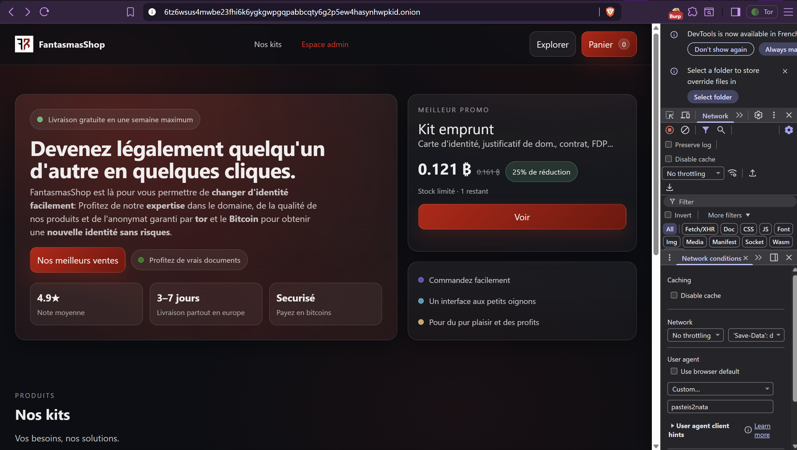
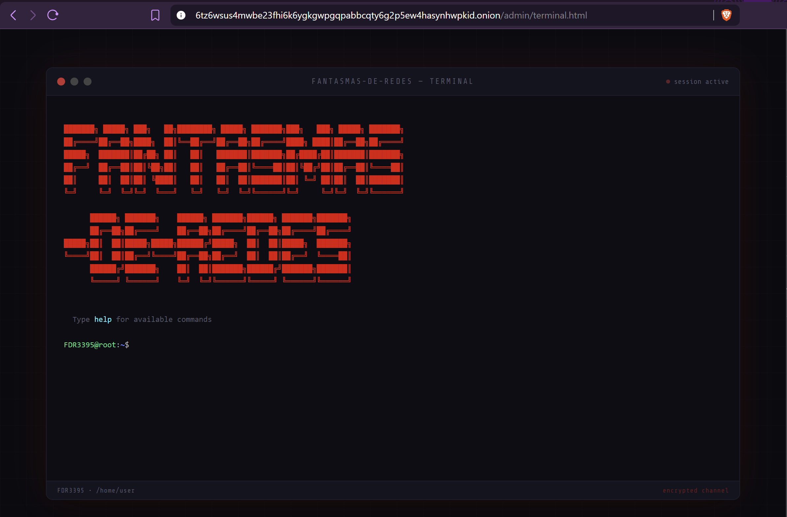
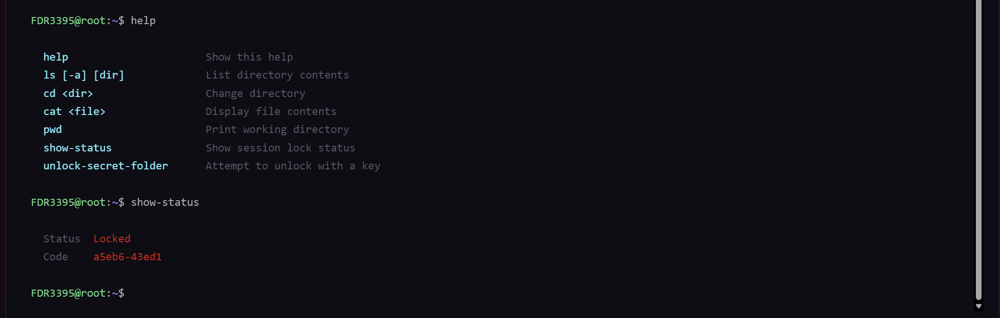
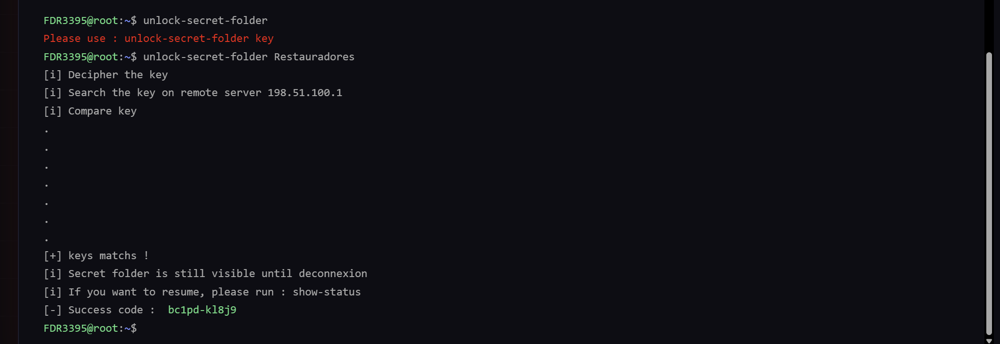
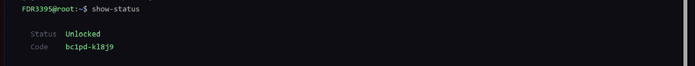

# Challenge : Avoirs criminels 1

## Informations du challenge

| Catégorie | Difficulté | Points | Auteur |
|-----------|------------|--------|--------|
| Osint | Facile | 150 | Geistnigma |

**Preuve :** `bc1pd-kl8j9` (case sensitive)

---

## Résumé

Ce challenge nécessite de franchir deux principaux obstacles et d'utiliser la bonne passphrase.

1. **103.117.124.48** — utiliser une adresse IP portugaise dans la variable `X-Forwarded-For` du header
2. **pasteis2nata** — réutiliser le `user-agent` trouvé lors du challenge **Agent utilisateur** ou **Douceur de vivre**
3. **Restauradores** — réutiliser la preuve du challenge `Accident tragique` comme mot de passe pour déverrouiller l'accès à la preuve

---

## Étape 1 : Spoofing IP

Pour accéder à l'adresse **.onion** du challenge `6tz6wsus4mwbe23fhi6k6ygkgwpgqpabbcqty6g2p5ew4hasynhwpkid.onion`, il est possible
d'utiliser soit le navigateur `Tor`, soit `Brave` avec l'option navigation privée :

Le mot sous le message d'accès interdit (403 Forbidden) indique **nginx** ; il y a donc probablement un filtrage via le `proxy`.
Les propriétaires du site web affichent un code 403 (accès interdit) pour dissuader les curieux. En réalité, un 428 aurait été plus adapté, mais sur le dark web le flou règne en maître.
En première intention, nous pensons à un filtrage par **adresses IP** et VPN. Or le fonctionnement de Tor ne permet justement
pas un filtrage par adresse IP. Une rapide recherche sur Internet indique qu'il est possible d'effectuer
un spoofing d'adresse IP (challenge web) en modifiant la variable `X-Forwarded-For` (technique de base en web).

Afin de permettre cette modification dans le navigateur **Tor**, il est nécessaire d'installer une extension.
Il en existe plusieurs ; dans notre cas, nous décidons d'installer `ModHeader` :

Il faut bien penser à **Autoriser en mode de navigation privée** ; pour cela, cochez la case suivante :

Puis il faut paramétrer la variable `X-Forwarded-For` :

Une fois la page rechargée, le Marketplace de **Fantasmas de Redes** s'affiche :

L'analyse de la page permet d'identifier les kits d'identité vendus par Fantasmas de Redes sur leur Marketplace.
Il y a également le crypto wallet de Fantasmas : `bc1pdwu79dady576y3fupmm82m3g7p2p9f6hgyeqy0tdg7ztxg7xrayqlkl8j9`
comme modalité de paiement possible (en bas de la page d'accueil du site).

---

## Étape 2 : User-agent personnalisé

La résolution du challenge `Agent utilisateur` nous permet de trouver le flag **pasteis2nata** ; nous allons l'utiliser
pour voir s'il y a des changements sur le site web :

La configuration du `user-agent` avec la valeur **pastenie2nata** permet d'afficher un bouton/menu caché nommé **Espace admin**.

Ce dernier affiche un terminal simulé de **Fantasmas de Redes** :

---

## Étape 3 : navigation dans le terminal

Le terminal propose une commande `help` ; il est possible d'afficher le code source du `terminal.js`, où la liste des commandes figure.

- **help :** affiche la liste des commandes possibles
- **ls :** liste le contenu d'un dossier
- **cd :** permet de changer de dossier
- **cat :** affiche le contenu d'un fichier
- **pwd :** affiche le chemin absolu du dossier courant
- **show-status :** affiche la session en cours et son statut
- **unlock-secret-folder :** permet de débloquer un dossier caché

La commande `show-status` indique un dossier verrouillé et affiche un code retour **a5eb6-43ed1** (ceci nous rappelle le numéro de
transaction observé dans le challenge `L'acompte`).

La commande `unlock-secret-folder` exige une **clé**. Pour résoudre cette partie, nous décidons d'utiliser la liste de
tous les précédents flags découverts comme wordlist (conseil donné sur le serveur Discord du CTE).

**Bingo !** Le nom de la station `Restauradores` découvert lors du challenge **Accident tragique** permet de débloquer la situation :

Le déblocage indique une connexion à un serveur distant `198.51.100.1` et un code retour **bc1pd-kl8j9** qui n'est rien d'autre
que le numéro de transaction du compte crypto-monnaie de Miguel découvert lors du challenge `L'acompte`.

Nous avons ainsi trouvé la preuve attendue pour résoudre ce challenge.

---

### Résultat

✅ **Preuve :** `bc1pd-kl8j9`
