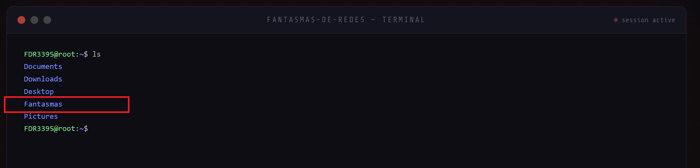
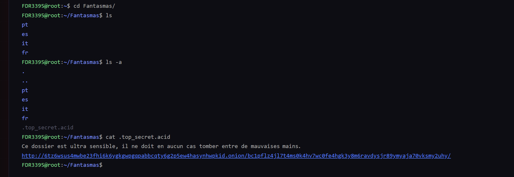
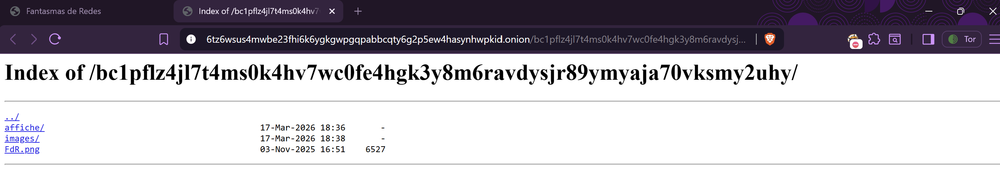
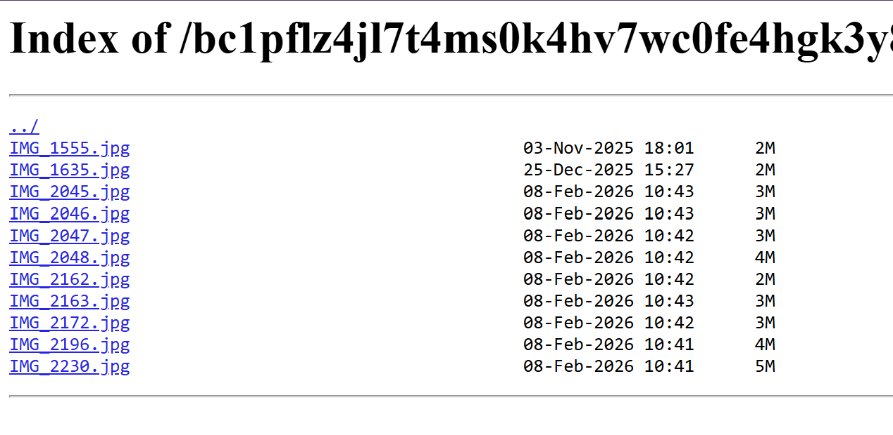
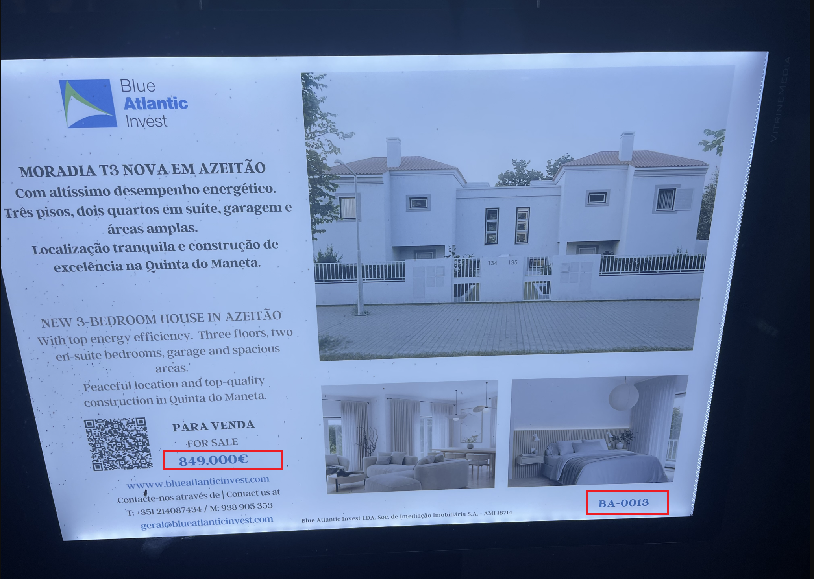
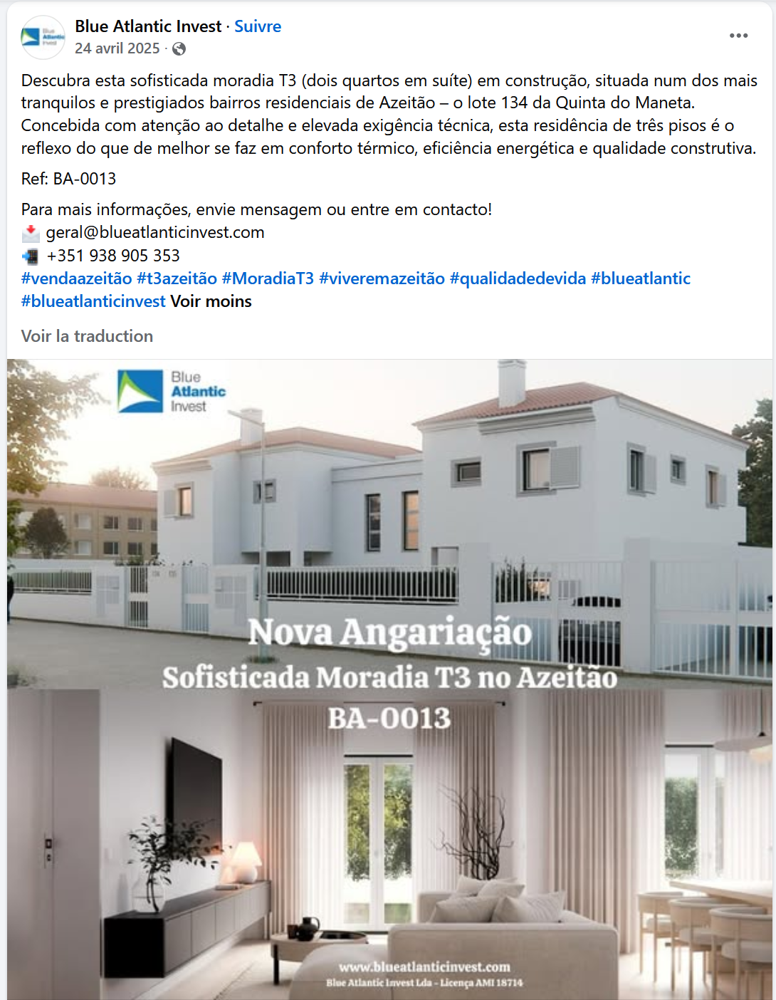
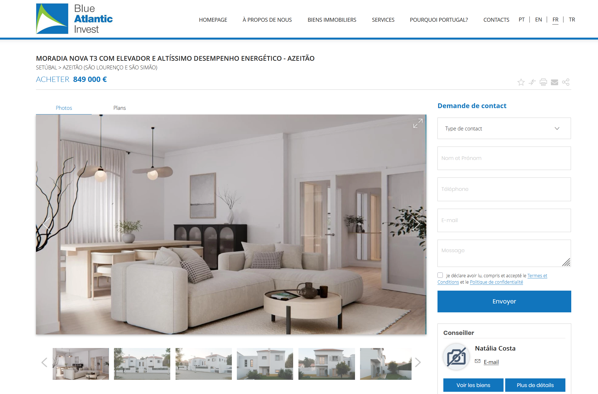

# Challenge : Avoirs criminels 2

## Informations du challenge

| Catégorie | Difficulté | Points | Auteur |
|-----------|------------|--------|--------|
| Osint | Facile | 150 | Geistnigma |

**Preuve :** `849.000€` (case sensitive)

---

## Résumé

Ce challenge facile nécessite la résolution du challenge `Avoirs criminels 1` ou du challenge `Blanchisserie`.

---

## Méthode 1 : menu Darkweb caché

Ce challenge s'inscrit dans la continuité du précédent, `Avoirs criminels 1`.
Le déblocage de celui-ci a permis l'apparition d'un nouveau dossier caché, `Fantasmas` :

Il faut ensuite se placer dans ce dossier et afficher son contenu avec la commande `ls -a` (vous remarquerez que toutes
les commandes Linux classiques ne sont pas implémentées : par exemple, `ls -ail` n'existe pas).

Un fichier nommé `.top_secret.acid` apparaît ; l'ouvrir avec la commande `cat` permet de dévoiler une URL :
http://6tz6wsus4mwbe23fhi6k6ygkgwpgqpabbcqty6g2p5ew4hasynhwpkid.onion/bc1pflz4jl7t4ms0k4hv7wc0fe4hgk3y8m6ravdysjr89ymyaja70vksmy2uhy/

Le dossier `bc1pflz4jl7t4ms0k4hv7wc0fe4hgk3y8m6ravdysjr89ymyaja70vksmy2uhy` n'est rien d'autre que l'adresse BTC du compte
`Bech32` vue lors du challenge `L'acompte`.
En se rendant sur cette URL, elle contient :

1. un dossier **affiche**
2. un dossier **images**
3. un fichier **FdR.png**

Le contenu du dossier `images` est le suivant :

La preuve recherchée se situe dans l'image **IMG_1555.jpg** :

La référence de l'annonce **Ref. BA-0013** présente une belle villa aux numéros 134 et 135, d'un montant de `849.000€`.

---

## Méthode 2 : recherche de l'annonce sur l'agence Blue Atlantic Invest

La deuxième technique pour trouver la réponse à ce challenge consiste en une rapide recherche sur votre navigateur favori
avec les mots-clés suivants : `Réf. BA-0013 + Blue Atlantic Invest`, le nom d'agence trouvé lors du challenge `Blanchisserie`.
https://www.facebook.com/profile/100076298495074/

Il faut ensuite se rendre sur le site de l'agence d'investissement et rechercher la villa avec la même référence :
http://www.blueatlanticinvest.com/fr-fr/bien-immobilier/moradia-nova-t3-com-elevador-e-altissimo-desempenho-energetico-azeitao/23688735

Le montant est affiché sur le site de l'agence : **849.000€**.

Il est nécessaire de trouver l'image de cette villa sur le site **Marketplace** de Fantasmas-de-Redes pour avoir une confirmation.

---

### Résultat

✅ **Preuve :** `849.000€`
