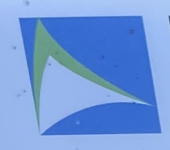
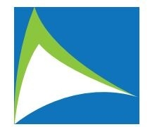
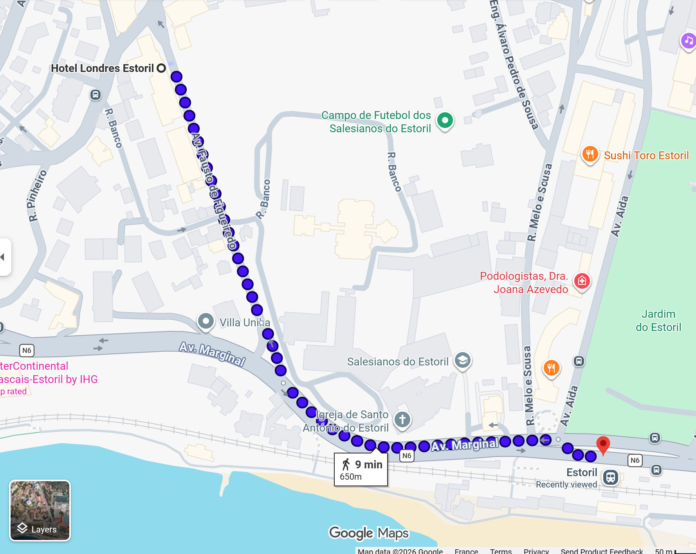
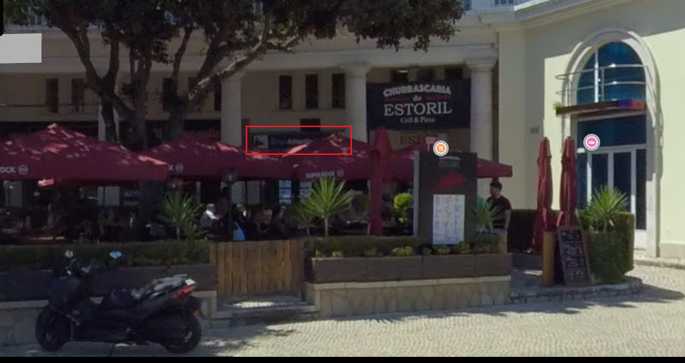
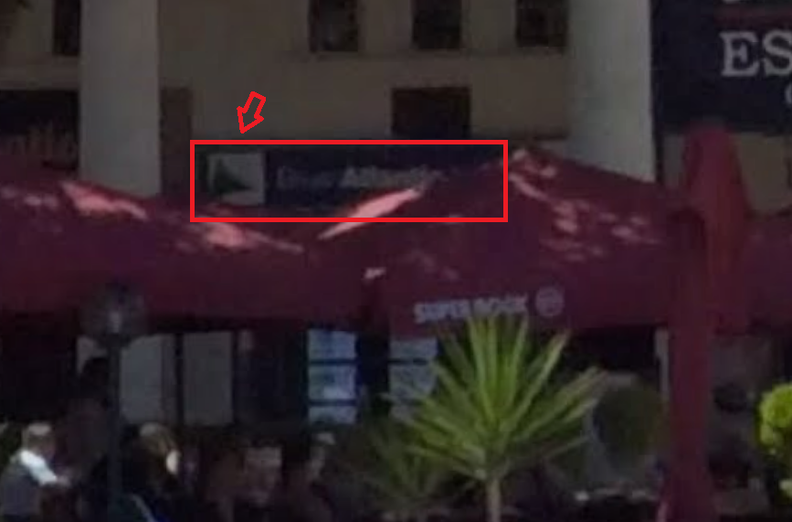
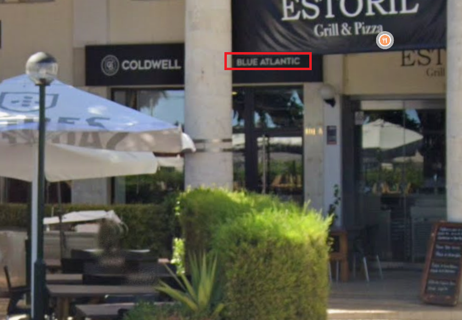
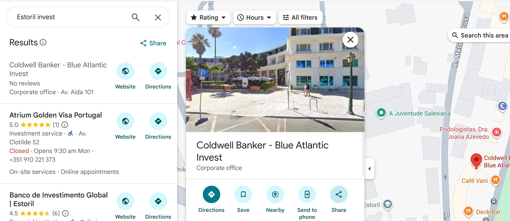
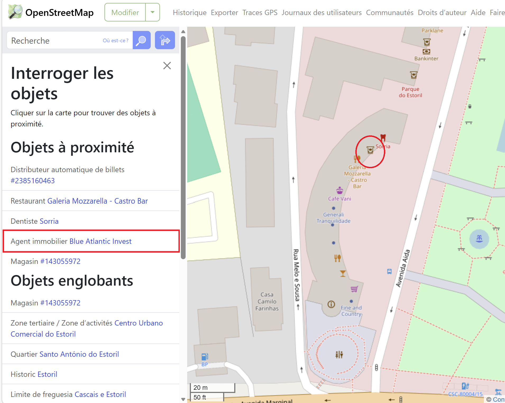
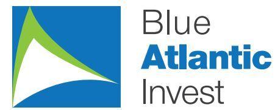

# Challenge : Blanchisserie

## Informations du challenge

| Catégorie | Difficulté | Points | Auteur |
|-----------|------------|--------|--------|
| Osint | Moyen | 300 | B3cha |

**Preuve :** `Blue Atlantic Invest`

## Résumé

Ce challenge nécessite de retrouver une agence immobilière à Estoril qui permet au groupe criminel
d'acheter des biens immobiliers afin de blanchir son argent, d'où le nom du challenge **Blanchisserie** :

1. Identifier l'établissement à partir du logo sur la photo fournie
2. Retrouver l'établissement dans le voisinage de l'hôtel `Londres Estoril`

## Étape 1 : Identification de la photo du challenge

### Recherche par image inversée

À partir de la photo représentant le logo de l'entreprise, on commence par une recherche par image inversée, qui ne
donne aucun résultat.

L'analyse de l'image montre un logo légèrement aplati :

Les recherches sur Google Images ne donnent pas plus de résultats.

Pour les personnes qui n'ont pas de point de départ pour leur recherche, le hint proposé — `En sortant de son hôtel, Miguel est passé plusieurs fois devant cette agence` — permet d'avoir un point de départ.
Vous avez la possibilité d'utiliser **Overpass Turbo** pour identifier toutes les agences immobilières sur le secteur d'Estoril.

## Étape 2 : recherche de l'établissement sur Estoril

En partant de l'hôtel Londres Estoril, en Google Street View, on se dirige vers la gare de train d'Estoril à la recherche
d'une agence immobilière (c'est l'exemple proposé dans le format du flag).

En regardant de part et d'autre de la rue, il y a très peu de commerces sur le trajet.
On remarque un bâtiment en forme d'arc de cercle entre la rue **Melo e Sousa** et l'avenue **Aida**.
Dans la vue Google Street View, sous un angle très particulier (photos récentes : `mai 2025`), juste après l'établissement
**CHURRASCARIA**, on aperçoit très difficilement notre logo (qualité dégradée, mais présent).

Il nous faut d'autres plans pour essayer d'extraire le nom de l'établissement :

On arrive donc à lire `Blue Atlantic`.
Nous obtenons le même résultat en recherchant avec le mot `Invest` sur Google Maps : une fiche société existe.

Passons maintenant sur OpenStreetMap pour voir si nous trouvons plus d'informations.

En sélectionnant le chemin du bâtiment arrondi, on obtient l'affichage des établissements qu'il contient.
On distingue un établissement, **agent immobilier** : `Blue Atlantic Invest`.

En regardant cette agence sur Google, on constate que cette entreprise possède un site web : http://www.blueatlanticinvest.com/
Le logo de cette agence immobilière confirme l'image de départ :

## Résultat

La solution de notre challenge est l'agence immobilière `Blue Atlantic Invest`.

✅ **Preuve :** `Blue Atlantic Invest`
