# Challenge : L'acompte

## Informations du challenge

| Catégorie | Difficulté | Points | Auteur |
|-----------|------------|--------|--------|
| Osint | Moyen | 200 | B3cha |

**Preuve :** `bc1pxpcm7fx7v9yj4g87ay3l8vq56f3ae39vw80jmcnqca53scqa8xfsmj59rk-$107000`

---

## Résumé

Ce challenge vise à identifier l'adresse Bitcoin de Miguel et le montant de la transaction en cryptomonnaie
effectuée par Fantasmas-de-Redes vers Miguel.

Les étapes suivantes sont nécessaires pour résoudre ce challenge :

1. retrouver le compte crypto (Bitcoin) de Fantasmas `bc1pdwu79dady576y3fupmm82m3g7p2p9f6hgyeqy0tdg7ztxg7xrayqlkl8j9`
2. fouiller l'ensemble des transactions de ce compte, plus spécialement le jour du rendez-vous entre Miguel et Henri (son nouveau boss)
3. définir le cours de change Bitcoin <-> Dollars à la fermeture le jour de la transaction (22/10/2025)

---

### Récupération de l'adresse crypto de Fantasmas-de-Redes

Lors de la résolution du challenge `Market place`, on trouve sur la page d'accueil du site
darkweb l'adresse du porte-monnaie crypto qu'il faut utiliser pour les achats de kits d'identité volés :
**bc1pdwu79dady576y3fupmm82m3g7p2p9f6hgyeqy0tdg7ztxg7xrayqlkl8j9**.

Il existe plusieurs façons de savoir s'il s'agit d'un compte `Bitcoin`, `Ethereum` ou encore `Dogecoin`.
La plus simple est de visualiser l'image de courbe fournie avec le challenge :

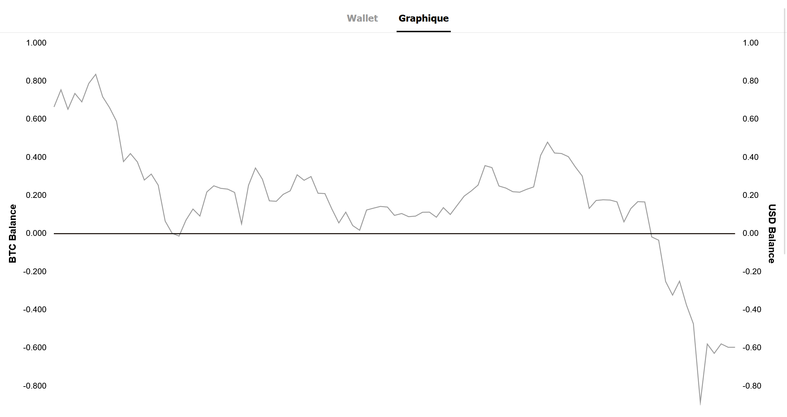

Soit vous reconnaissez la courbe d'évolution, soit, tout simplement, il faut lire l'axe des ordonnées (Y) => **BTC** => Bitcoin.

### Analyse de la blockchain

Nous allons à présent rechercher ce compte crypto sur la blockchain (https://www.blockchain.com/fr/explorer/addresses/BTC).

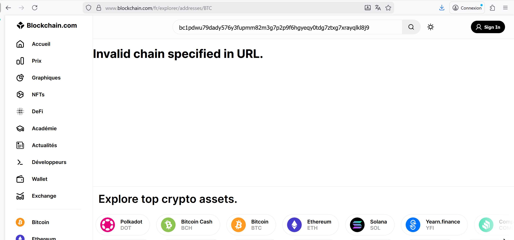

Il y a bien un résultat avec cette adresse Bitcoin :

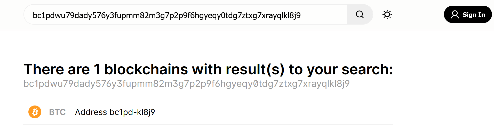

Cette adresse BTC ne vous rappelle rien ?

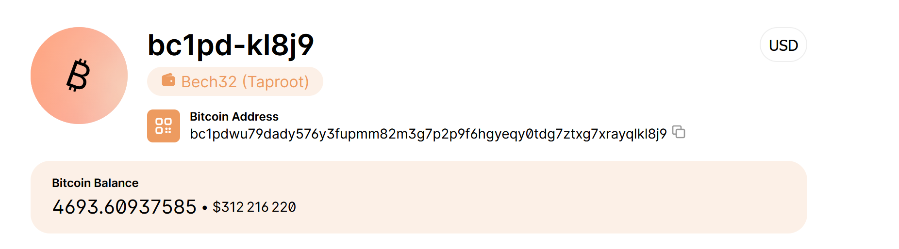

Vous l'avez croisée sur le Proton Drive de Miguel : coïncidence ? Je ne pense pas : à garder dans un coin de la tête.


### Analyse des transactions

Nous sommes à peu près certains que, parmi ces milliers de transactions, il y a celle que l'on recherche.

Mais comment procéder sans toutes les parcourir ? Pour cela, il faut utiliser les renseignements collectés
lors des précédents challenges.

### Renseignements utiles

Lors du challenge `Rendez-vous imminent`, Miguel a rencontré Henri pour la première fois. Cette entrevue a eu lieu
au restaurant `LIBERTÀ`. Miguel était encore sur les quais le **mercredi_22-10-2025_10:11:48**, en partance vers son rendez-vous.

Il est possible que cette transaction ait été faite le jour de la rencontre, le **22-10-2025**, car un cadeau
de bienvenue se donne toujours le premier jour et nécessairement pendant le repas entre les deux hommes
(donc très probablement après 11h00, temps nécessaire à Miguel pour arriver sur les lieux du meeting).

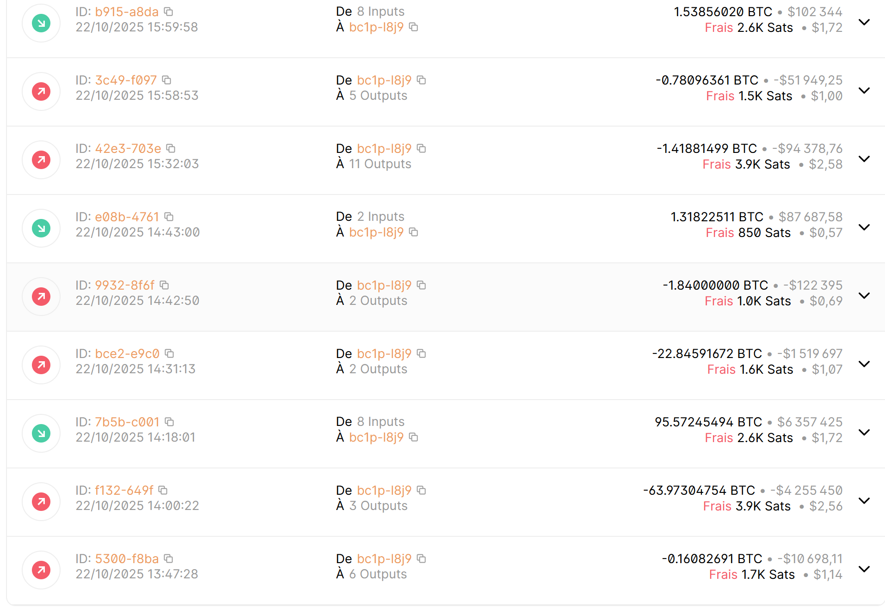

Il faut donc s'intéresser uniquement aux transactions sortantes.

**Post Facebook indiquant un lien cassé**

Sur le compte Facebook de Miguel, il y a un post public qui mentionne un lien cassé.

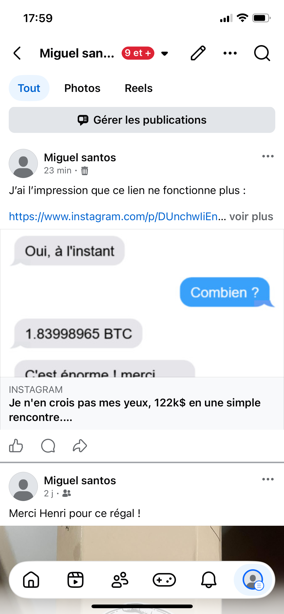

L'URL du post est la suivante : https://www.instagram.com/p/DUnchwIiEn0SxZ4aVw1j7hCUE8yGm0DhfpVn_Q0/

En se rendant sur le compte Instagram de Miguel, on s'aperçoit que ce post n'existe pas ou plus.

**Post Instagram supprimé**

En procédant à une recherche d'archive sur le site archive.today de la page du post supprimé (https://www.instagram.com/miguel.100tos/),
nous remarquons qu'un post a bien été supprimé.

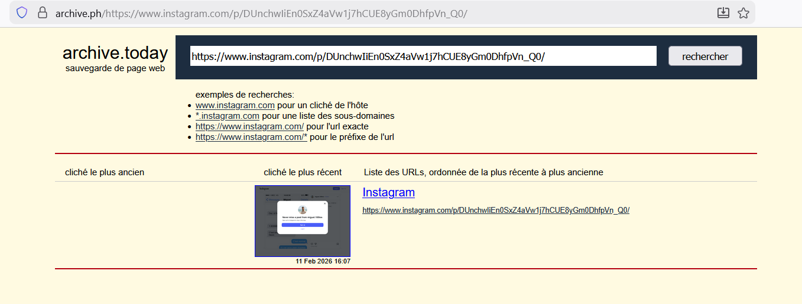

Malheureusement, il y a une fenêtre dans l'archive qui empêche de lire le texte. Pour cela, il suffit d'inspecter les propriétés de l'archive, de rechercher la partie du code qui représente cette fenêtre gênante et de supprimer le nœud :

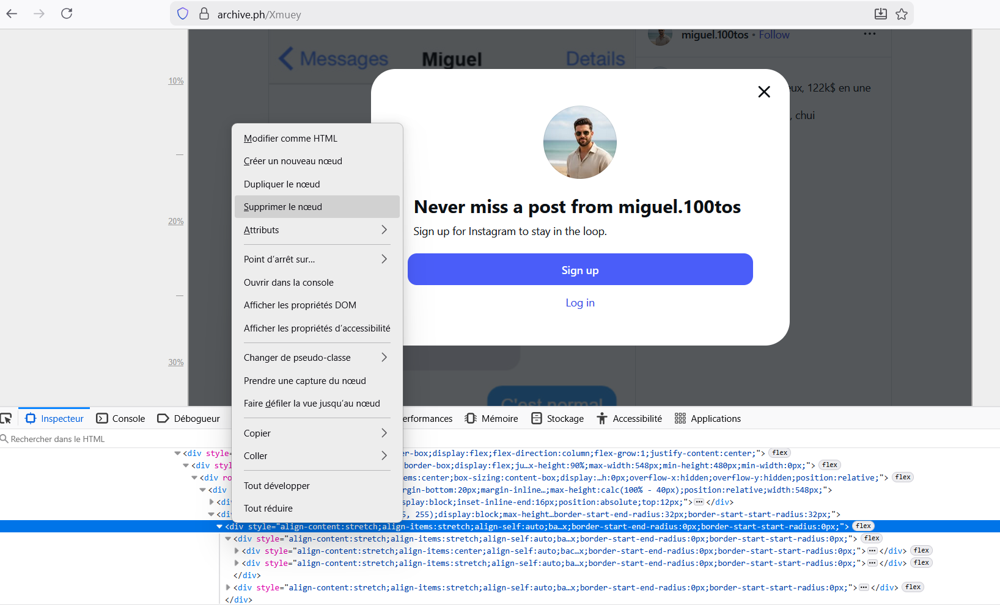

Le post original est le suivant :

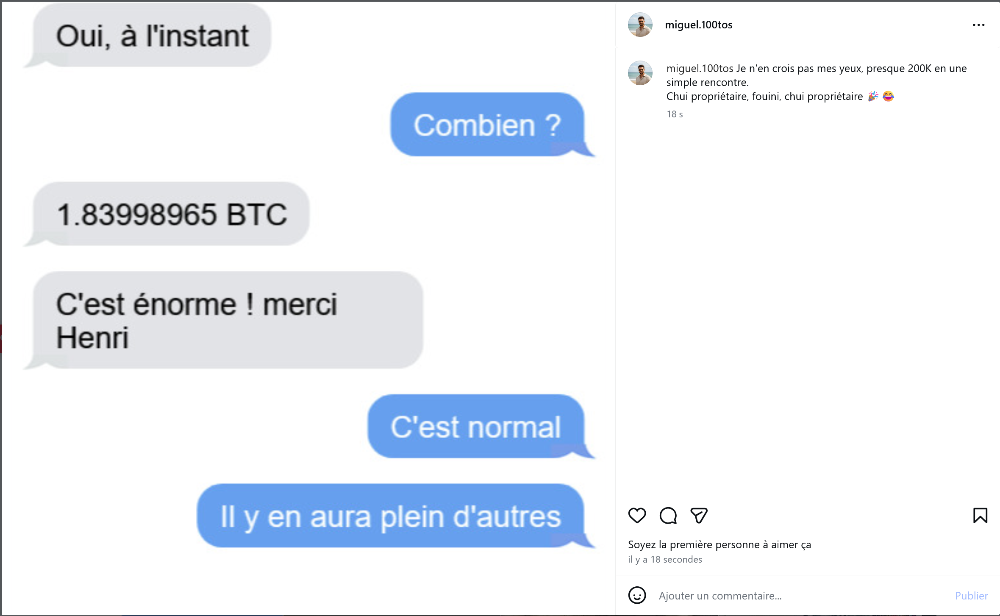

Ce post présente une conversation entre Miguel et Henri où il dit : **as-tu reçu ?** en précisant « à l'instant ».
L'horaire sur le téléphone indique `14:42:50`. Essayons de rechercher une transaction sortante de l'adresse Bitcoin de Fantasmas-de-Redes
le `22-10-2025 à 14:42:50` :

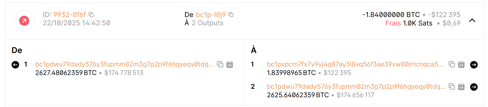

Le nombre de bitcoins transférés sur cette transaction, `1.83998965 BTC`, correspond exactement au nombre indiqué dans les
SMS de Miguel.

## Identification de la valeur BTC <-> dollars

Plusieurs sites proposent d'identifier le cours de change à la clôture le **22 octobre 2025**.

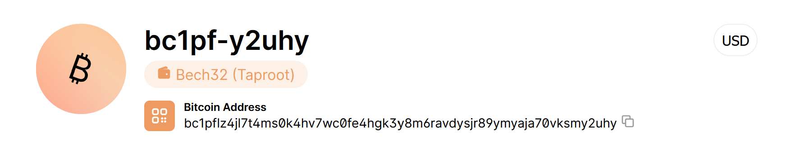

Il suffit maintenant de se rendre sur l'adresse BTC du compte en réception :

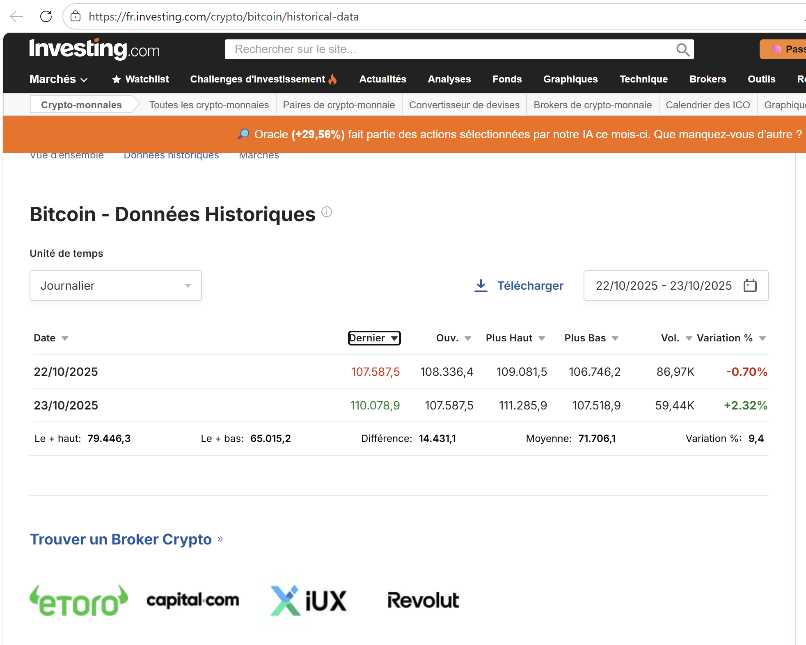

Celui-ci indique la valeur à la clôture, `107.587,5$` ; l'énoncé demande de tronquer la valeur au millier, donc on obtient la valeur de **107000 $**.

Il est également possible de recalculer le montant de l'acompte en dollars, `1.83998965 x 107587` : **$116 624**, soit environ 122 k€ (très proche de l'affirmation de Miguel sur son post Instagram).

De plus, le nom du compte BTC est `Bech32`, très proche du pseudo du concepteur du challenge : `c'est rigolo !`

### Résultats

Nous avons donc trouvé la transaction de l'acompte `ID:9932-8f6f`.

```
Adresse bitcoin Miguel : bc1pxpcm7fx7v9yj4g87ay3l8vq56f3ae39vw80jmcnqca53scqa8xfsmj59rk
Valeur de clôture du BTC : $107 000
```

✅ **Preuve :** `bc1pxpcm7fx7v9yj4g87ay3l8vq56f3ae39vw80jmcnqca53scqa8xfsmj59rk-$107000`
