## Challenge : La tanière du Lion

## Informations du challenge

| Catégorie | Difficulté | Points | Auteur |
|-----------|------------|--------|--------|
| Osint | Moyen | 400 | map_hack |

**Preuve:** `A89-69102_AD_0037-831299714`

**Fichier fourni :** deplacements_miguel.csv

---

## Résumé

Ce challenge est composé de trois objectifs qu'il faut résoudre :

1. Objectif 1 : trouver **la route principale** empruntée par Miguel pour se rendre au logement

2. Objectif 2 : identifier **la parcelle cadastrale** du logement

3. Objectif 3 : rechercher **le numéro de siren** du demandeur ayant déposé le permis de construire

---

## Étape 1 : Identification de la route principale

### Analyse du fichier fourni

Le fichier deplacements_miguel.xlsx contient des données de déplacement.
À l'ouverture, on découvre les colonnes :

-   Time stamp
-   SUP_ID : Identifiant (des antennes téléphoniques)
-   signal_strength : Force du signal
-   Distance arrondie : Distance approximative à l'antenne

> Exemple :
> Time stamp;SUP_ID;Force;Distance arrondie
>
> 22/03/2025 11:00 ;1671893;moyen;200
>
> 22/03/2025 11:01 ;905381;fort;100
>
> 22/03/2025 11:02 ;689660;fort;100

**Intuition :** Ces identifiants correspondent à des antennes téléphoniques. Il faut trouver leur géolocalisation.

## Récupération des données d'antennes

La première étape consiste à récupérer la liste complète des antennes téléphoniques du département 69 (Rhône).

**Source :** [ANFR OpenData](https://data.anfr.fr/visualisation/table/?id=observatoire_2g_3g_4g&disjunctive.adm_lb_nom)

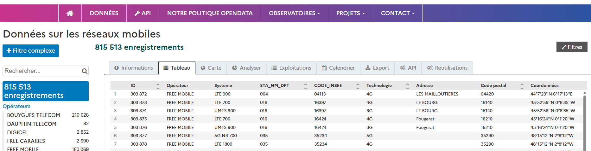

Le fichier téléchargé contient notamment :
```shell
-   sup_id : Identifiant unique de l'antenne
-   lat / lon : Coordonnées de géolocalisation
-   Autres informations techniques
```

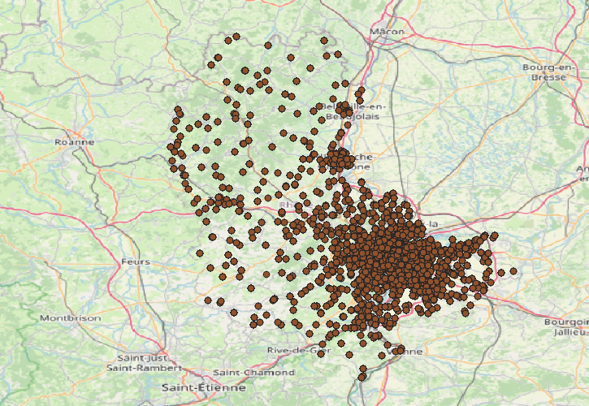

## Jointure des données

On réalise une jointure entre :

-   Le fichier du challenge deplacements_miguel.xls (contient : `sup_id,signal_strength, distance`)

-   Le fichier des antennes du département 69 (contient : sup_id, lat, lon) => car nous avons vu lors d'un précédent challenge que Miguel réside sur l'aire Lyonnaise (merci pour le hint dans le titre du challenge la tanière du **Lion**).

### Champ de jointure : sup_id

### Visualisation cartographique

Pour visualiser le trajet, plusieurs outils sont possibles :
-   QGIS (recommandé)

### Procédure avec QGIS :

1.  Importer le fichier joint (CSV avec lat/lon)
2.  Créer une couche de points à partir des coordonnées
3.  Ajouter un fond de carte IGN (via WMS ou XYZ) : https://cartes.gouv.fr/aide/fr/guides-utilisateur/utiliser-les-services-de-la-geoplateforme/tutoriels-api/qgis/
4.  Outil `joindre les attributs`

    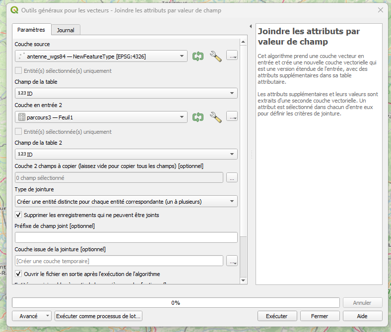

### Identification du trajet

En superposant les antennes captées sur le fond IGN, on observe clairement que le trajet suit une route départementale.

En zoomant et en comparant avec la nomenclature des routes sur la carte IGN, on identifie :

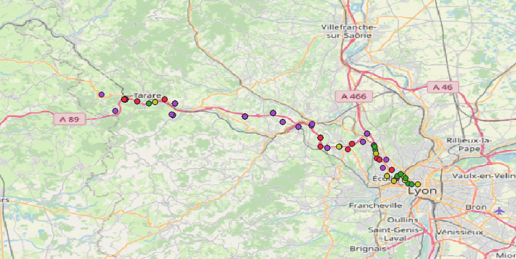

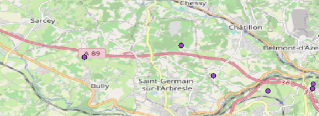

✅ Ainsi, nous avons trouvé l'objectif 1 : **A89**

---

## Étape 2 : Localisation du logement secondaire

### Analyse de la zone de stationnement

En examinant les données, on remarque que Miguel reste plusieurs heures à proximité de certaines antennes.

**Méthodologie :**

-   Analyser les timestamps pour identifier les périodes de stationnement
-   Repérer les antennes captées pendant ces périodes

**Création de buffers**

Pour affiner la localisation, on crée des buffers (zones tampons) :
Attention il est necessaire de passer en projection L93 pour appliquer des buffers en mettre

- Avec QGIS :
  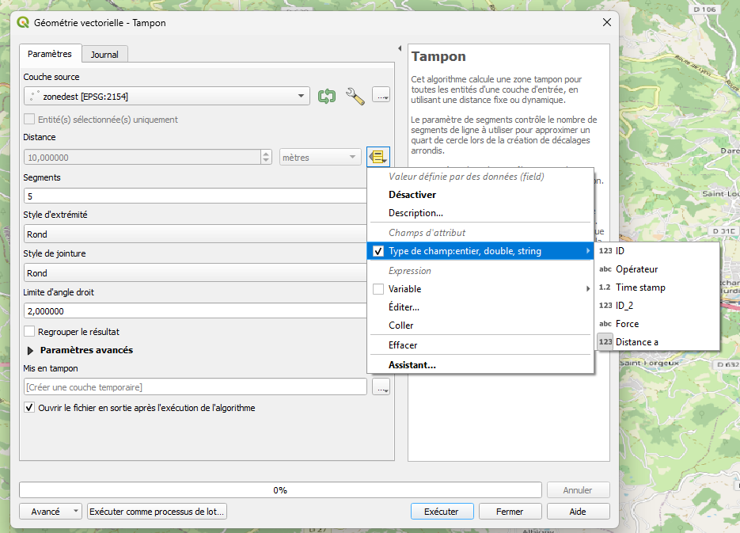

1.  Sélectionner les antennes de la zone de stationnement
2.  Menu Vector → Geoprocessing Tools → Buffer
3.  Distance : utiliser le champ distance du fichier (arrondie)
4.  Observer l'intersection des buffers

La zone d'intersection des buffers indique la position probable de Miguel.

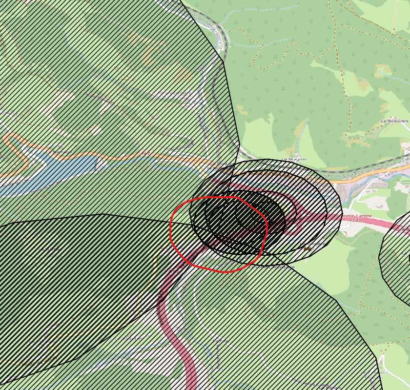

**Utilisation de `Remonter le temps` IGN**

Pour confirmer qu'il s'agit bien d'un logement avec travaux dans les années 2019/2020 :

**Site :** [Remonter le temps - IGN](https://remonterletemps.ign.fr/)

1.  Zoomer sur la zone identifiée par les buffers
2.  Utiliser le comparateur temporel
3.  Comparer les photos aériennes avant/après 2020

Zone : [Remonter le temps](https://remonterletemps.ign.fr/comparer/?lon=4.398698&lat=45.888429&z=17.1&layer1=10&layer2=11&mode=split-h)

**Observation :** On visualise clairement une maison qui a subi des travaux :

Démolition partielle et rénovation :
- 2016/2020 :
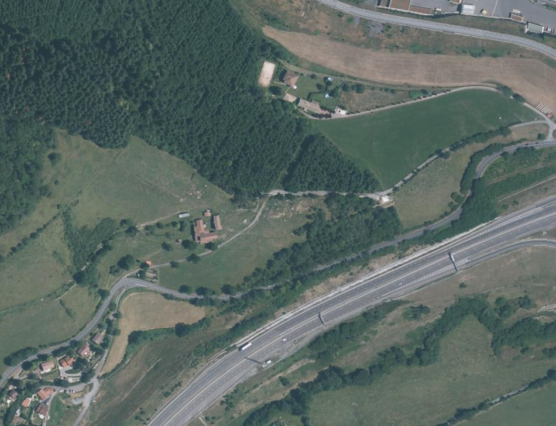

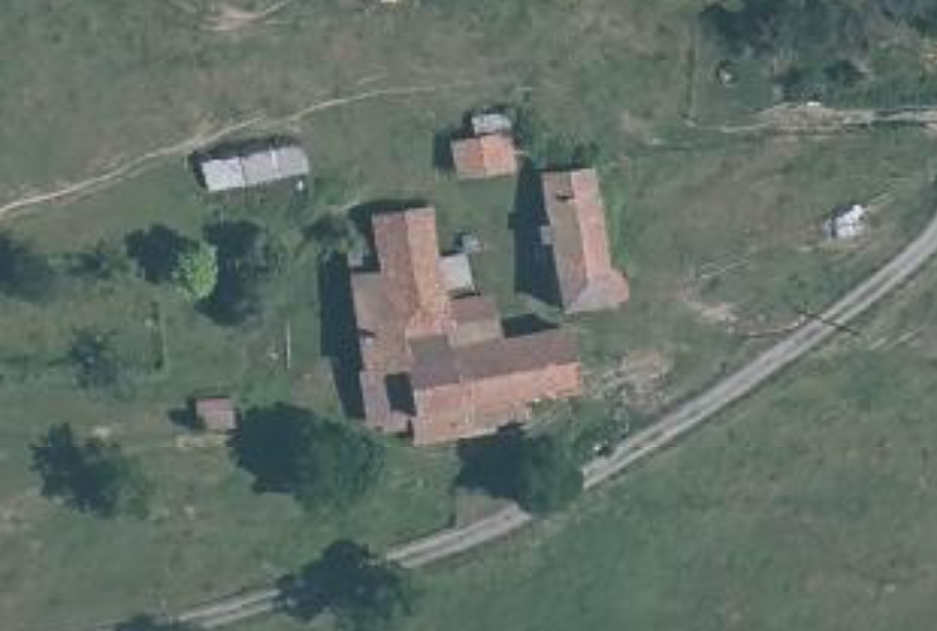

- Aujourd'hui :

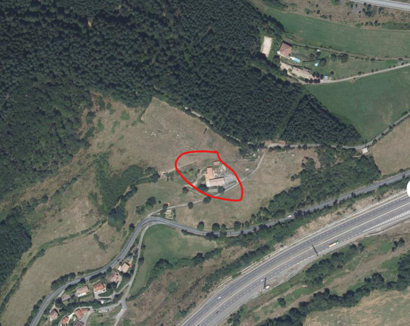

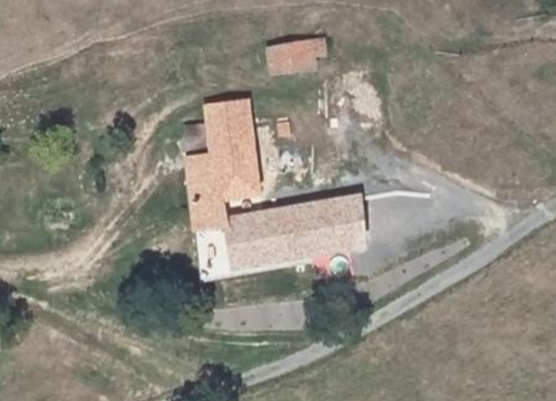

### Identification de la parcelle cadastrale

Une fois le bâtiment identifié, direction le cadastre :

**Site :** [Visualisation cartographique - Géoportail](https://www.geoportail.gouv.fr/carte)

1.  Rechercher la commune identifiée
2.  Zoomer sur l'emplacement exact du bâtiment
3.  Cliquer sur la parcelle
4.  Noter le numéro de parcelle (format : Section + Numéro, ex: AB 123)

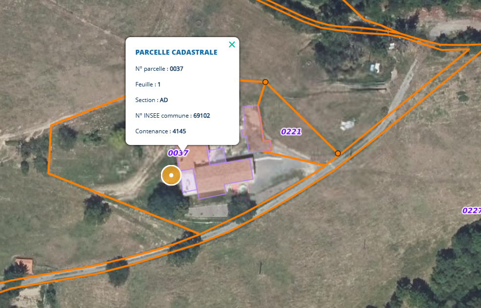

✅ Nous avons trouvé l'objectif 2 : **69102_AD_0037**

---

## Étape 3 : Récupération du permis de construire

### Recherche dans l'open data

Maintenant que nous avons la parcelle cadastrale, nous pouvons rechercher le permis de construire.

**Source :** [Catalogue Dido | Données et études statistiques](https://www.statistiques.developpement-durable.gouv.fr/catalogue?page=datafile&datafileRid=8b35affb-55fc-4c1f-915b-7750f974446a&datafileMillesime=2025-12&tab=datas)

**Recherche du dataset :** "Permis de construire" + nom de la commune/département

**Filtrage des données**

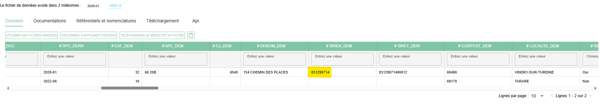

2 permis mais 1 seul avec un siren en 2019 :

✅ Nous avons trouvé l'objectif 3 : **831299714**

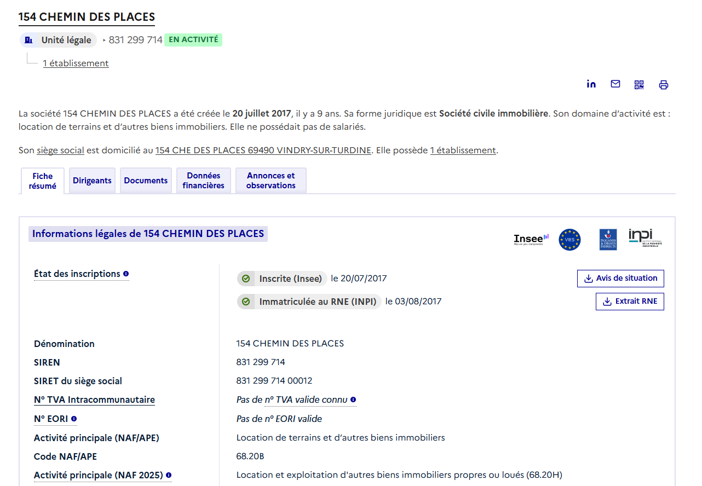


### Résultat

```
Preuve 1 (Route): A89
Preuve 2 (Parcelle): 69102_AD_0037
Preuve 3 (SIREN): 831299714
```

## Conclusion

### Outils utilisés

-   Base de données d'antennes téléphoniques
-   QGIS (ou autre outil cartographique)
-   IGN Remonter le temps
-   Cadastre.gouv.fr
-   Plateforme open data

### Compétences mobilisées

-   Analyse de données géolocalisées
-   Manipulation SIG (jointures, buffers)
-   Recherche OSINT sur plateformes publiques
-   Analyse temporelle d'images aériennes
-   Exploitation de données cadastrales et administratives

### Difficulté technique :

Ce challenge nécessite une bonne maîtrise des outils cartographiques et une connaissance des sources de données ouvertes françaises (c'est cela aussi l'OSINT quand on veux devenir cyber-enquêteur).

✅ **Preuve:** `A89-69102_AD_0037-831299714`
