# Challenge : Placement lucratif

## Informations du challenge

| Catégorie | Difficulté | Points | Auteur |
|-----------|------------|--------|--------|
| Osint | Difficile | 400 | B3cha |

**Preuve:** `C483 OWV-C483 OVW` ou `C483 OVW-C483 OWV`

---

## Résumé

Ce challenge nécessite de retrouver le chalet face auxquel les deux véhicules militaires sont stationnés (Valberg),
puis retrouver un post de l'évènement ou ces deux véhicules de collection sont exposés.

La résolution du challenge `Avoirs criminels 2` permet également de retrouver la photo des deux voitures stationnées
devant le même challenge.

---

## Première méthode d'identification du lieu

L'image de départ fournie avec le challenge est la suivante :


Commençons par une recherche par image inversée sur google en zoomant sur le chalet derrière les deux véhicules


Le premier résultat est le bon :

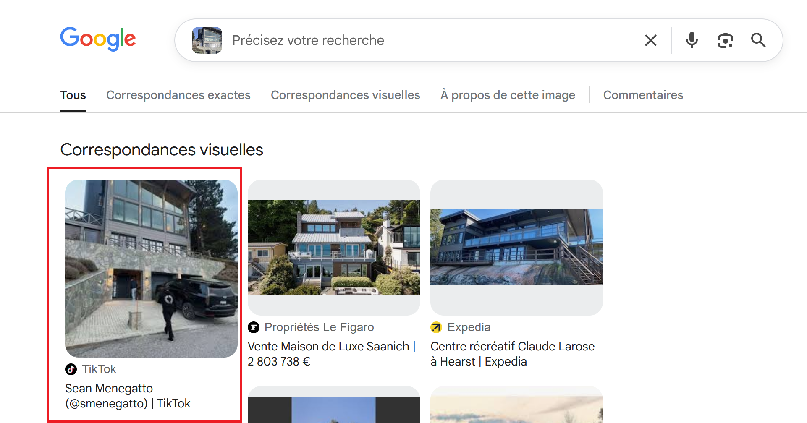

En recherchant sur google map cette même photo de chalet, pour l'extraire il faut inspecter les éléments de la page et
télécharger l'image original du compte Tikto (https://www.tiktok.com/@smenegatto) comme suit :

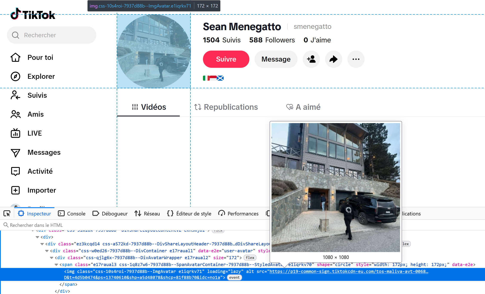

Ce même chalet a été immortalisé par un artiste peintre de passage :

https://www.facebook.com/groups/urbansketchersdfw/posts/2732555333448559/

Nous allons maintenant contextualiser notre recherche. Ce placement lucratif ressemble à l'achat d'un chalet au ski.

Nous devons donc concentrer nos recherches sur une station de ski. Lors de l'édition CTE v1 **Henri NAPILINO** habitait les alpes maritimes
et possédait son imprimerie dans le VAR. Il serait logique de rechercher une station proche de la côte d'azur (dans les Alpes par exemple).

Les dépenses frauduleuses identifiées sur le relevé de compte bancaire de Mélanie vues dans le challenge `Banque root` indiquent
des dépenses sur la principauté de **Monaco**.

Nous allons donc arpenter (en google street) les stations de ski les plus prochent du Var :
1. Valberg
2. ISOLA 2000
3. AURON
...

Après quelques heures de balade en google street view (normal, c'est un challenge à 400pts), nous voici devant **CHALET CHANTE VENT**


## Deuxième méthode d'identification du lieu

Sur le groupe Telegram de **Fantasmas-de-Redes**, il y a une image d'une pierre avec des inscriptions anciennes :

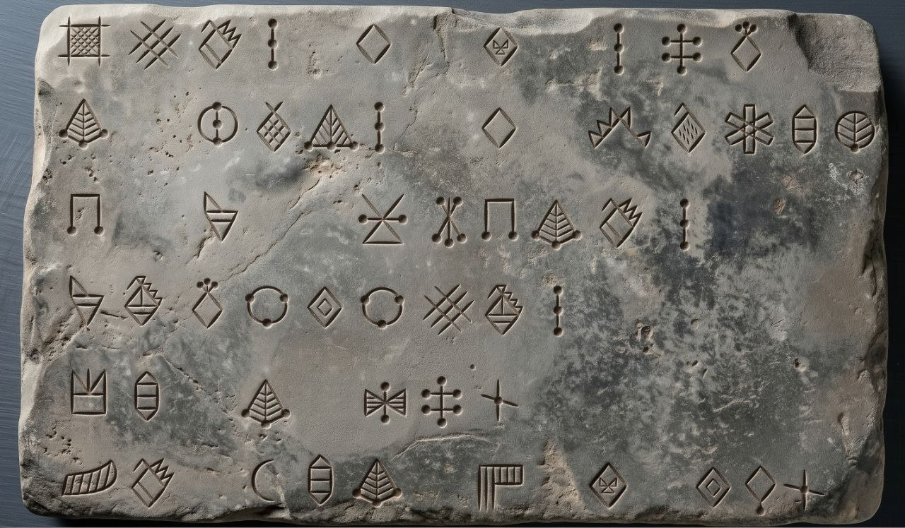

Après quelques recherches sur google, une image présentant les mêmes symboles :

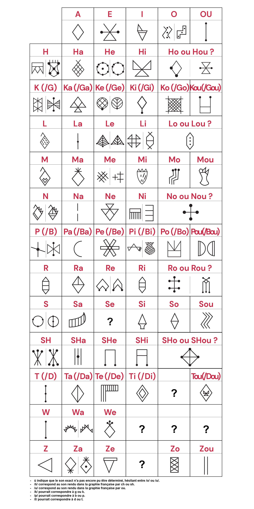

Un article de recherche scientifique du chercheur **François Desset** présent <a href="documents/article la recherche.pdf">ici</a> indique
qu'il s'agit d'une langue très ancienne : `l'élamite linéaire` datant de plus de 200 ans provenant d'iran.

Ces recherches indiquent qu'il s'agit d'une langue phonétique dont il vient à peine de terminer le décodage :

https://essentiels.bnf.fr/fr/image/d461f25a-21e7-4105-8eee-10a8744356e6-grilles-valeurs-phonetiques-signes-elamite-lineaire

La table de transcription complète est donc la suivante :

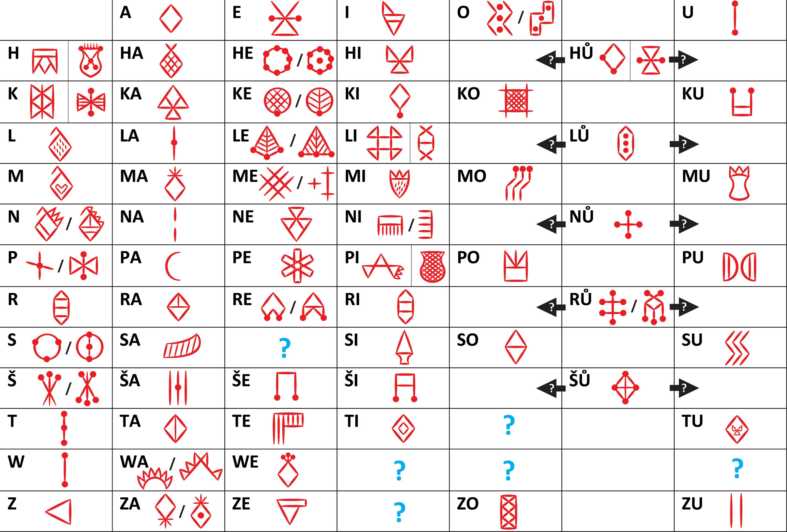

Il nous faut maintenant retranscrire le message codé issue de la pierre :

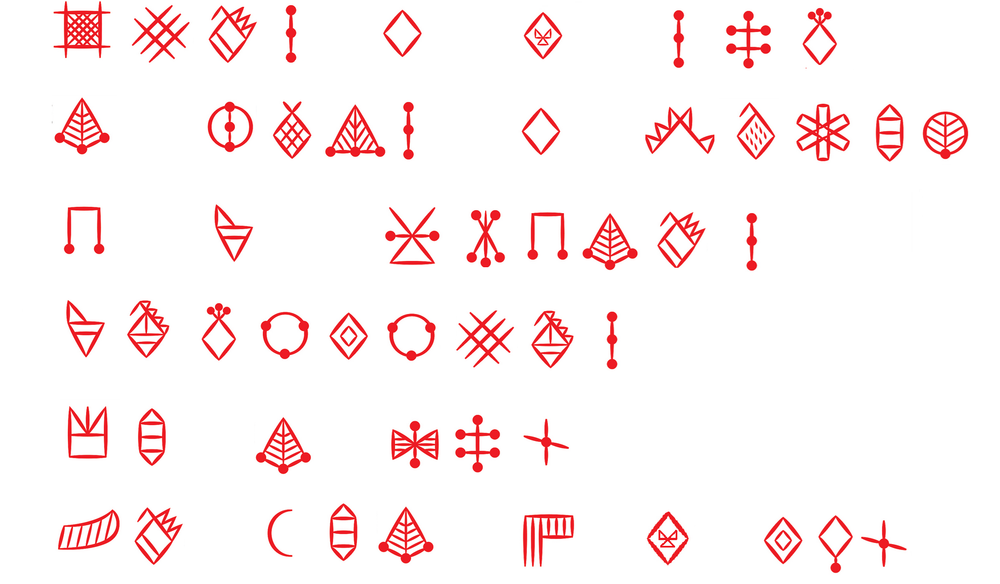

En utilisant la table de transcription précédente, le décodage est le suivante :

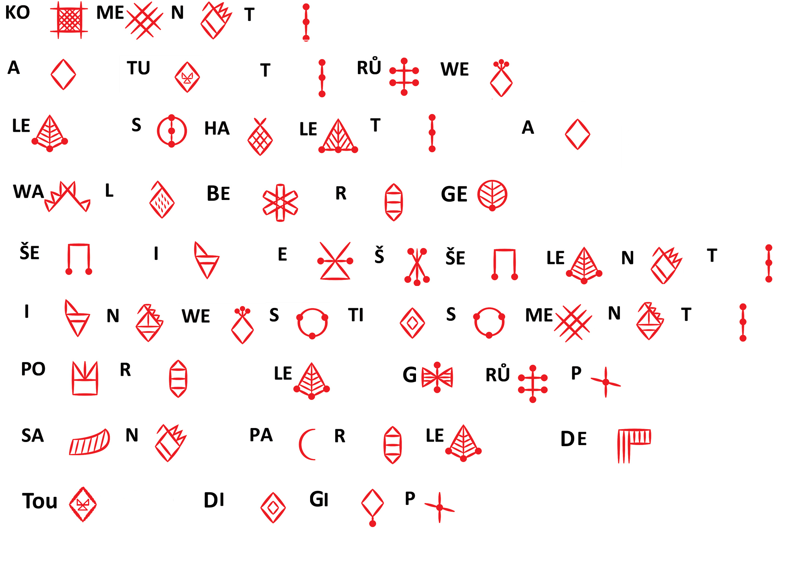

Ce qui nous donne le texte suivant :

```shell
Comment as tu trouvé le chalet à Valberg ?
C'est un excellent investissement pour le groupe.
Sans parler des deux jeeps.
```

Cette stèle est donc une confirmation pour la ville **Valberg** ou ces deux jeeps (véhicules militaires Mercedes Benz G Wagon 250 pour être plus précis)
sont stationnées devant le `CHALET CHANTE VENT`.

## Recherche de traces d'immatriculation

A ce stade de l'enquête plusieurs hypothèses des recherches :
1. les véhicules figurent dans une rue de Valberg ou bien stationnés sur un parking ?
2. les véhicules ont été en vente sur un site marchand type **Leboncoin** ou autre établissement de revente de VL (= Véhicule) militaires anciens
3. l'un des protagonistes de l'histoire fait allusion à ces deux véhicules acquis sous forme de placement d'avoir criminels
4. ces deux véhicules ont participés à une exposition dédiés aux véhicules militaires, généralement les propriétaire des VL aiment bien les exposés.

Commençons par faire des recherches sur les modèles précis de ces deux véhicules. Les images similaires sur internet indique
4x4 Mercedes Benz G Wagon 250. Ce sont des véhicules de collections, plus de chance de les retrouvers chez les revendeurs spécialisés.

Il est possible de faire des recherches par mots clés classique ou demandé à ChatGPT de fournir une liste de sites qui commercialisent
ce type de véhicules.

En poursuivant nos recherches, un compte LinckedIn de Miguel SANTOS : https://www.linkedin.com/in/miguel-santos-a48a94415/

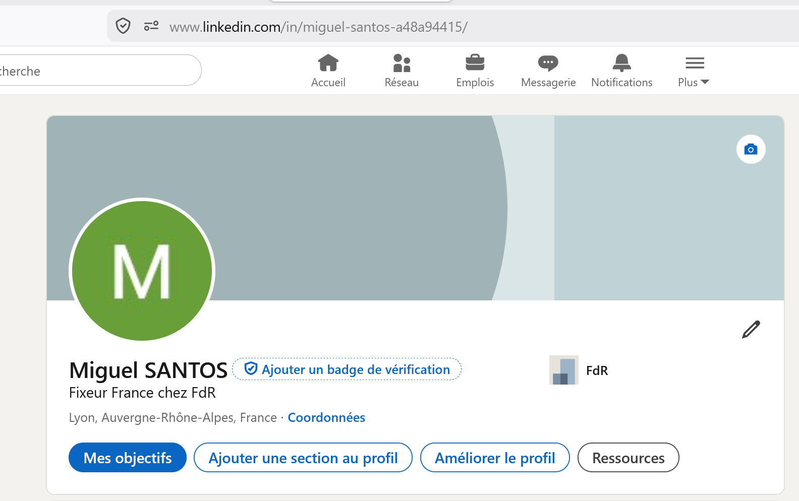

Le compte est vide mais il suit une seule société :

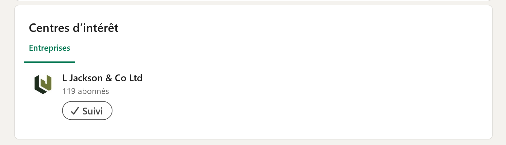

Parmi les dizaines de sites visités, nous avons trouvé https://ljacksonandco.com/

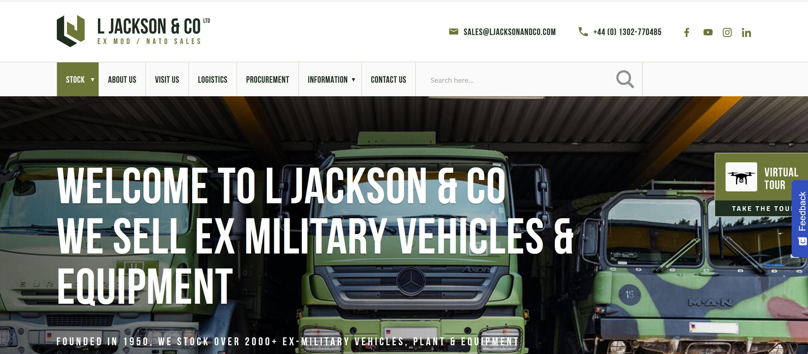

Ils indiquent avoir sur leur site des réseaux sociaux : **Facebook**, **Instagram** et **LinkedIn**.
L'idéal serait de trouver des photos de nos deux VL militaire vendu sur leur site (si c'est bien la bonne ressource).
Le compte **Instagram** présente que 8 photos, par contre le compte **Facebook** est bien garni.

A force de parcourir les différentes photos, nous retrouvons un post qui pourrait correspondre au modèle des 4x4 recherchés :

https://www.facebook.com/photo.php?fbid=514761976728407&set=pb.100042652853145.-2207520000&type=

En faisant afficher la publication, dans les commentaires nous trouvons notre bonheur :

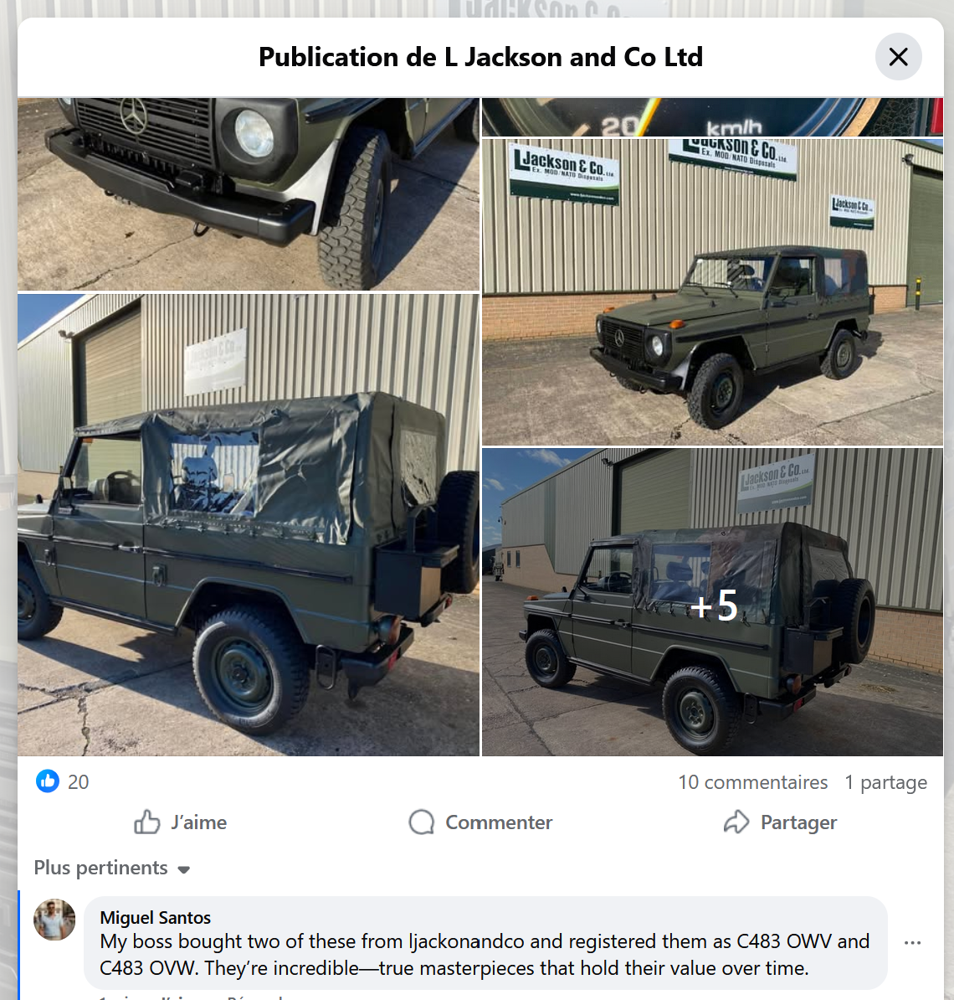

Notre fameux **Miguel SANTOS** à laissé le commentaire suivant :
`My boss bought two of these from ljackonandco and registered them as C483 OWV and C483 OVW. They’re incredible—true masterpieces that hold their value over time.`

Nous avons donc nos deux immatriculations recherchées.

### Résultat

La solution de notre challenge est l'immatriculation des deux VL militaire.

✅ **Preuve:** `C483 OWV-C483 OVW` ou `C483 OVW-C483 OWV` (les deux ordres sont acceptés)
