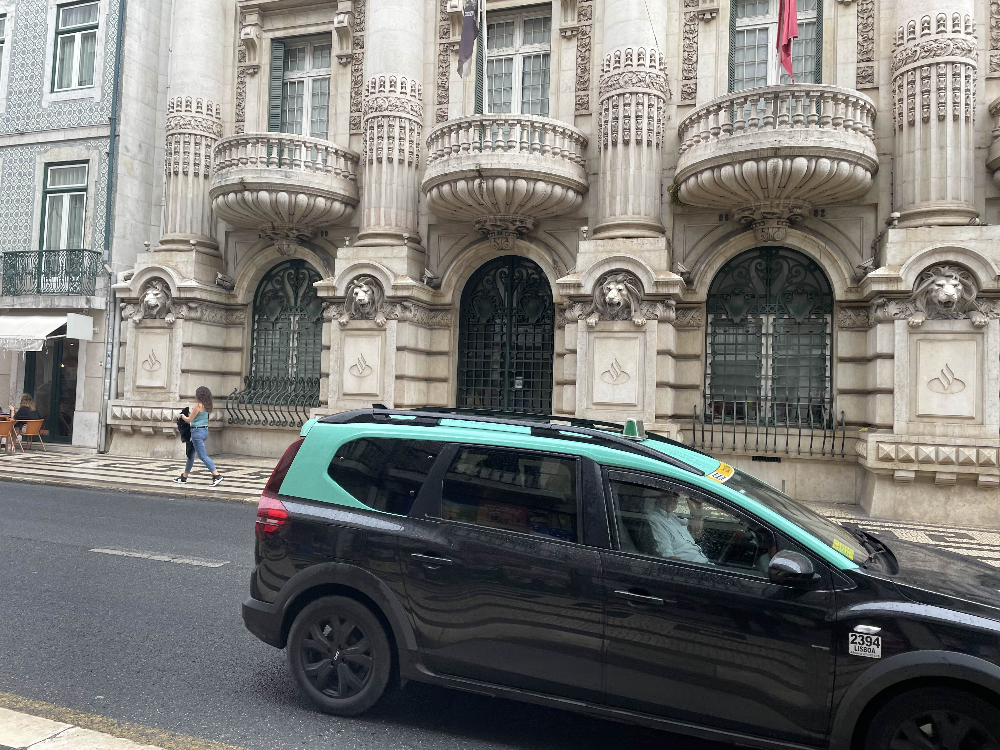
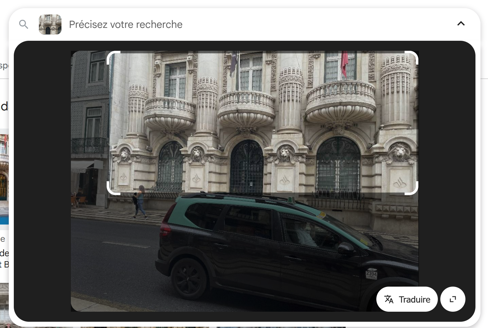
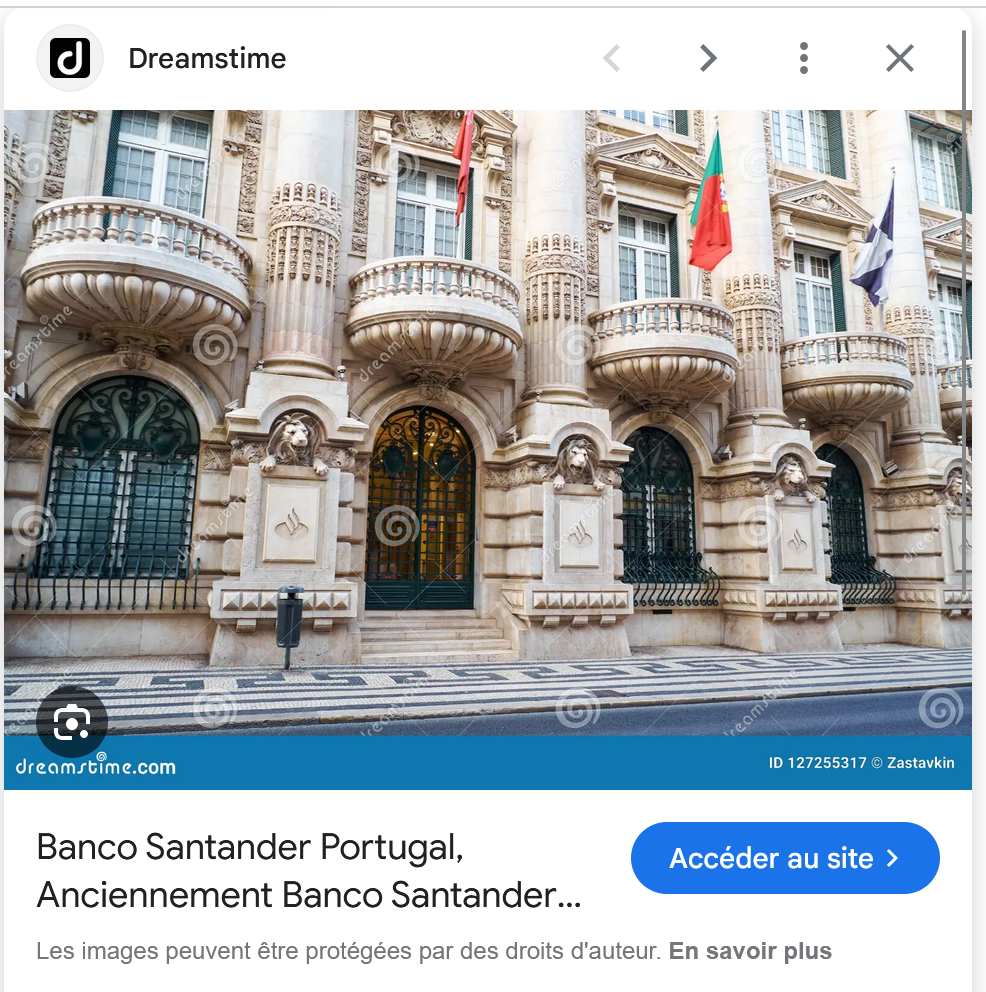
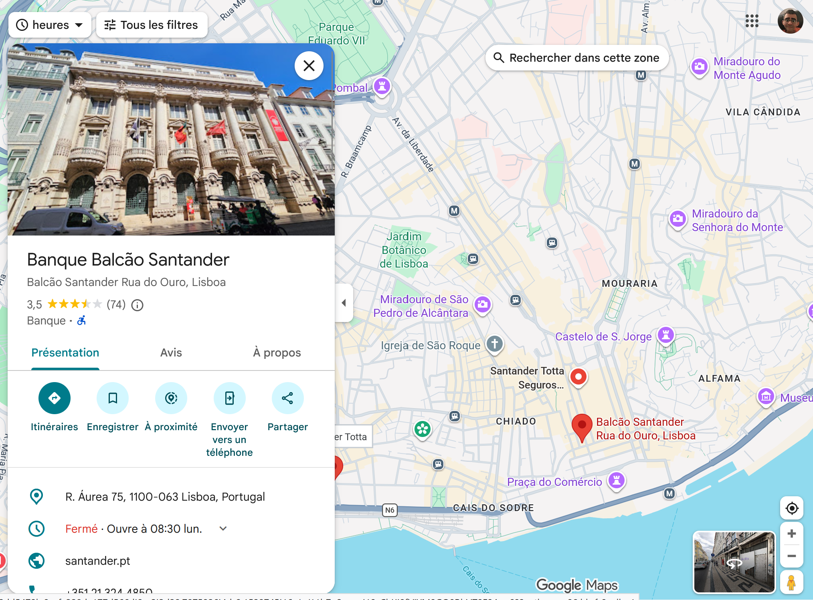
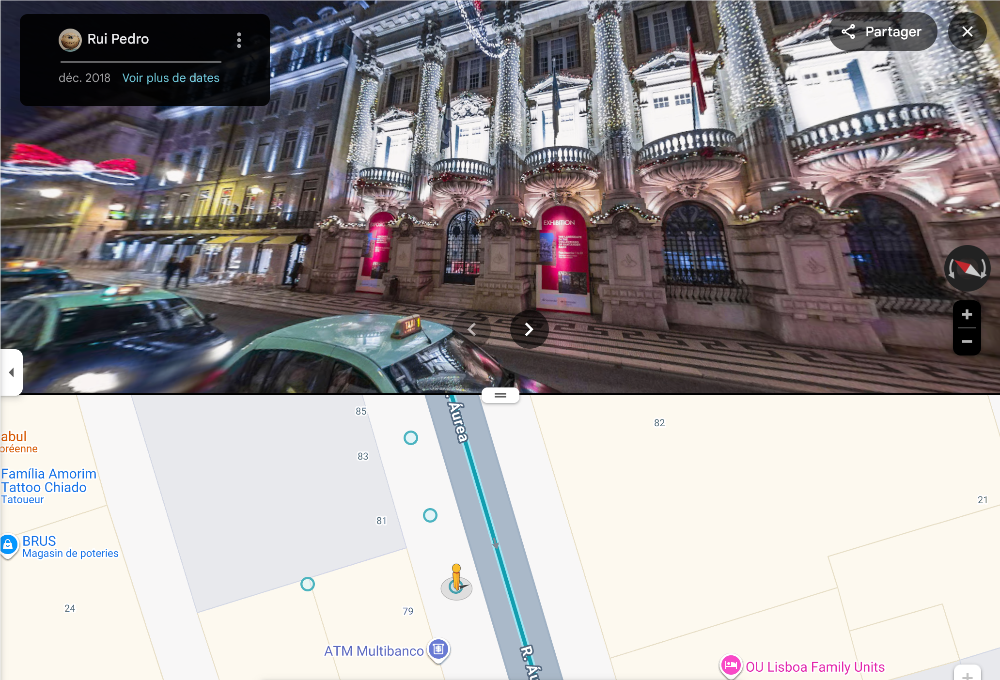

# Challenge : Réserve intouchable

## Informations du challenge

| Catégorie | Difficulté | Points | Auteur |
|-----------|------------|--------|--------|
| GeoInt | Moyen | 150 | B3cha |

**Preuve:** `Latitude : 38.70962719580694, Longitude : -9.138223829825805`

---

## Résumé

Ce challenge nécessite de retrouver l'emplacement de la banque `Banco Santander Portugal` à Lisbonne.

---

## Identification de la banque

Dans cette banque de Lisbonne `Fantasmas-de-Redes` entreprose une partie de son argent.

L'image de départ fournie avec le challenge est la suivante :

Commençons par une recherche par image inversée sur google en zoomant sur la façade du batiment derrière le Taxis :

Le premier résultat est très intéressant, la banque **Banco Santander Portugal**,

En recherchant sur google map cette même banque :

Il faut ensuite bien se placer dans la rue (face au distributeur de billet ATM de l'agence  `SANTANDER Totta`) pour avoir la façade de la banque au lieu
précis de prise de vue de la photo :

Le radian positionné permet une incertitude acceptable pour ne pas se tromper.

---

### Résultat

La solution de notre challenge est la position face à la banque **Banco Santander Portugal,**.

✅ **Preuve:** `38.70962719580694,-9.138223829825805`
