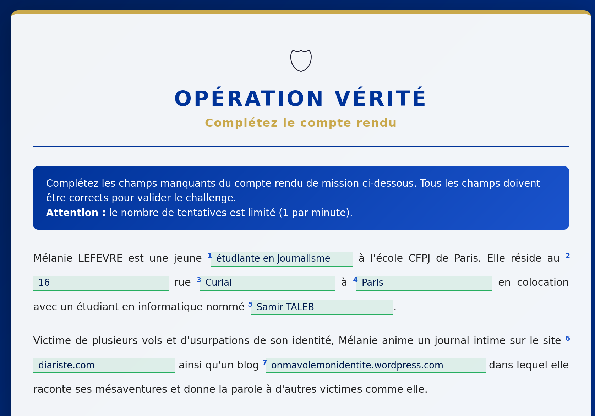
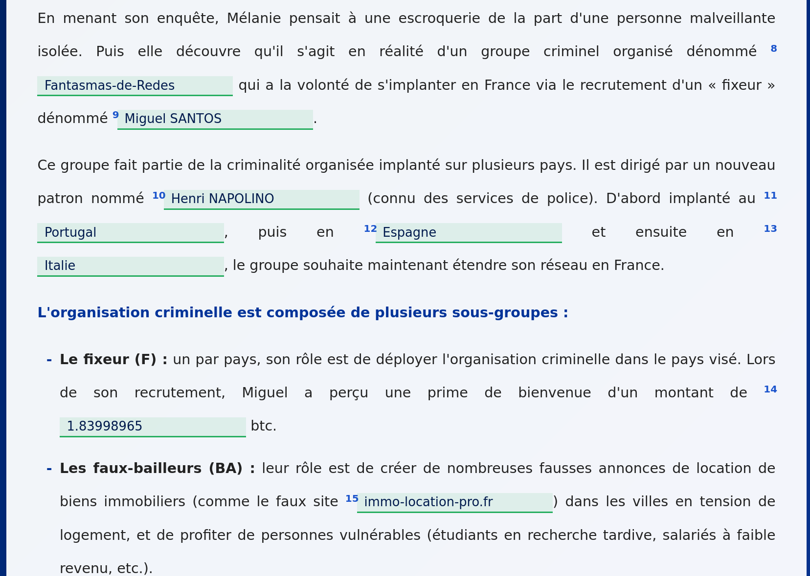
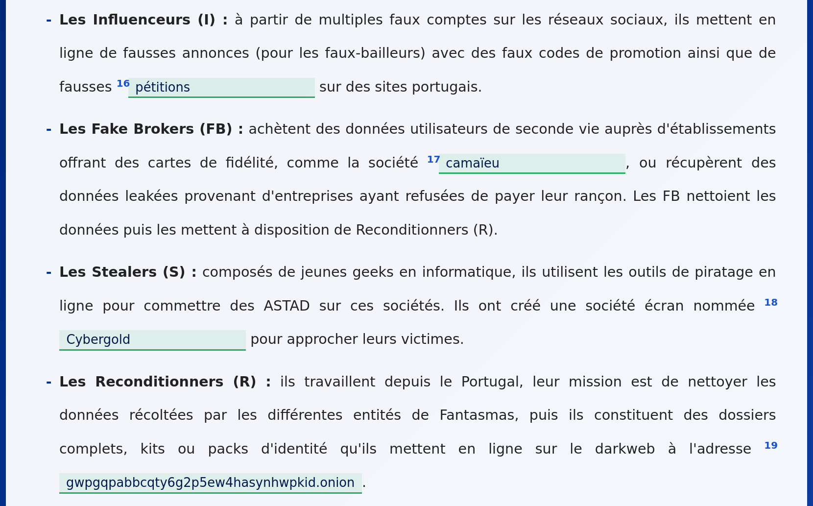
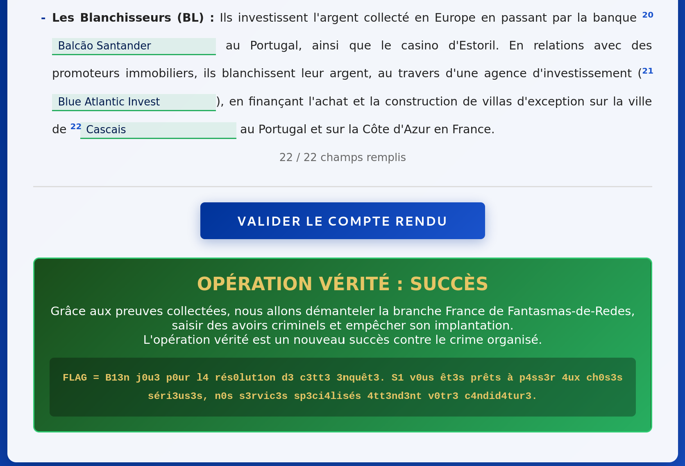

# Challenge : Charlie romeo

## Informations du challenge

| Catégorie | Difficulté | Points | Auteur |
|-----------|------------|--------|--------|
| Misc | Facile | 50 | YoyoChaud |

**Preuve :** `B13n j0u3 p0ur l4 rés0lut1on d3 c3tt3 3nquêt3. S1 v0us êt3s prêts à p4ss3r 4ux ch0s3s séri3us3s, n0s s3rvic3s sp3ci4lisés 4tt3nd3nt v0tr3 c4ndid4tur3.` (case insensitive)

---

## Résumé

Ce challenge est un compte-rendu de mission ; il consiste tout simplement à retrouver les principales preuves qui permettent
de comprendre l'histoire du CTEv2 **l'enfer numérique** :

1. **étudiante en journalisme** : trouvé dans le challenge `L'emploi` de la catégorie `Bienvenue en enfer`
2-3-4. **16 rue Curial à Paris** : trouvé dans le challenge `Domiciliation` de la catégorie `Conseils d'un ami`
5. **Samir TALBEB** : croisé dans le challenge `Son histoire` de la catégorie `Conseils d'un ami`
6. **diariste.fr** : trouvé dans le challenge `Soutien indéfectible` de la catégorie `Bienvenue en enfer`
7. **[www.onmavolemonidentite.wordpress.com](https://www.onmavolemonidentite.wordpress.com)** : trouvé dans le challenge `Les autres victimes` de la catégorie `Bienvenue en enfer`
8. **Fantasmas-de-Redes** : trouvé dans le challenge `Affiliation` de la catégorie `Fantômes du net`
9. **Miguel SANTOS** : croisé dans le challenge `L'enfer continue` de la catégorie `Bienvenue en enfer`
10. **Henri NAPOLINO** : croisé dans le challenge `Nouveau boss` de la catégorie `Réseaux financiers`
11-12-13. **Portugal Espagne Italie** : trouvé dans le challenge `Tentaculaire` de la catégorie `Organisation criminelle`
14. **1.83998965** btc : trouvé dans le challenge `L'acompte` de la catégorie `Réseaux financiers`
15. **immo-location-pro.fr** : trouvé dans le challenge `Agence tout risque` de la catégorie `Ennemis de l'intérieur`
16. **pétitions** : croisé dans le challenge `Lutte d'influence` de la catégorie `Fantômes du net`
17. **camaïeu** : croisé dans le challenge `Ça aussi c'est du vol` de la catégorie `Bienvenue en enfer`
18. **Cybergold** : trouvé dans le challenge `Vitrine parfaite` de la catégorie `Haut du spectre`
19. **6tz6wsus4mwbe23fhi6k6ygkgwpgqpabbcqty6g2p5ew4hasynhwpkid.onion** : trouvé dans le challenge `Market place` de la catégorie `Organisation criminelle`
20. **Balcão Santander** : trouvé dans le challenge `Réserve intouchable` de la catégorie `Réseaux financiers`
21. **Blue Atlantic Invest** : trouvé dans le challenge `Blanchisserie` de la catégorie `Réseaux financiers`
22. **Cascais** : croisé dans le challenge `Avoirs criminels 2` de la catégorie `Réseaux financiers`

---

## Solution

Il est possible de soumettre autant de fois que nécessaire par minute.
Lorsqu'une réponse est erronée, celle-ci est surlignée en rouge. Il suffit ainsi de la corriger pour trouver le texte final.

Le flag est une invitation à rejoindre la réserve cyber de la gendarmerie pour travailler sur des missions passionnantes
combinant cyber et investigation.

---

### Résultat

Attention : le format du flag précise bien que le point en fin de citation fait partie du flag final.

✅ **Preuve :** `B13n j0u3 p0ur l4 rés0lut1on d3 c3tt3 3nquêt3. S1 v0us êt3s prêts à p4ss3r 4ux ch0s3s séri3us3s, n0s s3rvic3s sp3ci4lisés 4tt3nd3nt v0tr3 c4ndid4tur3.` (case insensitive)
