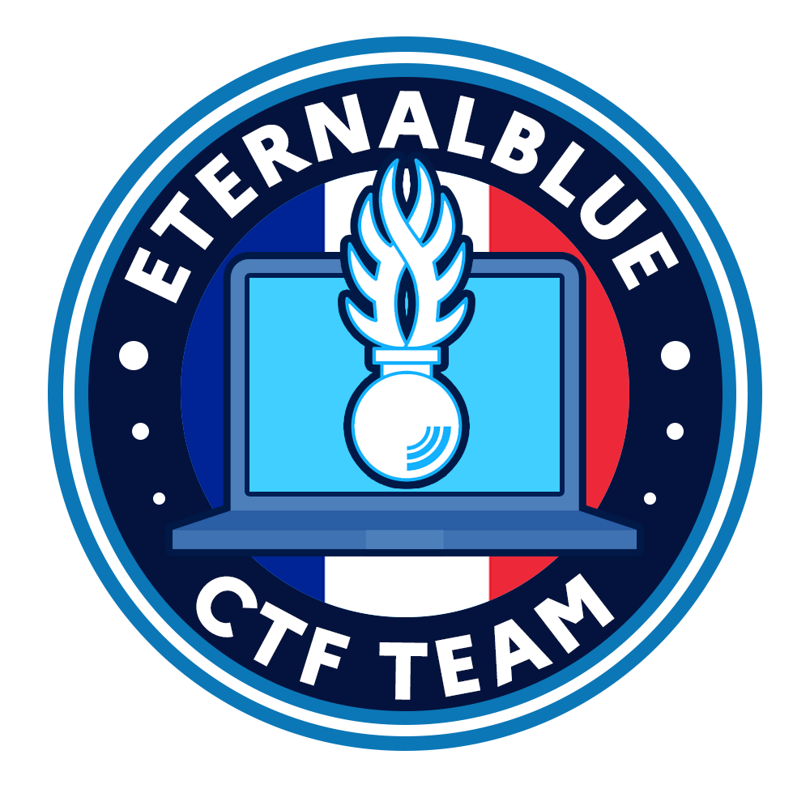

# Challenge : Epilogue

## Informations du challenge

| Catégorie | Difficulté | Points | Auteur |
|-----------|------------|--------|--------|
| Epilogue | Facile | 10 | B3cha |

**Preuve :** `A vos ordres chef`

## Résumé

La Région de Gendarmerie PACA vous remercie infiniment d'avoir pris part à ce `CTE l'Enfer Numérique`. Nous espérons que vous avez passé un bon moment
en compagnie des admins `EternalBlue`.

Nous espérons que cette compétition vous a plu et vous a permis de découvrir les différentes facettes du **Vol et de l'Usurpation d'identité !**

Restez prudents : vos données personnelles ont une valeur inestimable.
Nous comptons sur vous pour sensibiliser un maximum de personnes dans votre entourage (famille, amis, collègues de travail, ...), leur évitant ainsi de se
faire piéger à leur tour.

Nous avons un dernier service à vous demander : pouvez-vous remplir notre questionnaire de satisfaction https://url_questionnaire_de_satisfaction.fr ?

✅ **Preuve :** `A vos ordres chef`
